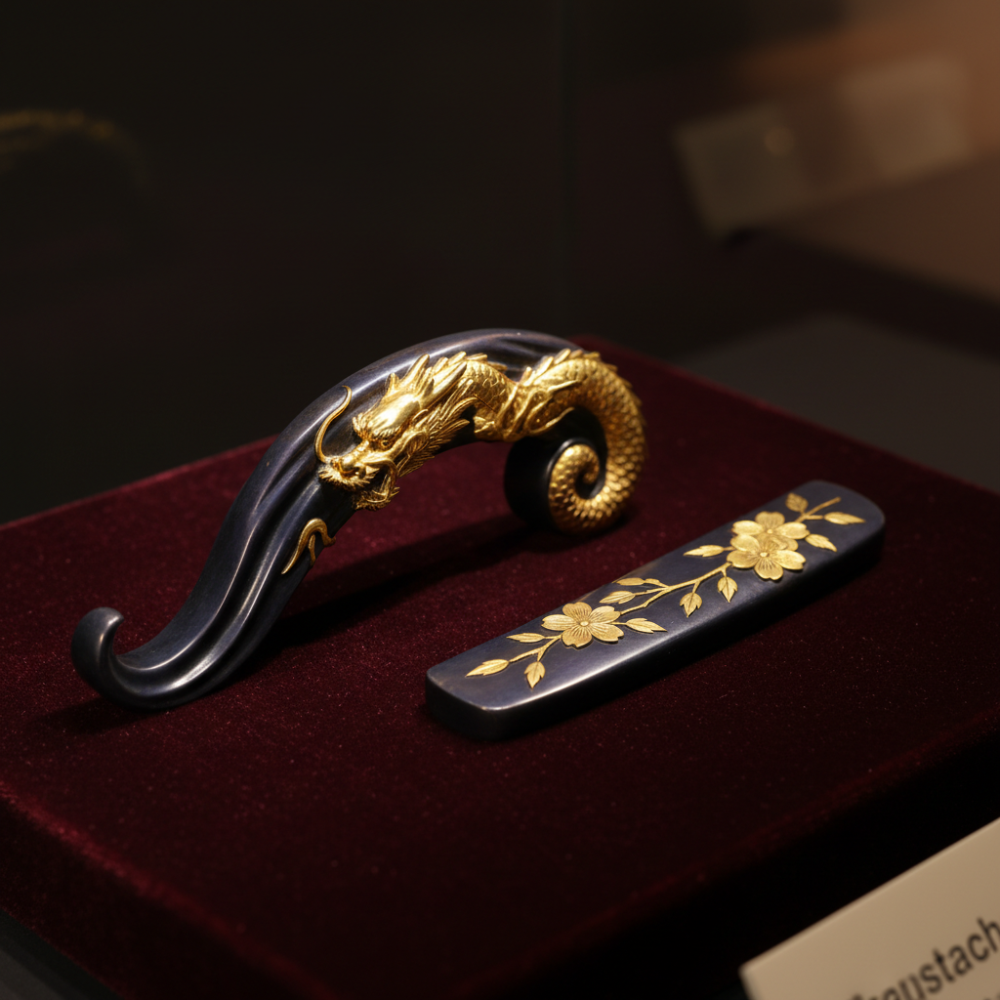

# Shakudo 赤铜

> "Shakudo is night made metal — a purple-black so deep it swallows light and returns mystery." — Unknown

## 概述

赤铜（Shakudo/赤銅）是一种日本传统的铜金合金——通常含2-7%的金，其余为铜。赤铜的神奇之处在于经过特殊的化学着色处理（煮色/niiro）后，表面会呈现出深邃的蓝黑色或紫黑色，这种色调被日本人称为"乌の濡れ羽色"（乌鸦湿羽的颜色）。这种深沉的黑紫色与金银的镶嵌形成极其优雅的对比，是日本刀剑装具和金属工艺中最珍贵的材料之一。

赤铜的美学在于：黑暗中的高贵——少量的金赋予铜一种深不可测的黑紫色，如同夜空中隐藏的星光。

## 核心特征

| 特征 | 描述 |
|------|------|
| 合金 | 铜金合金（2-7%金） |
| 黑紫 | 深邃的蓝黑/紫黑色 |
| 煮色 | 特殊化学着色 |
| 高贵 | 含金的高贵感 |
| 对比 | 与金银形成优雅对比 |
| 日本 | 日本独特的金属材料 |

## 视觉特征

- **黑紫**：深邃的蓝黑或紫黑色
- **深沉**：极其深沉的色调
- **光泽**：微妙的丝绒般光泽
- **对比**：与金银镶嵌的强烈对比
- **高贵**：内敛的高贵感
- **神秘**：神秘深邃的视觉效果

## 代表作品

| 作品 | 艺术家 | 年代 | 意义 |
|------|--------|------|------|
| *Goto school fittings* | 后藤家 | 15-19世纪 | 后藤流派的赤铜作品 |
| *Menuki and kozuka* | 匿名 | 江户时代 | 刀剑小道具 |
| *Shakudo tsuba* | 匿名 | 17-19世纪 | 赤铜刀镡 |
| *Contemporary art* | Various | 当代 | 当代赤铜艺术 |
| *Mixed metal jewelry* | Various | 当代 | 混合金属珠宝 |

## 历史时间线

| 时期 | 事件 |
|------|------|
| 奈良时代 | 赤铜合金的早期使用 |
| 室町时代 | 刀剑装具中的发展 |
| 江户时代 | 赤铜工艺的黄金时代 |
| 明治时代 | 废刀令后转向装饰品 |
| 20世纪 | 西方金属工艺师的学习 |
| 当代 | 当代珠宝和艺术中的应用 |

## 中国语境

赤铜合金在中国传统金属工艺中没有直接对应——中国古代虽然有铜金合金，但未发展出类似的化学着色传统。中国的"乌铜走银"（云南特有工艺）在视觉效果上与赤铜有相似之处——都是在深色金属底上镶嵌亮色金属。当代中国的金属工艺师正在学习赤铜的制作和着色技法。

## AI生成概念图

## 与其他风格的关系

- **Shibuichi** → 四分一是另一种日本装饰合金
- **Mokume-gane** → 木目金中使用赤铜
- **Tsuba** → 刀镡装饰材料
- **Japanese Metalwork** → 日本金属工艺
- **Damascening** → 金银镶嵌的底材
- **Niello** → 黑色金属装饰的对应

---

*浮光艺志 | Chronicle of Artistry*
