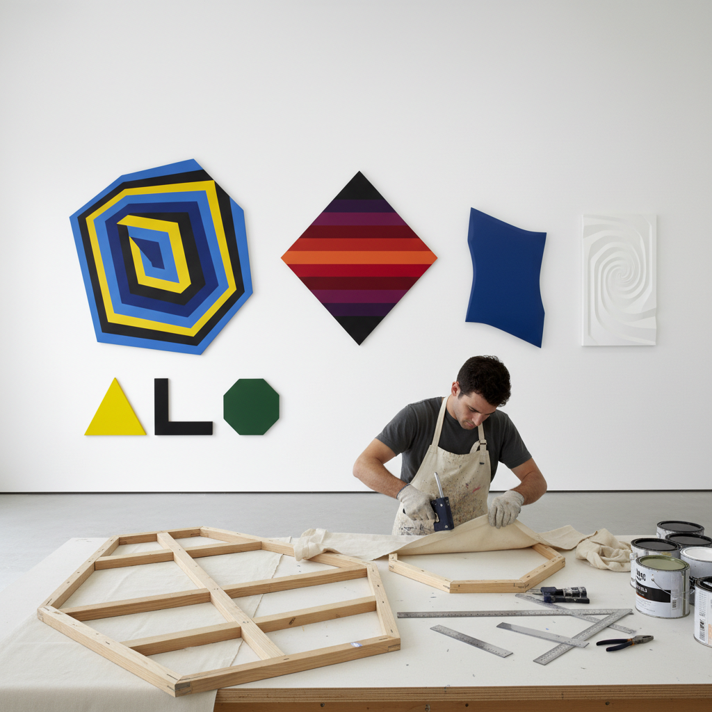

# Shaped Canvas 异形画布

> "The shaped canvas declares that a painting need not be a window — by cutting, angling, and sculpting the support itself, the artist makes the boundary between painting and object dissolve, the canvas edge becoming as expressive as any brushstroke within it, geometry no longer a neutral frame but an active participant in the composition, turning flat color into architectural presence that projects into the viewer's space." — Unknown

## 概述

异形画布（Shaped Canvas）是一种打破传统矩形画框限制，将画布裁剪或构造成非矩形形状（如三角形、菱形、多边形、圆形、不规则形状等）的绘画实践。在异形画布中，画布的外形本身成为作品构图的一部分——画布的边缘不再是中性的"窗框"，而是积极参与画面表达的元素。

异形画布在1960年代由弗兰克·斯特拉（Frank Stella）、肯尼斯·诺兰（Kenneth Noland）、查尔斯·辛尼瓦里（Charles Hinman）等艺术家系统化发展。斯特拉的"不规则多边形"系列（Irregular Polygon series）和"护壁板"系列（Protractor series）是异形画布的标志性作品。异形画布的理论基础来自克莱门特·格林伯格（Clement Greenberg）的形式主义批评——强调绘画的"平面性"和画布作为物理对象的本质。当画布的形状与画面内容完全一致时，绘画就不再是"窗户"而成为"物体"。

## 核心特征

| 特征 | 描述 |
|------|------|
| 非矩形 | 打破矩形画框限制 |
| 边缘 | 画布边缘成为构图元素 |
| 物体性 | 绘画作为物体而非窗户 |
| 形式 | 形状与内容的统一 |
| 建筑 | 建筑性的空间存在 |
| 极简 | 极简主义的逻辑延伸 |

## 视觉特征

- **几何**：几何形状的画布
- **边缘**：活跃的画布边缘
- **突出**：从墙面突出的存在
- **色彩**：大面积的纯色
- **建筑**：建筑般的体量感
- **物体**：介于绘画和雕塑之间

## 代表作品

| 作品 | 艺术家 | 年代 | 意义 |
|------|--------|------|------|
| *Irregular Polygon series* | Frank Stella | 1965-67 | 斯特拉的不规则多边形 |
| *Protractor series* | Frank Stella | 1967-71 | 斯特拉的护壁板系列 |
| *Chevron paintings* | Kenneth Noland | 1962-64 | 诺兰的V形画布 |
| *Shaped canvases* | Charles Hinman | 1960年代 | 辛尼瓦里的立体画布 |
| *Shaped paintings* | Ellsworth Kelly | 1960年代 | 凯利的异形色块 |

## 历史时间线

| 时期 | 事件 |
|------|------|
| 文艺复兴 | 圆形画（tondo）的传统 |
| 1960年代初 | 异形画布运动兴起 |
| 1964 | "异形画布"展览 |
| 1965-71 | Frank Stella的鼎盛期 |
| 当代 | 异形画布的持续发展 |

## 中国语境

异形画布在中国当代艺术中有一定的实践。中国的一些抽象艺术家和装置艺术家使用异形画布来探索绘画与空间的关系。有趣的是，中国传统绘画中的"扇面"、"团扇"、"册页"等形式本身就是"异形"的——它们不是标准的矩形，而是扇形、圆形等特殊形状，画家需要根据这些特殊形状来构图。中国传统的屏风画、壁画也常常需要适应非标准的建筑空间形状。从这个角度看，中国传统绘画中早已有丰富的"异形画面"实践。

## AI生成概念图

## 与其他风格的关系

- **Minimalism** → 极简主义
- **Hard-Edge Painting** → 硬边绘画
- **Color Field Painting** → 色域绘画
- **Frank Stella** → 弗兰克·斯特拉
- **Post-Painterly Abstraction** → 后绘画性抽象
- **Installation Art** → 装置艺术

---

*浮光艺志 | Chronicle of Artistry*
