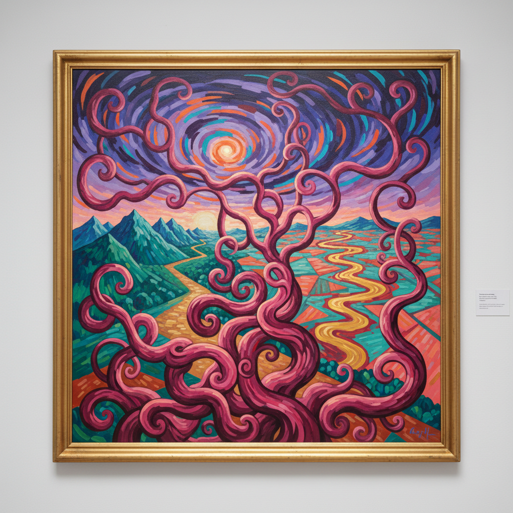

# Shara Hughes 莎拉·休斯

> **时期：** 1981–至今  
> **关键词：** 想象风景、野兽派色彩、内在地形、当代风景画

## 概述

Shara Hughes 是美国当代画家，以完全来自想象的风景画闻名。她的作品不描绘任何真实地点，而是将内在情感状态转化为色彩浓烈的地形——扭曲的树木、发光的天空、不可能的水面——融合了野兽派的色彩自由和表现主义的情感强度。

## 风格特征

- **想象风景**：所有场景来自内心而非观察，拒绝写生传统
- **野兽派色彩**：大胆使用非自然色彩——粉红树木、紫色天空、橙色水面
- **多视角并置**：同一画面中混合俯视、平视和仰视，空间逻辑自由
- **装饰性线条**：树枝和植物以装饰性的曲线呈现，如同新艺术运动的回响
- **画中画**：画面边缘常出现框架或窗户结构，暗示观看的多重层次

## 代表作品

- *Landscape for the People*（2017，惠特尼双年展）
- *Day Dream*（2019）
- *The Divide*（2020）
- *Luna*（2018）

## 历史意义

Hughes 重新激活了风景画这一"过时"的类型，证明了在摄影和数字图像时代，绘画的风景仍然可以提供独特的视觉体验——不是记录世界的样子，而是创造世界可能的样子。

## 概念图

