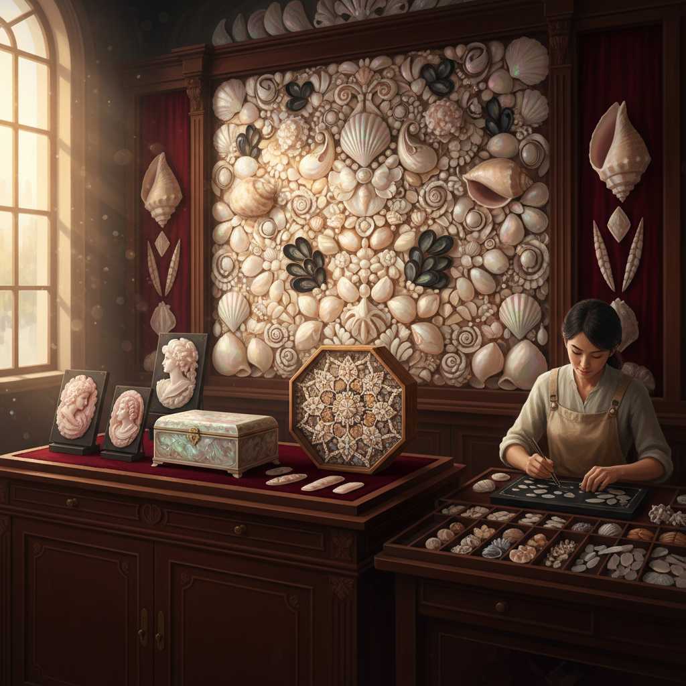

# Shell Art 贝壳艺术

> "Shells are the architecture of the sea — each one a house built by a soft creature that never studied engineering, yet produced structures of mathematical perfection. The spiral of a nautilus follows the golden ratio, the iridescence of abalone contains every color in the spectrum, and the hinged symmetry of a bivalve is a lesson in mechanical design. When an artist works with shells, they are collaborating with millions of years of evolution." — Unknown

## 概述

贝壳艺术（Shell Art）是以贝壳为主要材料或创作载体的艺术形式——利用贝壳的天然形态、色彩、光泽和纹理进行艺术创作。贝壳艺术涵盖从精细的贝雕到大型贝壳镶嵌装饰的广泛实践。

贝壳艺术的实践包括：1）贝雕——在贝壳上进行精细雕刻（浮雕贝壳cameo）；2）螺钿——将贝壳片镶嵌在漆器、家具或乐器表面；3）贝壳马赛克——用贝壳碎片拼贴成图案；4）贝壳首饰——用贝壳制作的项链、耳环等饰品；5）贝壳建筑装饰——用贝壳装饰建筑表面（如贝壳洞穴grotto）；6）贝壳拼贴——用完整贝壳组合成图案或雕塑；7）珍珠母艺术——利用珍珠母层的虹彩效果。

## 核心特征

| 特征 | 描述 |
|------|------|
| 虹彩 | 珍珠母的虹彩光泽 |
| 螺旋 | 天然的螺旋形态 |
| 坚硬 | 碳酸钙的硬度 |
| 多样 | 形态色彩极其多样 |
| 海洋 | 海洋的象征 |
| 古老 | 最古老的装饰材料之一 |

## 视觉特征

- **虹彩**：珍珠母的彩虹光泽
- **粉白**：贝壳的天然粉白色
- **螺旋**：螺旋和曲线形态
- **光滑**：打磨后的光滑表面
- **纹理**：生长线的天然纹理
- **层次**：多层镶嵌的深度

## 代表作品

| 作品 | 艺术家 | 年代 | 意义 |
|------|--------|------|------|
| *Shell cameos* | 意大利传统 | 文艺复兴至今 | 贝壳浮雕 |
| *Mother-of-pearl inlay* | 中东/东亚传统 | 古代至今 | 螺钿镶嵌 |
| *Shell Grotto, Margate* | Unknown | 约1835 | 贝壳洞穴 |
| *Sailor's valentines* | 水手传统 | 19世纪 | 贝壳拼贴 |
| *Contemporary shell art* | Various | 当代 | 当代贝壳艺术 |

## 历史时间线

| 时期 | 事件 |
|------|------|
| 10万年前 | 最早的贝壳装饰品 |
| 古代 | 贝壳货币和装饰 |
| 文艺复兴 | 意大利贝壳浮雕 |
| 维多利亚时代 | 贝壳收藏和工艺热潮 |
| 当代 | 贝壳作为当代艺术媒介 |

## 中国语境

贝壳艺术在中国有极其辉煌的传统。中国的螺钿工艺（将贝壳片镶嵌在漆器表面）是世界上最精美的贝壳艺术形式之一——唐代的螺钿漆器已达到极高水平，宋代更是发展出"薄螺钿"技法，将贝壳片磨至极薄再镶嵌。中国传统的贝雕以广东、浙江为代表，能在贝壳上雕出精细的人物和山水。中国古代的"贝币"——用贝壳作为货币——反映了贝壳在中国文化中的重要地位（"贝"字旁的汉字多与财富有关）。中国当代的螺钿艺术家将传统工艺与现代设计结合，创作出融合传统美学与当代审美的作品。

## AI生成概念图

## 与其他风格的关系

- **Mosaic Art** → 马赛克艺术
- **Lacquer Art** → 漆艺术
- **Jewelry Art** → 首饰艺术
- **Cameo Art** → 浮雕艺术
- **Marine Art** → 海洋艺术
- **Pearl Art** → 珍珠艺术

---

*浮光艺志 | Chronicle of Artistry*
