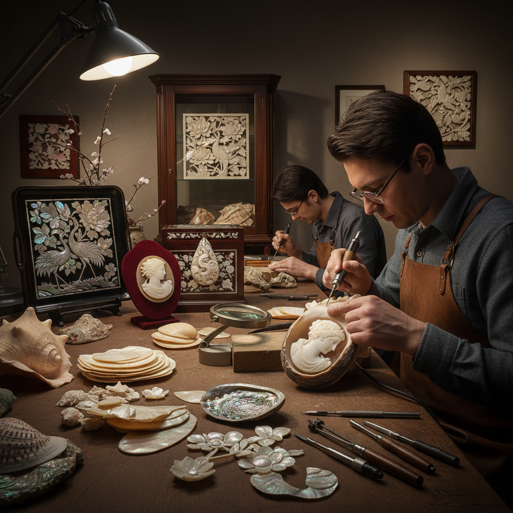

# Shell Carving 贝雕

> "Shell carving captures the ocean's palette in miniature — the natural iridescence and layered colors of shell become the artist's canvas, each cut revealing a new stratum of pearlescent beauty." — Unknown

## 概述

贝雕（Shell Carving）是在贝壳上进行雕刻、浮雕和镶嵌的工艺。贝雕使用的材料包括：珍珠母贝（mother of pearl）、�的鲍鱼壳（abalone）、海螺壳（conch）、砗磲（giant clam）、河蚌壳等各种贝壳。贝壳的独特之处在于其天然的虹彩光泽（iridescence）和层状结构——不同深度的切割会露出不同颜色的层次。

贝雕的技法包括：浮雕（cameo carving，利用贝壳的多色层次雕刻出浮雕）、透雕（pierced carving）、平面雕刻、镶嵌（inlay，将贝壳片镶嵌到木器或漆器中）和拼贴。贝雕作品包括：首饰（浮雕胸针、吊坠）、装饰品、镶嵌家具、螺钿漆器、宗教物品等。

## 核心特征

| 特征 | 描述 |
|------|------|
| 贝壳 | 使用各种贝壳 |
| 虹彩 | 天然的虹彩光泽 |
| 层次 | 利用层状结构 |
| 精细 | 极其精细的雕刻 |
| 镶嵌 | 可用于镶嵌 |
| 多色 | 天然的多色层次 |

## 视觉特征

- **虹彩**：珍珠般的虹彩光泽
- **层次**：多色的层次变化
- **精细**：极精细的雕刻
- **光泽**：天然的光泽
- **半透明**：薄处呈半透明
- **优雅**：优雅精致的美感

## 代表作品

| 作品 | 艺术家 | 年代 | 意义 |
|------|--------|------|------|
| *Italian shell cameos* | 匿名 | 文艺复兴起 | 意大利贝壳浮雕 |
| *Mother of pearl inlay* | 匿名 | 传统 | 珍珠母贝镶嵌 |
| *Raden lacquerware* | 日本工匠 | 传统 | 螺钿漆器 |
| *Chinese shell carving* | 中国工匠 | 传统 | 中国贝雕 |
| *Contemporary shell art* | Various | 当代 | 当代贝雕艺术 |

## 历史时间线

| 时期 | 事件 |
|------|------|
| 史前 | 贝壳作为装饰品 |
| 古代 | 各文明的贝壳加工 |
| 文艺复兴 | 意大利贝壳浮雕的繁荣 |
| 传统 | 东亚螺钿工艺的精致化 |
| 19世纪 | 维多利亚时代贝壳首饰 |
| 当代 | 贝雕作为当代艺术 |

## 中国语境

贝雕在中国有着极其悠久和辉煌的传统。中国的螺钿工艺（将贝壳片镶嵌到漆器、家具中）是世界上最精美的贝壳装饰技法之一——可追溯到商周时期。中国的贝雕主要产地包括：北海（广西）、青岛（山东）、大连（辽宁）等沿海城市。中国的贝雕作品以精细的浮雕和镶嵌著称——传统题材包括花鸟、人物、山水、吉祥图案等。北海贝雕、青岛贝雕等被列为非物质文化遗产。中国的螺钿漆器（如扬州漆器）是国家级非物质文化遗产。

## AI生成概念图

## 与其他风格的关系

- **Cameo** → 浮雕宝石
- **Mother of Pearl Inlay** → 珍珠母贝镶嵌
- **Raden/螺钿** → 螺钿
- **Bone Carving** → 骨雕
- **Jade Carving** → 玉雕
- **Lacquerware** → 漆器

---

*浮光艺志 | Chronicle of Artistry*
