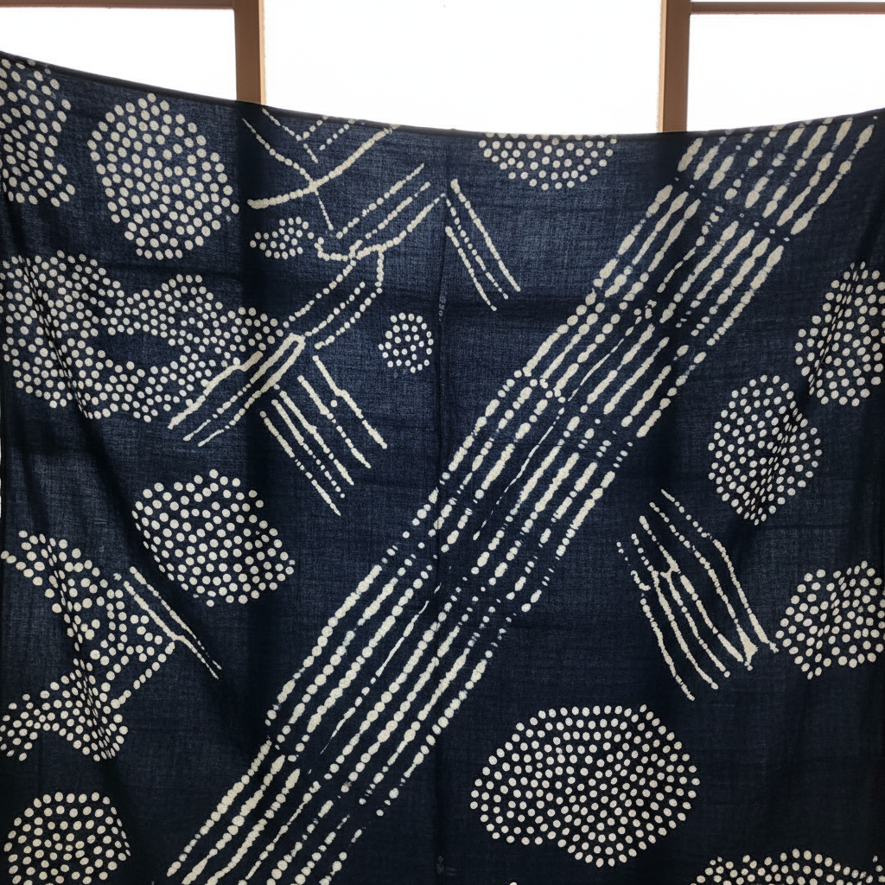

# Shibori Art 绞缬染色艺术

> "Shibori is resistance made visible — fabric is bound, stitched, folded, twisted, or compressed before dyeing so that the dye cannot reach certain areas, creating patterns that emerge only when the bindings are released. It is the art of controlled unpredictability, where the maker sets up conditions but the indigo makes the final decision. Each piece carries the memory of its compression in every fold and crease of color." — Unknown

## 概述

绞缬染色艺术（Shibori Art）是一种源自日本的传统扎染技法——通过绑扎、缝合、折叠、扭转或夹压织物来阻止染料渗透，从而在织物上形成独特的图案。Shibori（日语"絞り"）是世界上最精致和多样化的防染技法体系，包含数十种不同的绑扎和折叠方法，每种都能产生独特的纹样效果。

绞缬染色艺术的实践包括：1）Kanoko——绑扎小点形成鹿子纹；2）Miura——用钩针挑起织物绑扎；3）Kumo——蜘蛛网状绑扎；4）Nui——缝合防染；5）Arashi——将织物缠绕在柱子上的暴风纹；6）Itajime——板夹防染；7）当代绞缬——将传统技法与现代设计结合的创作。

## 核心特征

| 特征 | 描述 |
|------|------|
| 防染 | 物理阻止染料渗透 |
| 偶然 | 可控的偶然性 |
| 靛蓝 | 传统使用靛蓝染料 |
| 手工 | 完全手工操作 |
| 多样 | 数十种技法变化 |
| 日本 | 源自日本的传统 |

## 视觉特征

- **蓝白**：经典的靛蓝与白色对比
- **有机**：有机自然的图案
- **渐变**：染料渗透的渐变效果
- **纹理**：织物折叠的纹理记忆
- **重复**：规律性的重复图案
- **偶然**：每件作品的偶然独特性

## 代表作品

| 作品 | 艺术家/文化 | 年代 | 意义 |
|------|-------------|------|------|
| *Arimatsu shibori* | 日本有松 | 17世纪至今 | 有松绞缬传统 |
| *Kanoko shibori kimono* | 日本 | 江户时代 | 鹿子绞和服 |
| *Indigo shibori textiles* | 日本 | 传统 | 靛蓝绞缬织物 |
| *Contemporary shibori art* | 国际 | 当代 | 当代绞缬艺术 |
| *Shibori fashion* | 国际 | 当代 | 绞缬时装设计 |

## 历史时间线

| 时期 | 事件 |
|------|------|
| 8世纪 | 日本正仓院收藏最早的绞缬 |
| 江户时代 | 有松绞缬的繁荣 |
| 明治时代 | 工业化对传统的冲击 |
| 1970年代 | 西方纤维艺术界的重新发现 |
| 当代 | 绞缬的全球化和艺术化 |

## 中国语境

绞缬染色在中国有极其悠久的传统。中国的扎染（绞缬）可追溯到东汉时期——是中国传统三大印染技法之一（与蜡染、夹缬并列）。中国云南大理的白族扎染是国家级非物质文化遗产——以蓝白色调的蝴蝶、花卉图案著称。中国的扎染传统与日本绞缬有历史渊源——唐代的绞缬技法传入日本后发展出独特的体系。中国当代的纤维艺术家将传统扎染与现代设计结合——在时装和室内设计中广泛应用。中国的贵州苗族也有丰富的扎染传统——与蜡染并列为苗族重要的染色工艺。中国的美术院校中，扎染作为纤维艺术的重要课程——培养学生对传统染色工艺的理解和创新。

## AI生成概念图

## 与其他风格的关系

- **Tie-dye** → 扎染
- **Batik** → 蜡染
- **Indigo Dyeing** → 靛蓝染色
- **Textile Art** → 纺织艺术
- **Resist Dyeing** → 防染技法
- **Japanese Craft** → 日本工艺

---

*浮光艺志 | Chronicle of Artistry*
