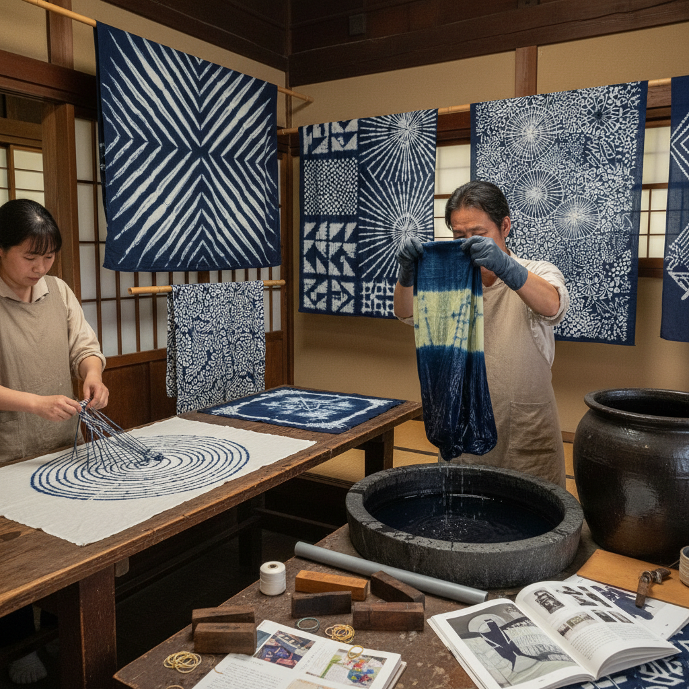

# Shibori Dyeing 绞缬染色

> "Shibori is the art of controlled resistance — fabric bound, stitched, folded, and clamped before submersion in dye, creating patterns born from the tension between what is revealed and what is concealed, between order and the beautiful accidents of indigo." — Unknown

## 概述

绞缬染色（Shibori Dyeing）是一种源自日本的传统织物染色技法——通过折叠、扭绞、捆绑、缝缀、夹压等方式对织物进行物理处理，使部分区域在染色时无法接触染料，从而形成独特的图案。"Shibori"源自日语动词"shiboru"（绞、拧），涵盖了多种不同的防染技法。

绞缬染色包括多种子技法：扎染（kanoko shibori，用线绑扎）、缝绞（nui shibori，用针线缝缀后抽紧）、板缔（itajime shibori，用木板夹压）、柱绞（arashi shibori，缠绕在柱子上）、蜘蛛绞（kumo shibori，用线缠绕形成蜘蛛网状）等。绞缬染色的历史可追溯到数千年前——在日本、中国、印度、非洲等地都有悠久的传统。日本的绞缬在8世纪的正仓院宝物中已有精美的实物。

## 核心特征

| 特征 | 描述 |
|------|------|
| 防染 | 物理防染原理 |
| 折叠 | 折叠、扭绞、捆绑 |
| 偶然 | 部分偶然效果 |
| 多样 | 多种子技法 |
| 传统 | 悠久的传统 |
| 手工 | 完全手工操作 |

## 视觉特征

- **有机**：有机的图案
- **对称**：折叠产生的对称
- **渐变**：染料渗透的渐变
- **纹理**：织物的纹理感
- **蓝白**：经典的蓝白配色
- **独特**：每件都独一无二

## 代表作品

| 作品 | 艺术家 | 年代 | 意义 |
|------|--------|------|------|
| *正仓院绞缬* | 日本工匠 | 8世纪 | 最早的日本绞缬实物 |
| *有松�的绞缬* | 有松工匠 | 江户时代 | 有松绞缬传统 |
| *Contemporary shibori* | Various | 当代 | 当代绞缬艺术 |
| *Shibori fashion* | Issey Miyake | 当代 | 时尚中的绞缬 |
| *Shibori art textiles* | Various | 当代 | 绞缬艺术纺织品 |

## 历史时间线

| 时期 | 事件 |
|------|------|
| 古代 | 绞缬技法的起源 |
| 8世纪 | 日本正仓院的绞缬宝物 |
| 江户时代 | 有松绞缬的繁荣 |
| 明治时代 | 绞缬的工业化挑战 |
| 20世纪 | 绞缬的艺术复兴 |
| 当代 | 绞缬在时尚和艺术中的全球传播 |

## 中国语境

绞缬在中国有极其悠久的历史——中国是绞缬技法的重要发源地之一。中国的"扎染"（tie-dye）传统与日本的绞缬同源。中国云南大理的白族扎染是国家级非物质文化遗产——以蓝白色调的板蓝根染色闻名。中国的贵州苗族也有精美的绞缬传统。中国的当代纺织艺术家和时尚设计师在创作中融合传统绞缬技法。中国的美术学院纺织设计专业教授绞缬作为基础染色技法。

## AI生成概念图

## 与其他风格的关系

- **Indigo Dyeing** → 靛蓝染色
- **Batik** → 蜡染
- **Tie-Dye** → 扎染
- **Resist Dyeing** → 防染
- **Textile Art** → 纺织艺术
- **Japanese Craft** → 日本工艺

---

*浮光艺志 | Chronicle of Artistry*
