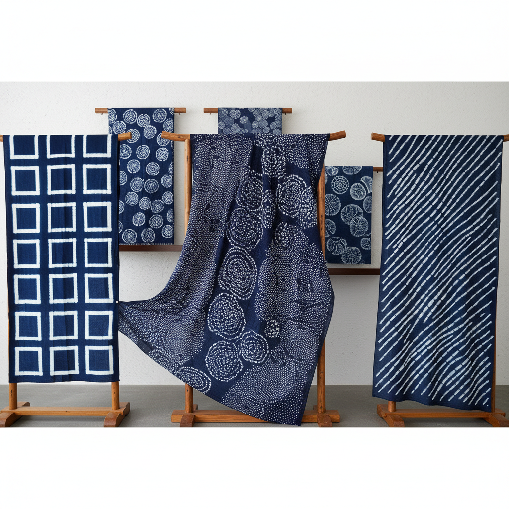

# Shibori 绞缬染

> "Shibori is the art of controlled resistance — binding, folding, and twisting to create patterns that surprise." — Unknown

## 概述

绞缬染（Shibori/絞り）是日本传统的扎染技法——通过绑扎、缝缀、折叠、夹压等方式对织物进行物理抵抗处理，再浸入染料中，使被抵抗的部分不着色，从而形成精美的图案。Shibori比普通扎染更加精细和多样——它包含了数十种不同的技法，每一种都能创造独特的视觉效果。

绞缬染的魅力在于"抵抗与渗透"的对话——你控制了一部分，但染料总会找到自己的路径，创造出意料之外的美。

## 核心特征

| 特征 | 描述 |
|------|------|
| 抵抗 | 物理抵抗染料渗透 |
| 多技法 | 绑、缝、折、夹等多种方法 |
| 靛蓝 | 传统上以靛蓝为主 |
| 偶然 | 部分不可预测的效果 |
| 手工 | 完全手工操作 |
| 立体 | 三维操作产生二维图案 |

## 视觉特征

- **蓝白**：传统的靛蓝与白色
- **有机**：自然有机的图案边缘
- **重复**：重复的图案单元
- **渐变**：染料渗透的渐变效果
- **质感**：织物的褶皱质感
- **不规则**：手工的不规则美感

## 代表作品

| 作品 | 艺术家 | 年代 | 意义 |
|------|--------|------|------|
| *Arimatsu shibori* | 有松工匠 | 1608+ | 有松绞缬的传统 |
| *Kanoko shibori* | 匿名 | 传统 | 鹿子绞——最精细的绞缬 |
| *Itajime shibori* | 匿名 | 传统 | 板缔——几何绞缬 |
| *Contemporary shibori* | Various | 2000s+ | 当代绞缬艺术 |
| *Fashion shibori* | Issey Miyake等 | 1990s+ | 时装中的绞缬 |

## 历史时间线

| 时期 | 事件 |
|------|------|
| 古代 | 各文明的早期扎染 |
| 8世纪 | 日本正仓院的绞缬织物 |
| 1608 | 有松绞缬的确立 |
| 江户时代 | 绞缬的黄金时代 |
| 20世纪 | 绞缬的衰落和复兴 |
| 当代 | 绞缬在时装和艺术中的复兴 |

## 中国语境

绞缬染在中国有悠久的历史——中国的"绞缬"可追溯到秦汉时期，是中国传统染色"三缬"（绞缬、蜡缬、夹缬）之一。云南大理白族的扎染是中国绞缬的代表，被列为国家级非物质文化遗产。中国的绞缬传统与日本shibori有历史渊源——日本绞缬很可能受到了中国唐代绞缬的影响。

## AI生成概念图

## 与其他风格的关系

- **Batik** → 蜡染与绞缬是姐妹技法
- **Tie-Dye** → 扎染是绞缬的简化版本
- **Textile Art** → 纺织艺术的重要分支
- **Indigo Dyeing** → 靛蓝染色是绞缬的传统搭配
- **Fashion** → 时装中的绞缬应用
- **Folk Art** → 民间艺术的染色传统

---

*浮光艺志 | Chronicle of Artistry*
