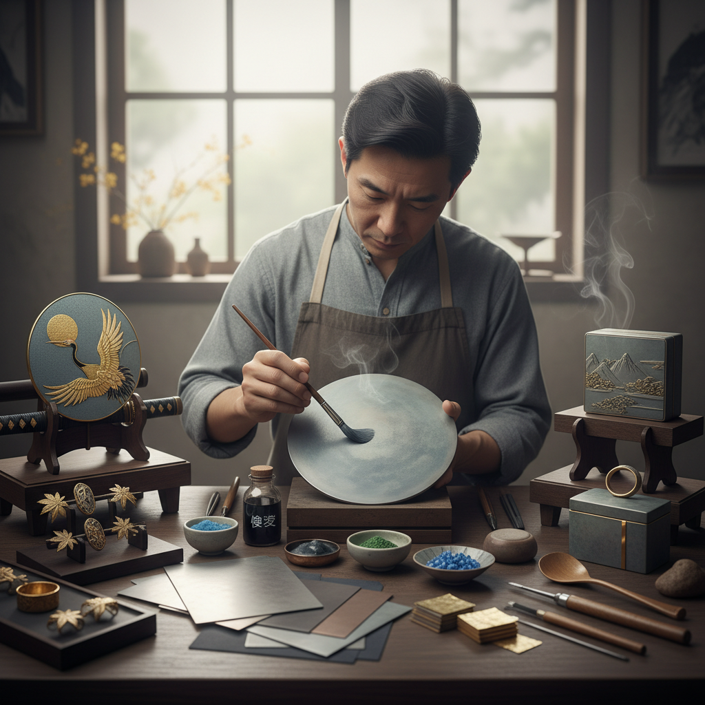

# Shibuichi Art 四分一艺术

> "Shibuichi — 'one-quarter' — is a Japanese alloy of silver and copper that patinates to an extraordinary range of grey-blue-green tones impossible to achieve with any other metal. Named for its traditional ratio of one part silver to three parts copper, shibuichi was the secret weapon of Japanese sword-fitting artists who used its subtle, muted colors as a foil for gold and shakudo inlays, creating miniature landscapes of astonishing depth on tsuba and kozuka." — Unknown

## 概述

四分一艺术（Shibuichi Art）是使用日本传统合金"四分一"（银铜合金）进行创作的金属工艺艺术——四分一合金因其独特的灰蓝绿色调和丰富的着色可能性而在日本金属工艺中占有特殊地位。传统配比为四分之一银、四分之三铜，但实际比例可以变化以获得不同色调。

四分一艺术的实践包括：1）刀装具——日本刀的�的鍔、小柄等配件；2）着色技法——通过化学着色获得不同灰蓝绿色调；3）镶嵌——与金、赤铜等金属的色彩搭配；4）当代珠宝——利用四分一独特色调的现代首饰；5）雕金——在四分一表面的精细雕刻；6）象嵌——将其他金属嵌入四分一基体。

## 核心特征

| 特征 | 描述 |
|------|------|
| 色调 | 独特的灰蓝绿色调 |
| 着色 | 丰富的化学着色 |
| 微妙 | 极其微妙的色彩变化 |
| 配合 | 与其他金属的色彩配合 |
| 日本 | 日本独有的合金传统 |
| 高雅 | 含蓄高雅的审美 |

## 视觉特征

- **灰蓝**：独特的灰蓝色调
- **微妙**：极其微妙的色彩变化
- **哑光**：柔和的哑光表面
- **对比**：与金色的优雅对比
- **深度**：着色层的深度感
- **自然**：类似自然石材的质感

## 代表作品

| 作品 | 艺术家/文化 | 年代 | 意义 |
|------|-------------|------|------|
| *Edo period tsuba* | 江户时代 | 17-19世纪 | 刀装具四分一 |
| *Goto school works* | 後藤家 | 15-19世纪 | 後藤派金工 |
| *Nara school metalwork* | 奈良派 | 17-18世纪 | 奈良派金工 |
| *Contemporary shibuichi jewelry* | 当代 | 当代 | 当代四分一珠宝 |
| *Mixed metal vessels* | 当代工艺 | 当代 | 混合金属器皿 |

## 历史时间线

| 时期 | 事件 |
|------|------|
| 室町时代 | 四分一合金的早期使用 |
| 江户时代 | 刀装具四分一的黄金时代 |
| 明治维新 | 从刀装具到装饰品的转型 |
| 20世纪 | 西方金属工艺界的发现 |
| 当代 | 四分一在全球珠宝界的应用 |

## 中国语境

四分一艺术虽然是日本特有的金属工艺传统，但与中国有文化关联。中国古代的青铜合金技术是东亚金属工艺的源头——日本的金属合金传统受到中国大陆技术的影响。中国传统的"乌铜走银"工艺与四分一有相似之处——都是利用铜合金的特殊着色效果。中国云南的乌铜走银是国家级非物质文化遗产——其黑色铜合金基体与银丝镶嵌的对比效果与四分一和金的搭配有异曲同工之妙。中国当代的一些金属工艺师开始学习和实践四分一技法——将其与中国传统金属工艺结合。中国的珠宝设计教育中，日本金属着色技法（包括四分一的着色）被纳入一些高级课程——作为拓展金属色彩表现力的手段。

## AI生成概念图

## 与其他风格的关系

- **Shakudo** → 赤铜艺术
- **Mokume-gane** → 木目金艺术
- **Japanese Metalwork** → 日本金工
- **Jewelry Art** → 珠宝艺术
- **Patina Art** → 铜绿艺术
- **Inlay Art** → 镶嵌艺术

---

*浮光艺志 | Chronicle of Artistry*
