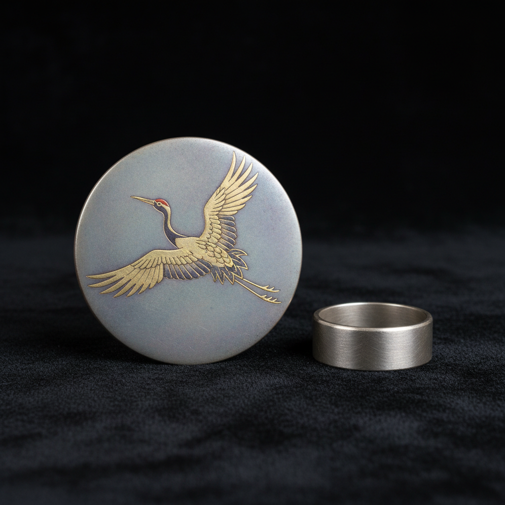

# Shibuichi 四分一

> "Shibuichi is the color of moonlight on water — a silver that remembers copper." — Unknown

## 概述

四分一（Shibuichi，日语"四分之一"）是一种日本传统的铜银合金——传统配比为银占四分之一、铜占四分之三（实际比例可变）。这种合金的独特之处在于经过化学着色（煮色）处理后，可以呈现出从银灰到深灰、从淡紫到暗绿的丰富色调，这些微妙的灰色调是任何单一金属无法实现的。四分一主要用于日本刀剑装具（tsuba、menuki等）和当代金属艺术，是日本金属工艺中最具诗意的材料之一。

四分一的美学在于：中间色的诗意——它既不是银的明亮也不是铜的温暖，而是介于两者之间的无数微妙灰调。

## 核心特征

| 特征 | 描述 |
|------|------|
| 合金 | 铜银合金 |
| 灰调 | 独特的灰色调 |
| 煮色 | 化学着色处理 |
| 微妙 | 微妙的色彩变化 |
| 日本 | 日本传统材料 |
| 配比 | 不同配比不同色调 |

## 视觉特征

- **灰色**：独特的银灰色调
- **微妙**：极其微妙的色彩
- **柔和**：柔和的金属光泽
- **深沉**：深沉内敛的质感
- **变化**：随配比变化的色调
- **月光**：如月光般的冷灰色

## 代表作品

| 作品 | 艺术家 | 年代 | 意义 |
|------|--------|------|------|
| *Edo period tsuba* | 匿名 | 江户时代 | 刀镡中的四分一 |
| *Sword fittings* | 匿名 | 17-19世纪 | 刀剑装具 |
| *Contemporary jewelry* | Various | 当代 | 当代四分一珠宝 |
| *Mixed metal vessels* | Various | 当代 | 混合金属器物 |
| *Mokume-gane layers* | Various | 当代 | 木目金中的四分一层 |

## 历史时间线

| 时期 | 事件 |
|------|------|
| 室町时代 | 四分一合金的发展 |
| 江户时代 | 刀剑装具中的广泛应用 |
| 明治时代 | 废刀令后的衰落 |
| 20世纪 | 西方金属工艺师的重新发现 |
| 当代 | 当代珠宝和金属艺术中的应用 |

## 中国语境

四分一合金在中国传统金属工艺中没有直接对应，但中国古代的"白铜"（铜镍合金）在色调上有类似的银灰效果。中国传统的铜合金种类丰富——青铜、黄铜、白铜等各有不同的色彩特性。当代中国的金属工艺师正在学习日本的煮色技法，将四分一等日本传统合金融入自己的创作。

## AI生成概念图

## 与其他风格的关系

- **Shakudo** → 赤铜是另一种日本装饰合金
- **Mokume-gane** → 木目金中使用四分一
- **Tsuba** → 刀镡装饰材料
- **Japanese Metalwork** → 日本金属工艺
- **Patina** → 化学着色的相关技法
- **Jewelry** → 当代珠宝应用

---

*浮光艺志 | Chronicle of Artistry*
