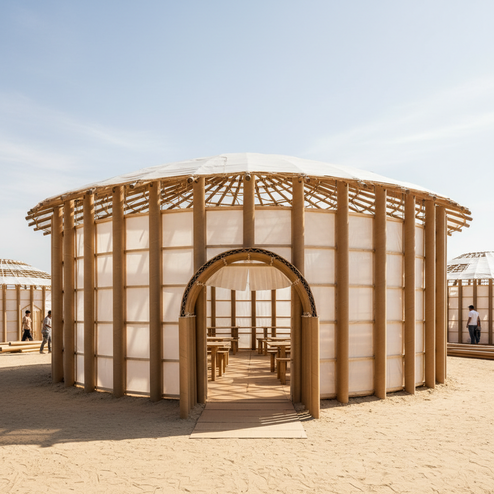

# Shigeru Ban 坂茂

> **时期：** 1957–至今  
> **关键词：** 纸管建筑、灾难救援、轻质结构、人道主义

## 概述

Shigeru Ban 是日本建筑师，以用纸管、纸板和回收材料建造建筑而闻名。他将这些"弱材料"用于灾后临时住所和永久性公共建筑——证明建筑的力量不在于材料的昂贵，而在于创意和对人的关怀。

## 风格特征

- **纸管结构**：用工业纸管作为主要结构材料
- **灾难建筑**：为地震、海啸灾民设计临时住所
- **轻质与透明**：建筑轻盈、通透、可快速搭建
- **材料实验**：纸、竹、集装箱等非常规材料
- **人道主义**：建筑服务于最需要帮助的人

## 代表作品

- *纸教堂*（1995，神户）
- *蓬皮杜梅斯分馆*（2010）
- *纸管临时住宅*（多个灾区）
- *苏黎世Tamedia办公楼*（2013）

## 概念图

