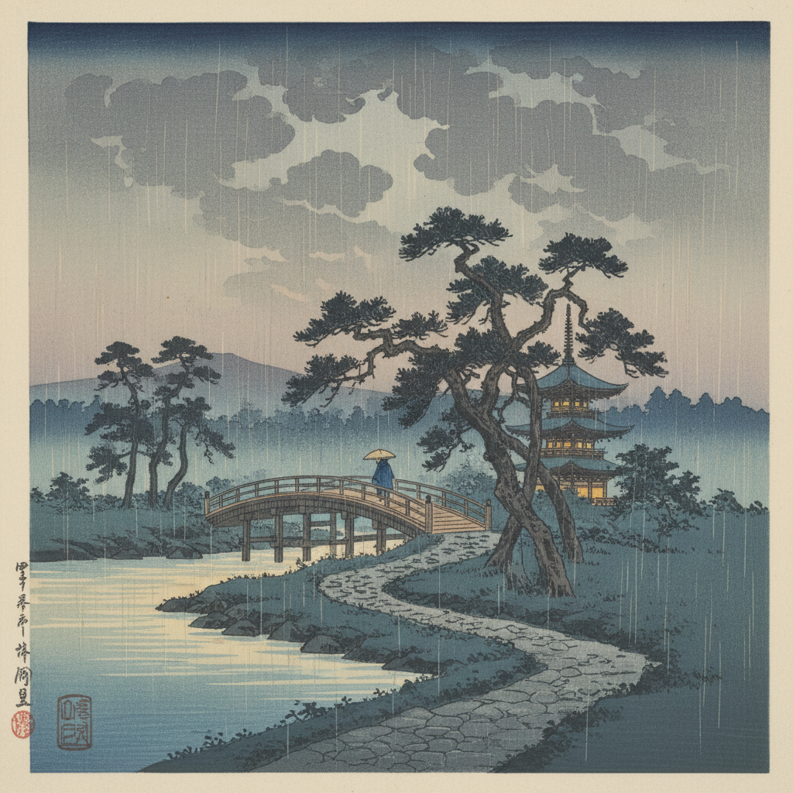

# Shin-Hanga 新版画

> **时期：** 1915年–1960年代  
> **关键词：** 传统木版画、西方光影、风景美人、渡边�的版画店、日本印象派

## 概述

Shin-Hanga（新版画）是20世纪初日本版画的革新运动，由出版商渡边庄三郎推动。它保留了浮世绘的传统木版画分工制度（画师-雕师-摺师），同时引入西方绘画的光影效果、透视法和写实技巧，创造出一种融合东西方美学的精致版画风格，尤其以风景和美人画著称。

## 风格特征

- **光影效果**：西方式的明暗对比和氛围光
- **传统技法**：木版水印的多层套色
- **写实倾向**：比浮世绘更接近真实的描绘
- **氛围营造**：雨、雪、月光、黄昏的诗意表现
- **精致印刷**：极高的技术品质和限量发行

## 代表人物与作品

- 川�的�的�的濑巴水《东京二十景》
- 桥口五叶《浴后之女》
- 吉田博《帆船》系列
- 伊东深水《美人画》系列

## 概念图

