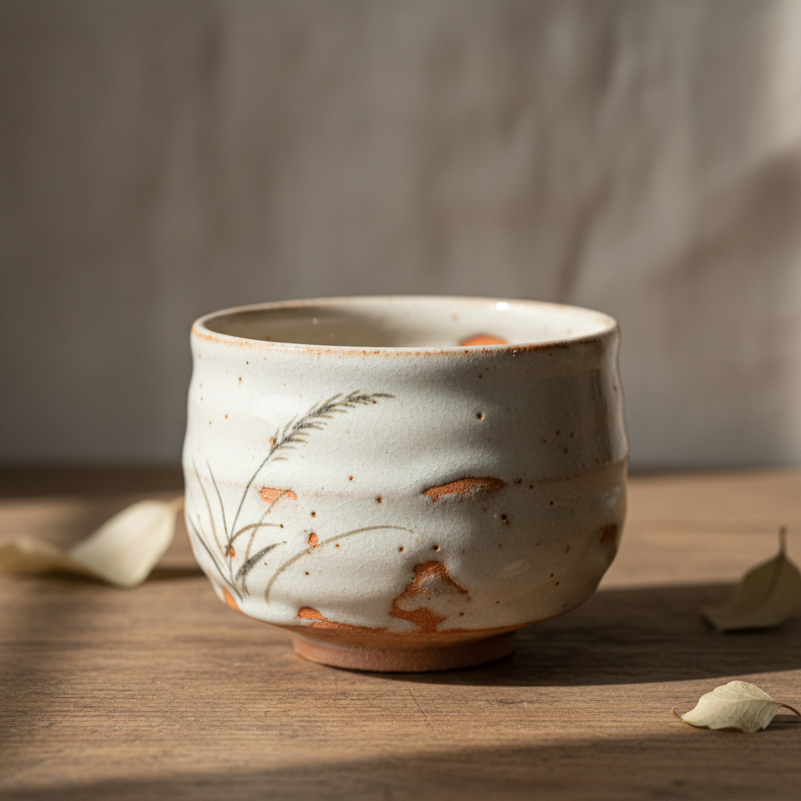

# Shino Art 志野烧艺术

> "Shino is the warmth of a winter hearth made ceramic — thick white feldspathic glaze applied generously over iron-painted brushwork, fired slowly in the anagama until the surface blushes with fire-color where the glaze thins, revealing the orange of scorched earth beneath milky snow, each piece carrying the memory of flame in its skin like a landscape seen through morning fog." — Unknown

## 概述

志野烧艺术（Shino Art）是日本桃山时代（16世纪末）在美浓地区发展出的一种独特陶瓷风格。志野烧以其厚重的白色长石釉、釉下铁绘装饰和火色（緋色）效果著称——厚釉处呈现温暖的乳白色，薄釉处透出坯体的橙红色，形成独特的"火色"美感。志野烧是日本茶道美学的重要载体，体现了侘寂（wabi-sabi）精神。

志野烧艺术的核心要素包括：1）长石釉——厚重的白色长石质釉料；2）铁绘——釉下用铁料绘制的简笔装饰；3）火色——薄釉处透出的橙红色效果；4）针孔——釉面上的细小气孔形成质感；5）造型——自由不拘的手捏造型；6）茶碗——志野烧最经典的器形；7）慢烧——长时间缓慢烧制形成独特效果。

## 核心特征

| 特征 | 描述 |
|------|------|
| 厚白釉 | 厚重温暖的白色长石釉 |
| 火色 | 薄釉处透出的橙红色 |
| 铁绘 | 釉下简笔铁料装饰 |
| 针孔质感 | 釉面细小气孔的肌理 |
| 自由造型 | 不拘一格的手工成型 |
| 侘寂美学 | 不完美中的深邃之美 |

## 视觉特征

- **乳白色**：温暖厚重的白色釉面
- **橙红火色**：薄釉处的温暖色调
- **铁褐笔触**：简洁有力的铁绘装饰
- **针孔肌理**：釉面上的微小气孔
- **不规则形态**：自由随性的器形
- **温暖质感**：触感温润的表面

## 代表作品

| 作品 | 艺术家/窑口 | 年代 | 意义 |
|------|-------------|------|------|
| *卯花墙志野茶碗* | 美浓窑 | 桃山时代 | 国宝级志野茶碗 |
| *志野�的皿* | 美浓窑 | 16世纪 | 铁绘装饰典范 |
| *荒川丰藏志野作品* | 荒川丰藏 | 20世纪 | 志野复兴大师 |
| *加藤唐九郎志野* | 加藤唐九郎 | 20世纪 | 现代志野名家 |
| *�的皿志野向付* | 美浓窑 | 桃山时代 | 志野食器代表 |

## 历史时间线

| 时期 | 事件 |
|------|------|
| 16世纪末 | 志野烧在美浓地区诞生 |
| 桃山时代 | 志野烧的黄金时期 |
| 江户初期 | 志野烧逐渐衰落 |
| 1930年代 | 荒川丰藏重新发现志野古窑址 |
| 20世纪中期 | 志野烧的现代复兴 |
| 当代 | 志野烧在国际陶艺界的影响 |

## 中国语境

志野烧虽然是日本本土发展的陶瓷风格，但其长石釉技术与中国白瓷有渊源关系。中国的白釉瓷器——从邢窑到定窑——对日本陶瓷产生了深远影响。志野烧的铁绘技法也可追溯到中国磁州窑的铁绘传统。在中国当代陶艺界，志野烧作为日本茶陶的代表受到广泛关注和研究。中国陶艺家在学习志野烧技法的同时，也在探索将其与中国传统审美结合的可能性。志野烧所体现的"不完美之美"与中国文人审美中的"拙"有相通之处。

## AI生成概念图

## 与其他风格的关系

- **Oribe** → 织部烧
- **Tenmoku** → 天目釉
- **Wabi-Sabi** → 侘寂美学
- **Tea Ceremony** → 茶道
- **Anagama** → 穴窑烧制
- **Iron Painting** → 铁绘装饰

---

*浮光艺志 | Chronicle of Artistry*
