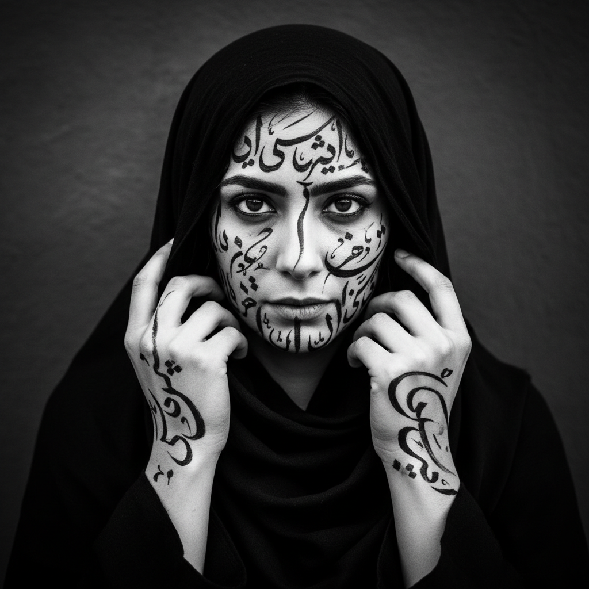

# Shirin Neshat 希琳·奈沙特

> **流派**: 当代艺术 · 摄影 · 视频艺术  
> **时期**: 1957–至今 伊朗/美国  
> **关键词**: 伊斯兰女性、书法与身体、双屏视频、流亡与身份

## 概述

希琳·奈沙特是当代最重要的伊朗裔艺术家之一。她的作品探索伊斯兰社会中的性别、权力和身份政治。她最著名的摄影系列将波斯书法直接书写在女性的面部、手掌和脚底上，将文字变成一种既是装饰又是禁锢的视觉隐喻。她的双屏视频装置则将男性与女性、公共与私密、东方与西方并置对照。

## 视觉特征

- **书法覆盖身体**: 波斯文字密密麻麻写在皮肤上
- **黑白对比**: 黑色面纱与白色皮肤的强烈反差
- **双屏对称**: 两个屏幕分别呈现男/女、内/外
- **眼神直视**: 被拍摄者直视镜头的力量感
- **武器与诗歌**: 枪支与书法诗句的并置

## 代表作品

- 《阿拉的女人》(Women of Allah, 1993–97) — 摄影系列
- 《狂喜》(Rapture, 1999) — 双屏视频
- 《动荡》(Turbulent, 1998) — 双屏视频，威尼斯金狮奖
- 《没有男人的女人》(Women Without Men, 2009) — 电影

## 历史影响

奈沙特为西方观众打开了理解伊斯兰世界复杂性的窗口，同时拒绝简单化的东方主义叙事。她证明了政治艺术可以同时具有极高的美学品质，身体可以成为文化冲突的战场。

## 相关风格

- [Video Art 视频艺术](video-art.md)
- [Feminist Art 女性主义艺术](feminist-art.md)
- [Contemporary Photography 当代摄影](contemporary-photography.md)
