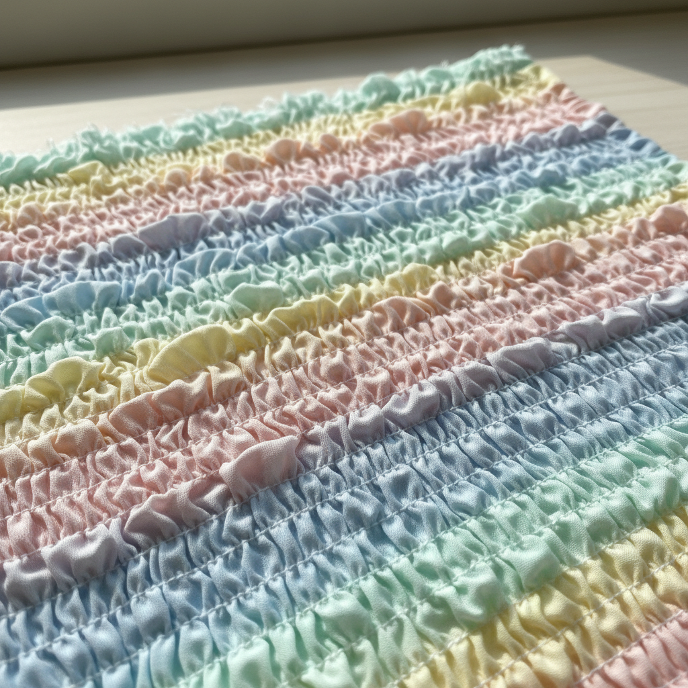

# Shirring Art 缩褶艺术

> "Shirring is controlled gathering — multiple rows of stitching draw fabric into even, elastic folds that stretch and release like an accordion. The technique transforms flat cloth into a textured, form-fitting surface without darts or seams, creating garments that breathe and move with the body while displaying rhythmic waves of gathered fabric." — Unknown

## 概述

缩褶艺术（Shirring Art）是一种通过在织物上缝制多排平行的收缩线（通常使用弹性线）来创造均匀褶皱效果的纺织技法。缩褶将平面织物转化为有弹性的、有纹理的表面——既是装饰性的也是功能性的，使服装能够贴合身体同时保持舒适的伸展性。

缩褶艺术的实践包括：1）弹性缩褶（Elastic Shirring）——使用弹性线在底线上缝制；2）线缩褶（Thread Shirring）——使用普通线拉紧收缩；3）管道缩褶——在管道状通道中穿入弹性带；4）华夫格缩褶（Waffle Shirring）——交叉方向的缩褶创造华夫格效果；5）装饰缩褶——将缩褶作为纯装饰元素；6）历史缩褶——维多利亚和爱德华时代的精细缩褶；7）当代缩褶——将传统技法与现代时装设计结合的创作。

## 核心特征

| 特征 | 描述 |
|------|------|
| 褶皱 | 均匀的收缩褶皱 |
| 弹性 | 可伸缩的弹性 |
| 平行 | 多排平行的缝线 |
| 贴合 | 贴合身体曲线 |
| 纹理 | 丰富的表面纹理 |
| 功能 | 装饰与功能兼具 |

## 视觉特征

- **波浪**：均匀的波浪褶皱
- **节奏**：有节奏的重复纹理
- **弹性**：可见的弹性伸缩
- **柔软**：柔软流动的质感
- **层次**：褶皱创造的层次感
- **立体**：平面变为立体的效果

## 代表作品

| 作品 | 艺术家/文化 | 年代 | 意义 |
|------|-------------|------|------|
| *Smocked garments* | 英国 | 维多利亚时代 | 维多利亚缩褶服装 |
| *1970s shirred tops* | 国际 | 1970年代 | 波西米亚风缩褶上衣 |
| *Issey Miyake pleats* | 日本 | 当代 | 三宅一生的褶皱设计 |
| *Contemporary shirring* | 国际 | 当代 | 当代缩褶时装 |
| *Elastic shirred dresses* | 国际 | 当代 | 弹性缩褶连衣裙 |

## 历史时间线

| 时期 | 事件 |
|------|------|
| 中世纪 | 早期收褶技法的使用 |
| 维多利亚时代 | 精细缩褶的流行 |
| 1920年代 | 弹性线的发明改变缩褶 |
| 1970年代 | 波西米亚风格中的缩褶复兴 |
| 当代 | 缩褶在现代时装中的应用 |

## 中国语境

缩褶技法在中国的服装制作中有一定的应用。中国传统服饰中的褶裥（如马面裙的褶）——虽然技法不同但追求类似的装饰效果。中国当代的服装设计中，缩褶作为一种造型手法——在休闲和时装设计中广泛使用。中国的服装教育中，缩褶作为基础的面料处理技法——在服装工艺课程中教授。中国的快时尚产业中，弹性缩褶——因其简单高效而被大量应用于女装生产。中国的独立设计师将缩褶与传统面料结合——创造出具有东方韵味的现代设计。

## AI生成概念图

## 与其他风格的关系

- **Smocking** → 烟褶绣
- **Pleating** → 褶裥艺术
- **Textile Art** → 纺织艺术
- **Fashion Design** → 时装设计
- **Gathering** → 收褶
- **Ruching** → 抽褶装饰

---

*浮光艺志 | Chronicle of Artistry*
