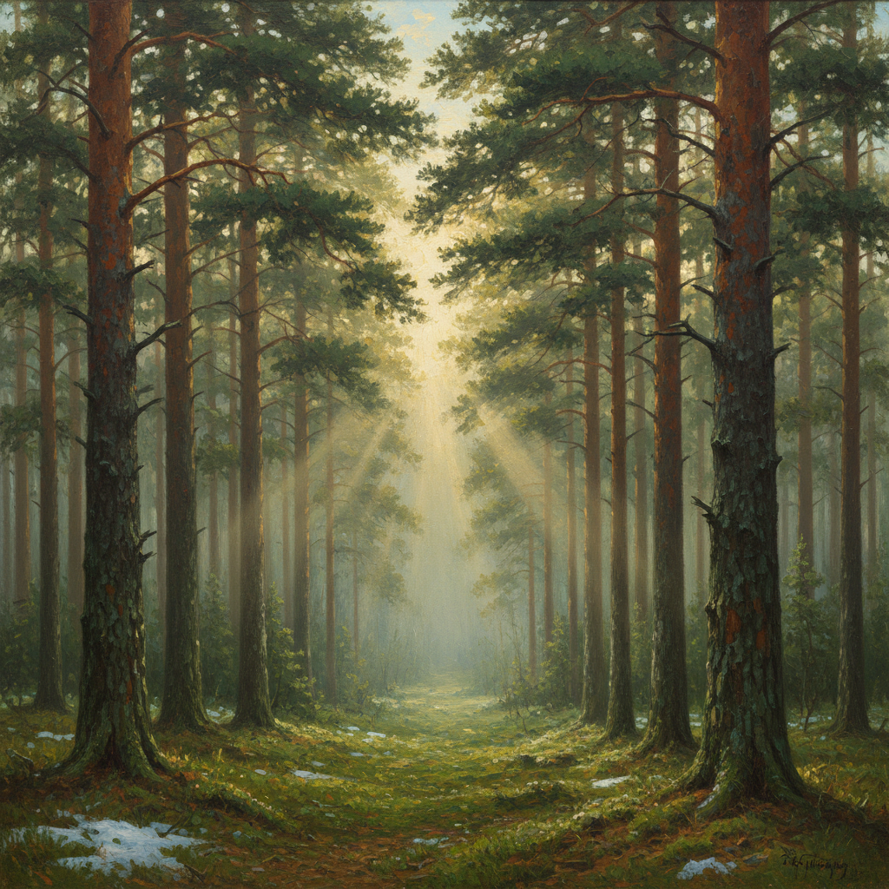

# Shishkin Art 希施金艺术

> "I am not a landscape painter, I am a naturalist." — Ivan Shishkin

## 概述

希施金艺术（Shishkin Art）是19世纪俄罗斯风景画大师伊万·伊万诺维奇·希施金（Ivan Ivanovich Shishkin, 1832-1898）创立的写实主义风景画风格。希施金被誉为"俄罗斯森林的歌手"——他以近乎科学的精确度描绘俄罗斯的森林、田野和自然景观，每一棵树、每一片叶子都清晰可辨。希施金是巡回展览画派（Peredvizhniki）的核心成员——他将对祖国大地的深沉热爱融入了极致写实的技法之中。

希施金的代表作《松树林的清晨》（1889）是俄罗斯最广为人知的画作之一——晨雾中的松林和嬉戏的熊（熊由康斯坦丁·萨维茨基绘制）构成了一幅充满诗意的自然画卷。他的其他杰作如《橡树林》《黑麦田》《船桅林》等，都以宏大的构图和精微的细节展现了俄罗斯自然的壮美。

希施金艺术的核心要素包括：1）极致写实——植物学级别的精确描绘；2）森林主题——以俄罗斯森林为核心题材；3）光影研究——阳光穿透树冠的效果；4）宏大构图——全景式的自然景观；5）民族情感——对俄罗斯大地的热爱；6）细节丰富——每一根松针都清晰可辨；7）科学精神——自然主义的观察方法。

## 核心特征

| 特征 | 描述 |
|------|------|
| 极致写实 | 植物学级别精确描绘 |
| 森林主题 | 以俄罗斯森林为核心 |
| 光影研究 | 阳光穿透树冠效果 |
| 宏大构图 | 全景式自然景观 |
| 民族情感 | 对俄罗斯大地的热爱 |
| 科学精神 | 自然主义观察方法 |

## 视觉特征

- **松林橡林**：高大挺拔的松树和橡树
- **光线穿透**：阳光穿过树冠的光柱效果
- **细节精微**：树皮纹理、苔藓、蕨类清晰可见
- **全景构图**：宽阔的全景式构图
- **绿色层次**：丰富的绿色层次变化
- **大气透视**：远近层次分明的空气感

## 代表作品

| 作品 | 年代 | 意义 |
|------|------|------|
| *松树林的清晨* (Morning in a Pine Forest) | 1889 | 最著名的作品 |
| *橡树林* (Oak Grove) | 1887 | 橡树的史诗 |
| *黑麦田* (Rye) | 1878 | 俄罗斯田野的象征 |
| *船桅林* (Mast-Tree Grove) | 1898 | 最后的杰作 |
| *雨后* (Rain in an Oak Forest) | 1891 | 光影的极致 |
| *松林* (Pine Forest) | 1872 | 早期代表作 |

## 历史时间线

| 时期 | 事件 |
|------|------|
| 1832年 | 出生于叶拉布加 |
| 1856-1860年 | 就读圣彼得堡美术学院 |
| 1860年代 | 留学德国和瑞士 |
| 1870年 | 加入巡回展览画派 |
| 1873年 | 获得教授头衔 |
| 1889年 | 创作《松树林的清晨》 |
| 1898年 | 在画架前去世 |

## 中国语境

希施金在中国有着深远的影响。20世纪50年代中苏友好时期，希施金的作品随苏联美术教育体系传入中国——他的写实风景画技法深刻影响了中国几代风景画家。中国美术院校的风景写生教学中，希施金的作品长期被作为范本——他对树木结构的精确描绘方法被中国画家广泛学习。希施金对自然的忠实态度与中国传统山水画的"师法自然"理念有相通之处——但他的方法更接近西方科学观察，而非中国画的意象表达。《松树林的清晨》在中国几乎家喻户晓——曾被大量印刷为装饰画和明信片。希施金证明了风景画可以达到与历史画同等的艺术高度——这一观念对中国当代风景油画的发展产生了重要影响。

## 真实作品

## 与其他风格的关系

- **Peredvizhniki** → 巡回展览画派
- **Levitan** → 列维坦（抒情风景）
- **Kuindzhi** → 库因芝（光影风景）
- **Savrasov** → 萨夫拉索夫（俄罗斯风景先驱）
- **Barbizon School** → 巴比松画派
- **Russian Realism** → 俄罗斯现实主义

---

*浮光艺志 | Chronicle of Artistry*
