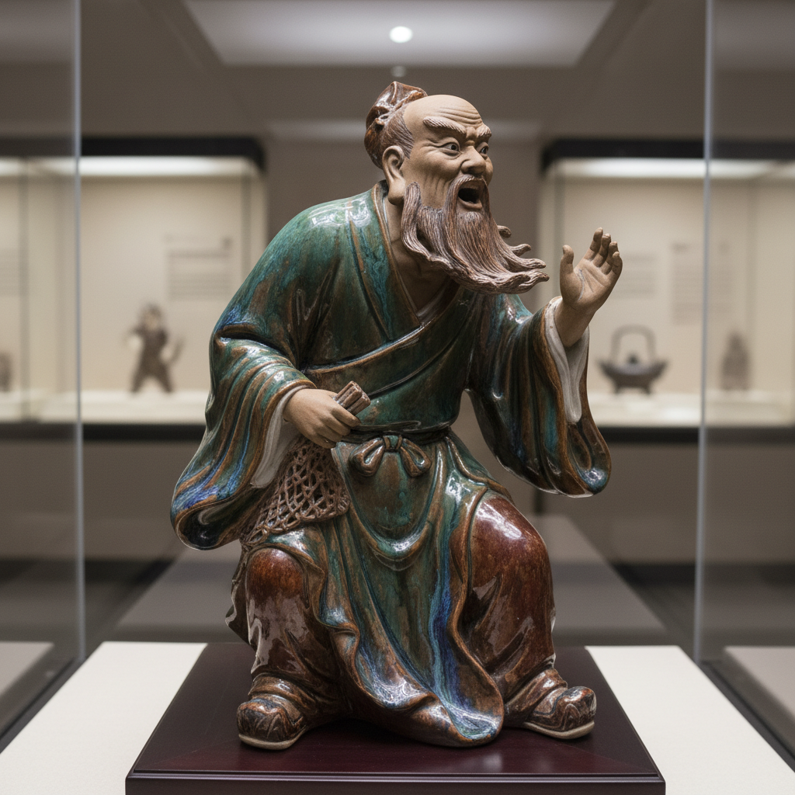

# Shiwan Ware Art 石湾窑艺术

> "Shiwan ware is clay with theatrical soul — ceramic figures so expressive they seem about to speak, glazes so rich they flow like lava down the sides of vessels, a tradition from Guangdong where potters became sculptors and every kiln firing was a performance, producing roof ridge ornaments, temple guardians, and scholar's desk objects with a vitality unmatched in Chinese ceramics." — Unknown

## 概述

石湾窑艺术（Shiwan Ware Art）是中国广东省佛山市石湾镇的传统陶瓷艺术，以其生动的陶塑和丰富的釉色著称。石湾窑有"南国陶都"之称——其历史可追溯到唐宋时期，至明清达到鼎盛。石湾陶艺以人物陶塑最为著名——渔翁、达摩、罗汉、仕女等形象栩栩如生，被誉为"石湾公仔"。石湾窑的釉色也极为丰富——其仿钧釉（广钧）色彩斑斓，变化万千。

石湾窑艺术的核心要素包括：1）陶塑为主——以人物陶塑著称；2）生动传神——人物表情极其生动；3）釉色丰富——仿钧釉等丰富釉色；4）民间气息——浓郁的民间艺术气息；5）岭南特色——岭南文化的代表；6）实用与艺术——建筑陶瓷与艺术陶瓷并重；7）传承悠久——千年窑火不断。

## 核心特征

| 特征 | 描述 |
|------|------|
| 陶塑为主 | 以人物陶塑著称 |
| 生动传神 | 人物表情极其生动 |
| 釉色丰富 | 仿钧釉等丰富釉色 |
| 民间气息 | 浓郁民间艺术气息 |
| 岭南特色 | 岭南文化代表 |
| 传承悠久 | 千年窑火不断 |

## 视觉特征

- **人物生动**：表情丰富的人物陶塑
- **釉色斑斓**：仿钧釉的斑斓色彩
- **质朴厚重**：厚重质朴的陶质
- **动态感强**：充满动态的造型
- **细节丰富**：衣纹、表情的细节
- **民间趣味**：浓郁的民间趣味

## 代表作品

| 作品 | 艺术家/文化 | 年代 | 意义 |
|------|-------------|------|------|
| *石湾达摩* | 各代名家 | 各时期 | 经典题材 |
| *渔翁得利* | 各代名家 | 各时期 | 民间题材 |
| *石湾罗汉* | 各代名家 | 各时期 | 宗教题材 |
| *刘传作品* | 刘传 | 当代 | 当代大师 |
| *石湾仿钧* | 石湾窑 | 明清 | 广钧精品 |

## 历史时间线

| 时期 | 事件 |
|------|------|
| 唐宋 | 石湾窑的起源 |
| 明代 | 石湾陶塑的成熟 |
| 清代 | 石湾窑的鼎盛 |
| 民国 | 石湾陶艺的近代发展 |
| 当代 | 列入国家级非遗 |

## 中国语境

石湾窑是中国南方最重要的民间陶瓷产区之一。石湾陶艺以其独特的岭南风格在中国陶瓷史上占有重要地位——它不同于景德镇的精致典雅，而是以质朴、生动、富有生活气息著称。石湾"公仔"（陶塑）是石湾窑最具代表性的产品——工匠们善于捕捉人物的瞬间表情和动态，使陶塑充满生命力。石湾窑的仿钧釉（广钧）也是一大特色——虽然模仿北方钧窑的窑变效果，但发展出了自己独特的风格，色彩更加浓烈奔放。石湾窑还生产大量的建筑陶瓷——岭南传统建筑屋脊上的陶塑装饰（脊饰）大多出自石湾窑。石湾陶艺已被列入中国国家级非物质文化遗产名录——当代石湾陶艺家在传承传统的同时，也在积极探索当代表达。

## AI生成概念图

## 与其他风格的关系

- **Jun Ware** → 钧窑
- **Chinese Sculpture** → 中国雕塑
- **Folk Art** → 民间艺术
- **Architectural Ceramics** → 建筑陶瓷
- **Lingnan Culture** → 岭南文化
- **Figurative Ceramics** → 人物陶瓷

---

*浮光艺志 | Chronicle of Artistry*
