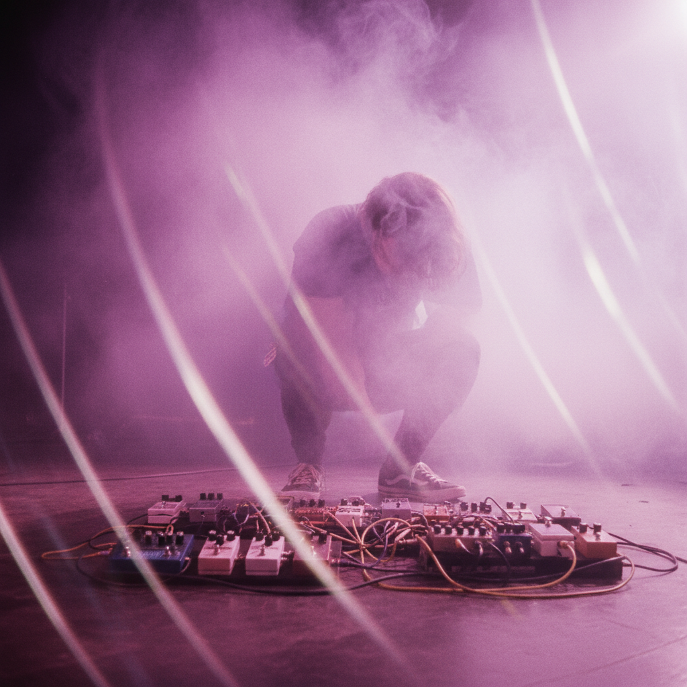

# Shoegaze 自赏



> **"效果器墙、低头弹琴、声音的海洋——美到让你忘记旋律。"**

## 概述

| 维度 | 描述 |
|------|------|
| 时期 | 1988–1993/2000s复兴/至今 |
| 别名 | Shoegaze, Shoegazing, Dream Pop (近亲) |
| 核心色彩 | 淡紫、粉色、雾白、银灰、深蓝 |
| 关键元素 | 效果器踏板、噪音墙、模糊人声、梦幻氛围 |
| 代表人物 | My Bloody Valentine, Slowdive, Ride, Cocteau Twins |
| 关联风格 | Dream Pop, Post-Rock, Noise Pop, Ethereal Wave |

---

## 历史脉络

| 年份 | 事件 |
|------|------|
| 1988 | My Bloody Valentine "Isn't Anything" |
| 1990 | Ride "Nowhere" / Slowdive 出道 |
| 1991 | My Bloody Valentine "Loveless"——Shoegaze 圣经 |
| 1993 | Britpop 兴起——Shoegaze 被"杀死" |
| 2000s | Shoegaze 复兴——M83, Deerhunter |
| 2013 | My Bloody Valentine "m b v"——回归 |

### 核心哲学

Shoegaze 的精神是**"声音本身就是目的——不需要歌词、不需要表演、只需要沉浸"**：
- 声音 = 一切（"吉他不是乐器——是画笔"）
- 模糊 = 美（"清晰是无聊的"）
- 内向 = 态度（"我们低头看效果器，不看观众"）
- 层叠 = 深度（"一层一层的声音"）
- "如果你能听清歌词，说明效果器还不够多"

---

## 视觉语法

### 色彩系统

```
主色：
  淡紫 (#E6E6FA) — 梦幻、模糊
  粉色 (#FFB6C1) — 温暖、柔和
  雾白 (#F5F5F5) — 朦胧
  银灰 (#C0C0C0) — 金属、冷

辅色：
  深蓝 (#191970) — 深邃
  黑色 (#000000) — 噪音
  金色 (#FFD700) — 温暖光线

规则：
  - 模糊、朦胧、不清晰
  - 过曝 > 欠曝
  - 柔焦 > 锐利
  - 层叠、重叠

质感：
  模糊 — 一切都是模糊的
  光晕 — 过曝的光
  噪点 — 胶片颗粒
  水彩 — 流动、渗透
```

### 标志性元素

| 类别 | 元素 |
|------|------|
| 视觉 | 模糊摄影、过曝、多重曝光、光晕 |
| 封面 | 抽象色块、模糊人像、梦幻风景 |
| 舞台 | 低头、效果器踏板、烟雾、投影 |
| 设备 | 效果器墙、Jazzmaster/Jaguar吉他 |
| 音乐 | 噪音墙、模糊人声、反馈、延迟 |
| 态度 | 内向、沉浸、梦幻、声音至上 |

---

## 与千禧怀旧的关系

### 2010s Shoegaze 复兴
- Shoegaze 在 2010s 经历了巨大复兴
- 与 Lo-fi/Bedroom Pop 交叉
- "Loveless" 被重新发现为"史上最伟大专辑之一"
- "每个拥有效果器踏板的年轻人都想做 Shoegaze"

### 对视觉文化的影响
- Shoegaze 的"模糊美学" → Instagram 滤镜
- 过曝/柔焦 = 现代摄影的常见手法
- "Shoegaze 教会了我们：不清晰也可以是美的"

---

## 中国语境

- Shoegaze 在中国独立音乐圈的影响
- 中国 Shoegaze 乐队（如 White+）
- 与中国"梦幻流行"的交叉
- 豆瓣音乐社区中的 Shoegaze 文化

---

## 设计应用

| 场景 | 应用方式 |
|------|----------|
| 音乐 | 模糊封面+过曝+抽象色块+梦幻 |
| 摄影 | 柔焦+过曝+多重曝光+光晕+胶片 |
| 品牌 | 梦幻+模糊+柔和+内向+深度 |
| 数字 | 模糊+渐变+柔和+层叠+朦胧 |

---

## 相关风格

← [Post-Punk 后朋克](post-punk.md) | [Synthwave 合成器浪潮](synthwave.md) →

↑ [返回千禧怀旧目录](README.md) | [返回总目录](../README.md)
