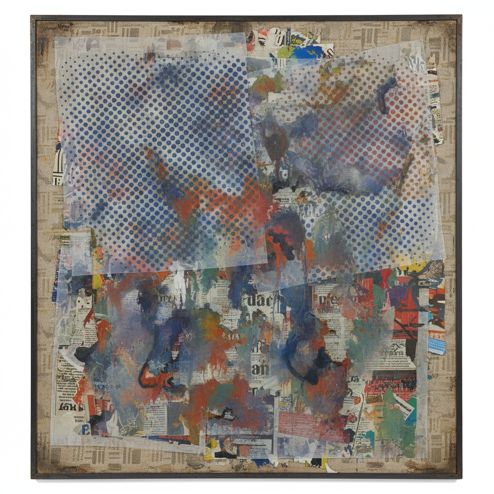

# Sigmar Polke 西格马尔·波尔克

> **流派**: 资本主义现实主义 · 后现代绘画  
> **时期**: 1941–2010 德国  
> **关键词**: 网点画、化学实验、图像挪用、反讽

## 概述

西格马尔·波尔克是战后德国最具实验精神的画家之一。他与格哈德·里希特共同创立了"资本主义现实主义"运动，以讽刺的方式回应美国波普艺术和消费文化。他的作品以不可预测的材料实验著称——使用化学颜料、毒物、陨石粉末，让画面随时间和环境变化。

## 视觉特征

- **放大网点**: 将印刷品的半调网点放大为绘画主题
- **化学变色**: 使用会随温度湿度变化的颜料
- **多层叠加**: 透明织物上的多层图像互相渗透
- **图像挪用**: 混合广告、新闻照片和艺术史引用
- **刻意粗糙**: 拒绝精致，拥抱偶然和错误

## 代表作品

- 《饼干》(Bunnies, 1966)
- 《高台跳水者》系列
- 《爱丽丝梦游仙境》(Alice in Wonderland, 1971)
- 威尼斯双年展德国馆壁画 (1986, 金狮奖)

## 历史影响

波尔克打破了绘画的一切规则——材料、主题、风格都可以随时更换。他证明了绘画不必忠于任何单一身份，可以同时是严肃的和滑稽的、美丽的和丑陋的。他对里希特、基弗等同代人产生了深远影响。

## 相关风格

- [Gerhard Richter 格哈德·里希特](gerhard-richter.md)
- [Pop Art 波普艺术](pop-art.md)
- [Capitalist Realism 资本主义现实主义](capitalist-realism.md)
