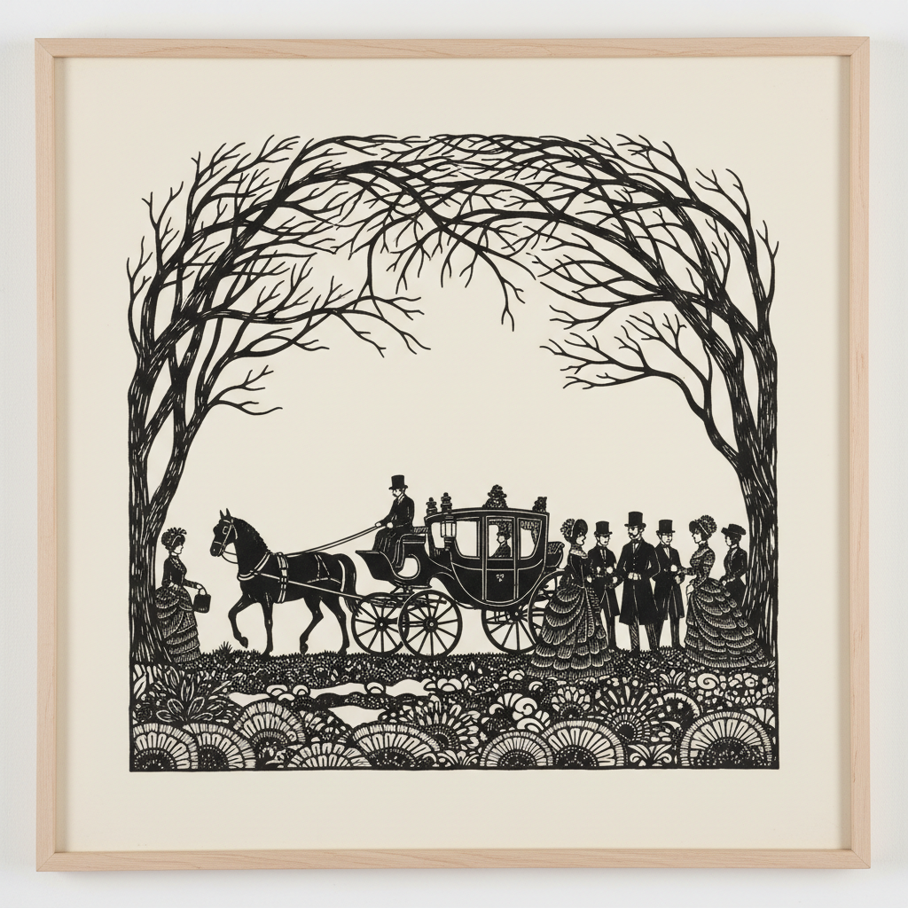

# Silhouette Art 剪影艺术

> "A silhouette is truth reduced to its essence — the outline alone must carry all the information of identity, character, and emotion that a full portrait conveys through color, shading, and detail. In that stark black shape against white, there is nowhere to hide, no flattering light to soften, no color to distract. The silhouette artist must find the soul in the edge." — Unknown

## 概述

剪影艺术（Silhouette Art）是一种以纯黑色轮廓形象表现人物、物体或场景的艺术形式——通常是在白色或浅色背景上的黑色剪影，或反之。剪影艺术得名于18世纪法国财政大臣Étienne de Silhouette，以其极简的表现力和优雅的视觉效果著称。从18世纪的肖像剪影到当代的剪影插画和装置艺术，这一形式持续演变。

剪影艺术的实践包括：1）肖像剪影——人物侧面轮廓的剪影；2）剪纸剪影——用剪刀或刻刀从黑纸上剪出形象；3）投影剪影——利用光影投射的剪影；4）剪影插画——出版物中的剪影风格插图；5）剪影动画——使用剪影的动画形式；6）装置剪影——大型剪影装置艺术；7）当代剪影——将传统形式与现代主题结合的创作。

## 核心特征

| 特征 | 描述 |
|------|------|
| 轮廓 | 纯轮廓的表现 |
| 黑白 | 极致的黑白对比 |
| 极简 | 极简的视觉语言 |
| 识别 | 仅靠轮廓识别 |
| 优雅 | 优雅精致的效果 |
| 叙事 | 强大的叙事能力 |

## 视觉特征

- **对比**：强烈的黑白对比
- **轮廓**：清晰的轮廓线条
- **平面**：完全平面的表现
- **优雅**：优雅简洁的形态
- **戏剧**：戏剧性的光影效果
- **神秘**：神秘含蓄的氛围

## 代表作品

| 作品 | 艺术家/文化 | 年代 | 意义 |
|------|-------------|------|------|
| *18th century portraits* | 欧洲 | 18世纪 | 肖像剪影传统 |
| *Lotte Reiniger animations* | 德国 | 1920年代 | 剪影动画先驱 |
| *Kara Walker installations* | 美国 | 当代 | 当代剪影装置 |
| *Hans Christian Andersen cuts* | 丹麦 | 19世纪 | 安徒生剪纸 |
| *Contemporary silhouette art* | 国际 | 当代 | 当代剪影发展 |

## 历史时间线

| 时期 | 事件 |
|------|------|
| 古代 | 影子戏和轮廓画的起源 |
| 18世纪 | 肖像剪影的黄金时代 |
| 19世纪 | 剪影插画和剪纸的发展 |
| 1920年代 | 剪影动画的诞生 |
| 当代 | 剪影的当代艺术化 |

## 中国语境

剪影艺术在中国有深厚的传统根基。中国的皮影戏是世界上最古老和最精致的剪影表演艺术——通过光影投射彩色皮影讲述故事。中国传统剪纸中的黑色剪影风格——特别是陕西和山西的剪纸传统中有大量剪影作品。中国当代的插画和设计中，剪影风格被广泛应用——从书籍封面到品牌标识。中国的动画传统中，万氏兄弟等先驱受到剪影动画的影响——中国的剪纸动画是独特的艺术形式。中国的一些当代艺术家使用剪影形式探讨社会议题——将传统形式赋予当代意义。中国的城市公共艺术中，剪影元素被广泛应用于景观设计和文化墙——以简洁的形式传达文化内涵。

## AI生成概念图

## 与其他风格的关系

- **Shadow Puppet** → 皮影戏
- **Paper Cutting** → 剪纸
- **Illustration** → 插画艺术
- **Animation** → 动画艺术
- **Minimalism** → 极简主义
- **Graphic Design** → 平面设计

---

*浮光艺志 | Chronicle of Artistry*
