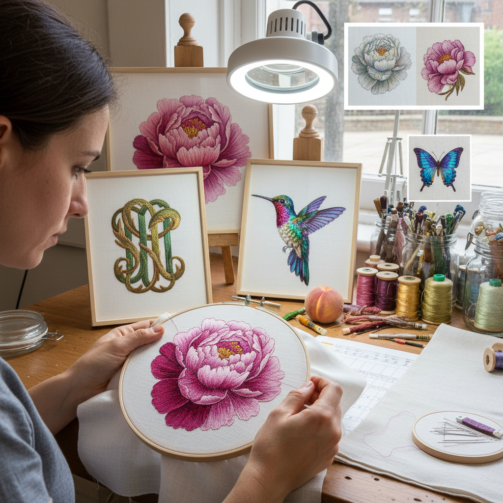

# Silk Shading 丝线渐变绣

> "Silk shading is the embroiderer's chiaroscuro — stranded silk threads split into single filaments and blended row by row in long and short stitch, each shade imperceptibly darker or lighter than the last, building up tonal gradations so smooth that the finished work glows with the luminosity of a Renaissance oil painting." — Unknown

## 概述

丝线渐变绣（Silk Shading），也称为丝线长短针绣（Silk Long and Short Stitch），是针绣绘画（Needle Painting）的最高级形式——使用单股或双股丝线（stranded silk），通过极其精细的长短针法，创造出如同油画般的光影渐变效果。Silk Shading与普通的长短针绣的区别在于：它使用丝线（而非棉线或毛线），丝线的天然光泽使作品具有独特的luminosity（发光感）。

Silk Shading是英国皇家刺绣学校（Royal School of Needlework）的核心课程之一。这种技法要求极高的技巧——刺绣者必须精确控制每一针的方向（跟随形体的轮廓）、长度（避免规律性）和颜色选择（在数十种相近色调中选择正确的过渡色）。一件精细的Silk Shading作品可能使用30-50种颜色的丝线来表现一朵花的光影变化。

## 核心特征

| 特征 | 描述 |
|------|------|
| 丝线 | 使用丝绸丝线 |
| 渐变 | 极其精细的色彩渐变 |
| 光泽 | 丝线的天然光泽 |
| 方向 | 针脚跟随形体方向 |
| 写实 | 追求写实绘画效果 |
| 精细 | 极其精细的工艺 |

## 视觉特征

- **光泽**：丝线的发光质感
- **渐变**：无缝的色彩渐变
- **写实**：照片级的写实效果
- **光影**：精确的光影表现
- **方向**：针脚的方向感
- **深度**：丰富的色彩深度

## 代表作品

| 作品 | 艺术家 | 年代 | 意义 |
|------|--------|------|------|
| *RSN silk shading* | Royal School of Needlework | 当代 | 英国皇家刺绣学校 |
| *Trish Burr botanicals* | Trish Burr | 当代 | 植物丝线渐变绣 |
| *Historical silk embroidery* | Various | 18-19世纪 | 历史丝线刺绣 |
| *Contemporary silk shading* | Various | 当代 | 当代丝线渐变绣 |
| *Photorealistic silk work* | Various | 当代 | 照片级丝线绣 |

## 历史时间线

| 时期 | 事件 |
|------|------|
| 中世纪 | Opus Anglicanum的丝线刺绣 |
| 文艺复兴 | 丝线绘画技法的发展 |
| 18-19世纪 | 丝线渐变绣的精细化 |
| 1872年 | 英国皇家刺绣学校成立 |
| 当代 | 丝线渐变绣的系统教学 |

## 中国语境

丝线渐变绣在中国有极其深厚的传统——中国的苏绣"仿真绣"（由沈寿创立）本质上就是丝线渐变绣。苏绣使用蚕丝线（比西方的stranded silk更细），通过"劈丝"（将一根丝线劈成多股极细的丝）实现更精细的渐变。中国的丝线渐变绣在技术精度上可能超过西方——苏绣大师可以将一根丝线劈成1/64甚至更细。中国的丝线渐变绣是国家级非物质文化遗产的重要组成部分。

## AI生成概念图

## 与其他风格的关系

- **Needle Painting** → 针绣绘画
- **Chinese Silk Embroidery** → 中国丝绣
- **Crewel Embroidery** → 毛线刺绣
- **Embroidery** → 刺绣
- **Oil Painting** → 油画
- **Realism** → 写实主义

---

*浮光艺志 | Chronicle of Artistry*
