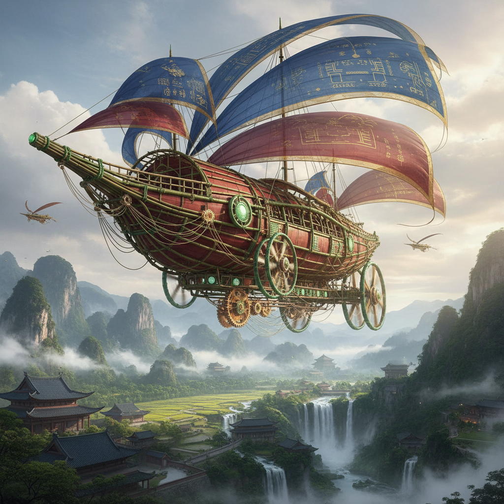

# Silkpunk 丝绸朋克



> **"竹子代替钢铁，丝绸代替电线，鲸鱼代替蒸汽机——东亚想象的技术文明。"**

## 概述

| 维度 | 描述 |
|------|------|
| 时期 | 2015–至今 |
| 别名 | Silkpunk, 丝绸朋克, 东方朋克 |
| 核心色彩 | 丝绸红、竹绿、宣纸白、漆黑、金箔 |
| 关键元素 | 东亚材料科技、有机机械、汉字符文、丝绸帆船 |
| 代表人物 | Ken Liu(刘宇昆，命名者+代表作家) |
| 关联风格 | Steampunk, Wuxia, Chinese Cyberpunk, Biopunk |

---

## 历史脉络

| 年份 | 事件 |
|------|------|
| 2015 | Ken Liu《蒲公英王朝》(The Grace of Kings)出版——Silkpunk诞生 |
| 2016 | Ken Liu正式定义"Silkpunk"美学 |
| 2016 | 《蒲公英王朝》获星云奖提名 |
| 2019 | 《蒲公英王朝》三部曲完结——Silkpunk世界观完整 |
| 2020s | Silkpunk概念扩展到游戏、概念艺术、建筑想象 |

### 核心哲学

Silkpunk的精神是**"如果技术革命发生在东亚——用的不是钢铁和蒸汽，而是竹子和丝绸"**：
- Ken Liu："Silkpunk是对Steampunk的回应——为什么技术想象总是欧洲的？"
- "竹子比钢铁更有弹性——丝绸比电线更轻"
- "鲸鱼的浮力 > 蒸汽的推力"
- "东亚的材料科学（漆器、丝绸、纸、竹）= 另一条技术路径"
- "不是'落后'——是'不同'"

---

## 视觉语法

### 色彩系统

```
主色：
  丝绸红 (#DC143C) — 中国红、力量
  竹绿 (#6B8E23) — 自然、弹性
  宣纸白 (#FFF8DC) — 纯净、书写
  漆黑 (#0D0D0D) — 漆器、深邃

辅色：
  金箔 (#FFD700) — 装饰、权力
  靛蓝 (#191970) — 染料、海洋
  玉色 (#00A86B) — 宝石、精神

材料体系：
  竹 — 结构材料（代替钢铁）
  丝绸 — 传动/通信（代替电线）
  纸 — 信息存储（代替硅芯片）
  漆 — 防护涂层（代替塑料）
  牛筋/鲸须 — 弹性动力（代替弹簧）

规则：
  - 有机材料 > 金属
  - 东亚美学 > 欧洲美学
  - 自然力 > 化石燃料
  - 精巧 > 粗暴
  - 和谐 > 征服
```

### 标志性元素

| 类别 | 元素 |
|------|------|
| 载具 | 丝绸帆飞艇、竹骨飞行器、鲸鱼动力船 |
| 武器 | 竹弩、丝线暗器、纸符咒 |
| 建筑 | 竹楼、纸窗、漆门、悬空寺 |
| 服装 | 丝绸铠甲、竹编护具、纸甲 |
| 文字 | 汉字作为技术符文/编程语言 |
| 态度 | 东方哲学、和谐、另类现代性 |

---

## 与千禧怀旧/当代的关系

### 对"技术想象的去殖民化"
- Steampunk = 英国工业革命的浪漫化
- Silkpunk = "如果工业革命发生在东亚会怎样？"
- 这是一种文化自信的表达——不是模仿西方，是提出替代方案

### 与Chinese Cyberpunk的区别
- Chinese Cyberpunk = 中国元素 + 西方赛博朋克框架
- Silkpunk = 从根本上重新想象技术的物质基础
- 两者都是"东方未来"——但路径完全不同

---

## 设计应用

| 场景 | 应用方式 |
|------|----------|
| 游戏 | 东方幻想+有机科技+武侠 |
| 影视 | 替代历史+东亚世界观 |
| 品牌 | 东方+自然+科技+文化自信 |
| 建筑 | 竹建筑+有机结构+东方美学 |

---

## 相关风格

← [Steampunk 蒸汽朋克](steampunk.md) | [Chinese Cyberpunk 中国赛博朋克](chinese-cyberpunk.md) →

↑ [返回千禧怀旧目录](README.md) | [返回总目录](../README.md)
