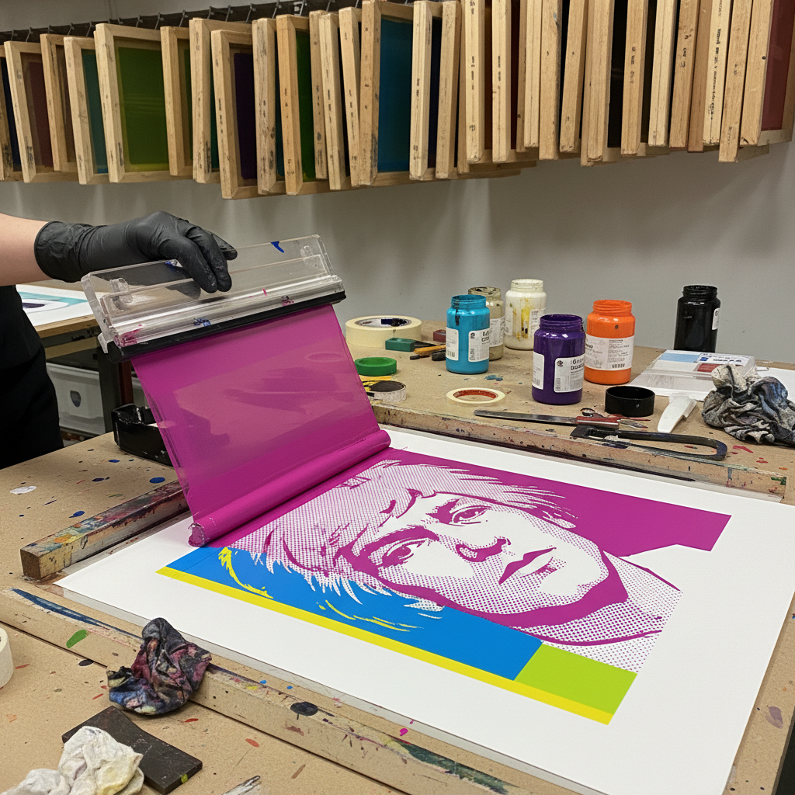

# Silkscreen 丝网版画

> "In the future, everyone will be world-famous for fifteen minutes." — Andy Warhol

## 概述

丝网版画（Silkscreen/Serigraphy）是通过丝网模版将油墨印刷到承印物上的版画技法。安迪·沃霍尔用丝网版画将玛丽莲·梦露和金宝汤罐头变成了艺术史上最具标志性的图像，彻底改变了人们对艺术、复制和原创性的理解。丝网版画以其鲜艳的色彩、平坦的质感和无限复制的可能性成为波普艺术的标志性媒介。

丝网版画的哲学在于：在机械复制时代，"原作"的概念被重新定义——每一张印刷品都是原作，或者说，没有原作。

## 核心特征

| 特征 | 描述 |
|------|------|
| 模版 | 通过丝网模版印刷 |
| 平坦 | 均匀平坦的墨层 |
| 鲜艳 | 极其鲜艳的色彩 |
| 复制 | 可以大量复制 |
| 多材料 | 可印在各种材料上 |
| 商业性 | 艺术与商业的交汇 |

## 视觉特征

- **平坦**：均匀平坦的色彩区域
- **鲜艳**：高饱和度的色彩
- **锐利**：清晰锐利的边缘
- **层叠**：多色层叠的效果
- **网点**：有时可见的网点结构
- **重复**：图像的重复和变化

## 代表作品

| 作品 | 艺术家 | 年代 | 意义 |
|------|--------|------|------|
| *Marilyn Diptych* | Andy Warhol | 1962 | 丝网版画的标志 |
| *Campbell's Soup Cans* | Andy Warhol | 1962 | 商业图像的艺术化 |
| *Prints* | Roy Lichtenstein | 1960s-90s | 漫画风格丝网画 |
| *Prints* | Robert Rauschenberg | 1960s-80s | 拼贴丝网画 |
| *Prints* | Corita Kent | 1960s-70s | 社会运动丝网画 |
| *Obey Giant* | Shepard Fairey | 1989-至今 | 街头丝网版画 |

## 历史时间线

| 时期 | 事件 |
|------|------|
| 古代中国 | 丝网印刷的早期形式 |
| 1910s | 现代丝网印刷技术的发展 |
| 1930s-40s | WPA项目中的丝网版画 |
| 1960s | Warhol——丝网版画的革命 |
| 1960s-70s | 波普艺术的标志性媒介 |
| 1980s-至今 | 街头艺术和独立出版 |
| 当代 | 丝网版画的持续活力 |

## 中国语境

丝网版画在中国有广泛的应用——从美术学院的版画教学到商业印刷，从当代艺术创作到独立出版。中国当代艺术家大量使用丝网版画技法。有趣的是，丝网印刷的早期形式可以追溯到中国古代的镂版印刷。当代中国的丝网版画在技法和观念上都有独特发展。

## AI生成概念图

## 与其他风格的关系

- **Pop Art** → 波普艺术的标志性媒介
- **Printmaking** → 版画是丝网版画的上位类别
- **Graphic Design** → 丝网版画影响平面设计
- **Street Art** → 街头艺术使用丝网技法
- **Poster Art** → 海报设计中的丝网印刷
- **Commercial Art** → 商业艺术与丝网的交汇

---

*浮光艺志 | Chronicle of Artistry*
