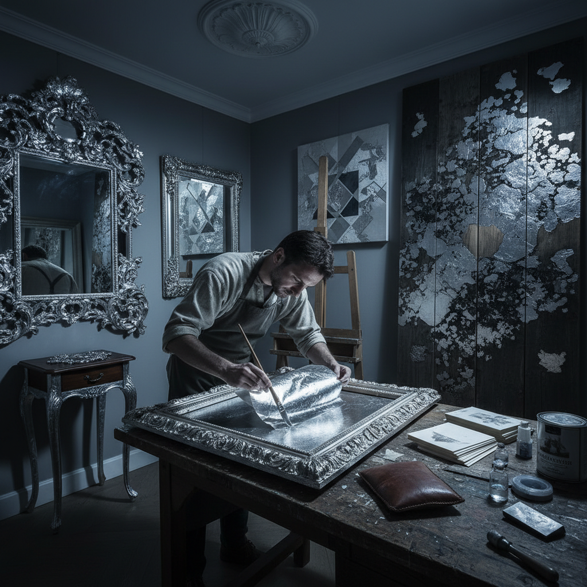

# Silver Leaf 银箔

> "Silver leaf is moonlight captured in metal — cooler and more subtle than gold, it brings a quiet luminosity to surfaces that speaks of elegance without ostentation." — Unknown

## 概述

银箔（Silver Leaf）是将纯银或银合金锤打成极薄薄片的工艺及其产品。银箔与金箔的制作工艺相似——通过反复锤打将银锭延展成极薄的薄片。银箔的厚度通常比金箔略厚（因为银比金硬），但仍然极其轻薄。

银箔的应用与金箔类似但有其独特之处：银箔提供的是冷色调的金属光泽——银白色、月光般的效果。银箔广泛应用于：画框装饰、家具装饰、艺术创作、建筑装饰、食品装饰等。银箔的一个特殊性质是它会氧化变黑（tarnish）——这既是缺点（需要保护层），也可以被利用为一种做旧效果。仿银箔（aluminum leaf）是银箔的廉价替代品，不会氧化。

## 核心特征

| 特征 | 描述 |
|------|------|
| 极薄 | 锤打成极薄薄片 |
| 银色 | 冷色调的银白色 |
| 氧化 | 会氧化变色 |
| 月光 | 月光般的光泽 |
| 装饰 | 装饰性极强 |
| 多用 | 用途广泛 |

## 视觉特征

- **银色**：冷色调的银白色
- **光泽**：柔和的金属光泽
- **月光**：月光般的效果
- **氧化**：可呈现氧化效果
- **轻盈**：轻盈的质感
- **优雅**：冷静优雅的美感

## 代表作品

| 作品 | 艺术家 | 年代 | 意义 |
|------|--------|------|------|
| *Silver leafed frames* | Various | 传统 | 银箔画框 |
| *Silver leaf furniture* | Various | 巴洛克 | 银箔家具 |
| *Silver leaf icons* | 匿名 | 拜占庭 | 银箔圣像 |
| *Contemporary silver leaf art* | Various | 当代 | 当代银箔艺术 |
| *Silver leaf interior design* | Various | 当代 | 银箔室内设计 |

## 历史时间线

| 时期 | 事件 |
|------|------|
| 古代 | 银箔的早期使用 |
| 中世纪 | 银箔在宗教艺术中的应用 |
| 巴洛克 | 银箔家具和装饰的繁荣 |
| 19世纪 | 铝箔作为替代品的出现 |
| 20世纪 | 银箔在现代设计中的应用 |
| 当代 | 银箔在当代艺术中的复兴 |

## 中国语境

银箔在中国的应用历史悠久——中国传统工艺中的"贴银"与贴金并列。中国的银箔主要应用于：佛像装饰、传统家具装饰、漆器装饰等。南京作为中国金箔的主要产地，同时也生产银箔。当代中国的室内设计和装饰行业中，银箔被用于墙面装饰、家具表面处理和艺术品创作。中国的一些当代艺术家使用银箔作为创作媒介——利用银箔的氧化特性创造时间感。

## AI生成概念图

## 与其他风格的关系

- **Gold Leaf** → 金箔
- **Gilding** → 鎏金
- **Aluminum Leaf** → 铝箔
- **Lacquerware** → 漆器
- **Frame Making** → 画框制作
- **Interior Design** → 室内设计

---

*浮光艺志 | Chronicle of Artistry*
