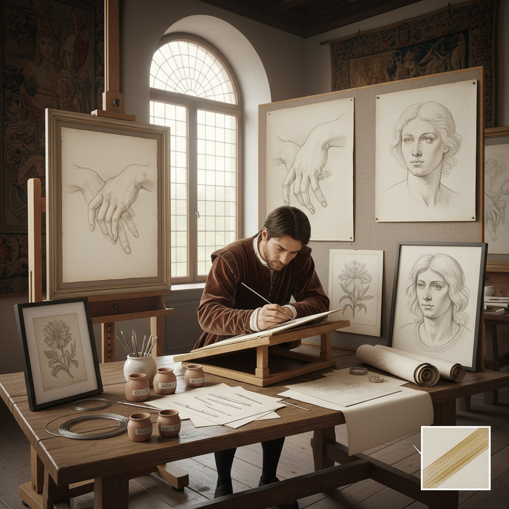

# Silver Point Drawing 银尖笔画

> "Silverpoint is drawing distilled to its essence — a thin silver wire leaving the faintest grey mark on a prepared surface, each line permanent and unforgiving, demanding absolute certainty of hand because nothing can be erased, the marks oxidizing over centuries from cool grey to warm brown as the silver tarnishes, making these drawings living things that age like their makers." — Unknown

## 概述

银尖笔画（Silverpoint Drawing）是一种使用银质尖端（银针/银线）在经过特殊处理的纸张或面板表面留下痕迹的绘画技法。银尖笔属于"金属尖笔"（metalpoint）的一种——其他金属如金、铜、铅也可以使用，但银尖笔最为常见和著名。

银尖笔的工作原理是：当银质尖端在有微细磨料颗粒的表面（如涂有石膏底/gesso、骨粉或氧化锌的纸张）上划过时，微量的银被磨料刮下并留在表面上。银尖笔的线条极其精细和均匀——无法通过压力变化来改变线条的粗细或深浅，也无法擦除。这使得银尖笔成为最具挑战性的绘画媒介之一。银尖笔在文艺复兴时期极为流行——达芬奇、拉斐尔、丢勒等大师都使用银尖笔。

## 核心特征

| 特征 | 描述 |
|------|------|
| 银质 | 银质的绘画工具 |
| 精细 | 极其精细的线条 |
| 不可擦 | 无法擦除修改 |
| 均匀 | 线条粗细均匀 |
| 氧化 | 银线随时间氧化变色 |
| 底料 | 需要特殊底料表面 |

## 视觉特征

- **精细**：极其精细的线条
- **灰色**：银灰色的色调
- **均匀**：均匀的线条质量
- **温暖**：氧化后的温暖色调
- **柔和**：柔和的整体效果
- **精确**：精确的轮廓线

## 代表作品

| 作品 | 艺术家 | 年代 | 意义 |
|------|--------|------|------|
| *Study of a Woman's Hands* | Leonardo da Vinci | 约1490 | 达芬奇银尖笔习作 |
| *Head of an Apostle* | Raphael | 约1519 | 拉斐尔银尖笔头像 |
| *Silverpoint portraits* | Jan van Eyck | 15世纪 | 凡·艾克银尖笔肖像 |
| *Self-Portrait at 13* | Albrecht Dürer | 1484 | 丢勒13岁自画像 |
| *Contemporary silverpoint* | Various | 当代 | 当代银尖笔复兴 |

## 历史时间线

| 时期 | 事件 |
|------|------|
| 中世纪 | 金属尖笔的早期使用 |
| 文艺复兴 | 银尖笔的鼎盛时期 |
| 16世纪后 | 石墨铅笔取代银尖笔 |
| 19世纪 | 银尖笔的短暂复兴 |
| 当代 | 银尖笔的艺术化复兴 |

## 中国语境

银尖笔画在中国相对少见——中国传统绘画使用毛笔和墨，与银尖笔的西方传统不同。但当代中国的一些艺术家和美术院校开始关注和实践银尖笔技法。中国的一些素描教学中介绍银尖笔作为一种特殊的绘画媒介。中国的金属工艺传统中有"银划线"的技法——用银针在漆面上划线，与银尖笔有技法上的相似性。

## AI生成概念图

## 与其他风格的关系

- **Drawing** → 素描
- **Metalpoint** → 金属尖笔
- **Renaissance Art** → 文艺复兴艺术
- **Graphite Drawing** → 石墨素描
- **Fine Line Art** → 精细线条艺术
- **Portrait** → 肖像画

---

*浮光艺志 | Chronicle of Artistry*
