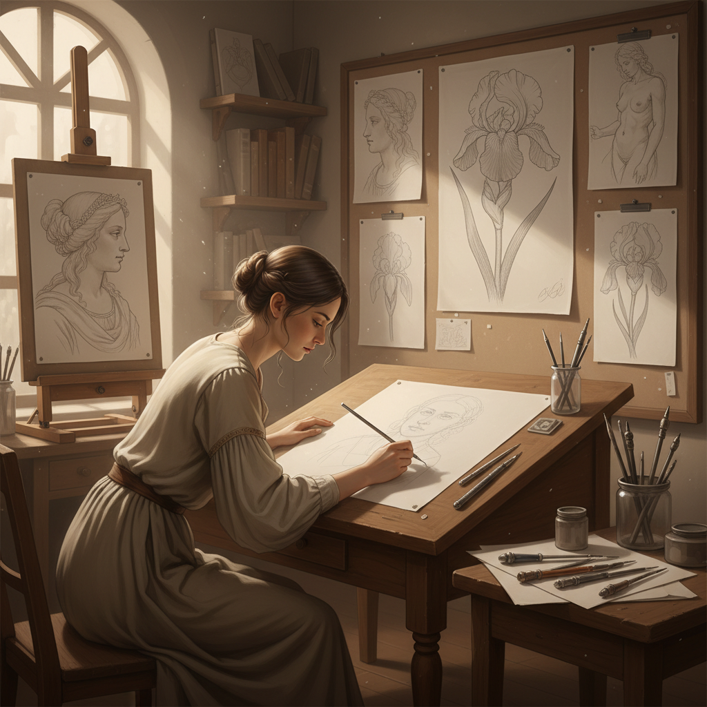

# Silverpoint 银尖笔画

> "Silverpoint forgives nothing — every mark is permanent from the first touch, demanding the artist's absolute certainty and control." — Unknown

## 概述

银尖笔画（Silverpoint）是使用银质笔尖在特殊处理的纸面上作画的古老技法。银尖笔在经过骨粉、石膏或氧化锌涂层处理的纸面上划过时，会留下极其细腻的银灰色线条——这些线条无法擦除，也无法加深，要求画家从第一笔开始就必须精确无误。银尖笔画的线条极其精细——比铅笔更细、更均匀，呈现出独特的银灰色调。随着时间推移，银的氧化会使线条逐渐变为温暖的金褐色。银尖笔画是文艺复兴大师们的基本训练工具——达芬奇、拉斐尔、丢勒都用银尖笔创作了大量素描。

银尖笔画的哲学在于：不可逆的精确——每一笔都是最终的，没有修改的余地，要求画家对形体有绝对的把握。

## 核心特征

| 特征 | 描述 |
|------|------|
| 银尖 | 银质笔尖作画 |
| 不可逆 | 线条无法擦除 |
| 精细 | 极其精细的线条 |
| 涂层 | 需要特殊涂层纸面 |
| 氧化 | 随时间氧化变色 |
| 精确 | 要求极高的精确度 |

## 视觉特征

- **精细**：极其精细的线条
- **银灰**：独特的银灰色调
- **均匀**：均匀一致的线条
- **柔和**：柔和的明暗过渡
- **优雅**：优雅精致的质感
- **古典**：古典的视觉品质

## 代表作品

| 作品 | 艺术家 | 年代 | 意义 |
|------|--------|------|------|
| *Study of a Woman* | Leonardo da Vinci | 1490s | 文艺复兴银尖笔 |
| *Head of an Apostle* | Raphael | 1500s | 拉斐尔银尖笔 |
| *Portrait studies* | Albrecht Dürer | 1500s | 丢勒银尖笔 |
| *Jan van Eyck drawings* | Jan van Eyck | 1430s | 早期尼德兰银尖笔 |
| *Contemporary silverpoint* | Various | 当代 | 当代银尖笔复兴 |

## 历史时间线

| 时期 | 事件 |
|------|------|
| 中世纪 | 银尖笔作为书写和绘画工具 |
| 14-16世纪 | 文艺复兴银尖笔的黄金时代 |
| 16世纪后 | 石墨铅笔取代银尖笔 |
| 19世纪 | 少数艺术家的复兴尝试 |
| 20世纪末 | 银尖笔的当代复兴 |
| 当代 | 全球银尖笔艺术的繁荣 |

## 中国语境

银尖笔画在中国是相对小众的艺术形式，但近年来受到越来越多关注。中国的一些美术院校开始在素描教学中介绍银尖笔技法。银尖笔画"不可修改"的特性与中国书法"一笔成形"的精神有相通之处——都要求创作者在下笔前有充分的准备和把握。一些中国当代艺术家开始探索银尖笔画，将其精细的线条质感与中国传统白描的线条美学进行对话。

## AI生成概念图

## 与其他风格的关系

- **Drawing** → 素描
- **Graphite** → 石墨铅笔画
- **Metalpoint** → 金属尖笔（总称）
- **Line Drawing** → 线描
- **Renaissance Art** → 文艺复兴艺术
- **Bai Miao** → 白描（中国线描）

---

*浮光艺志 | Chronicle of Artistry*
