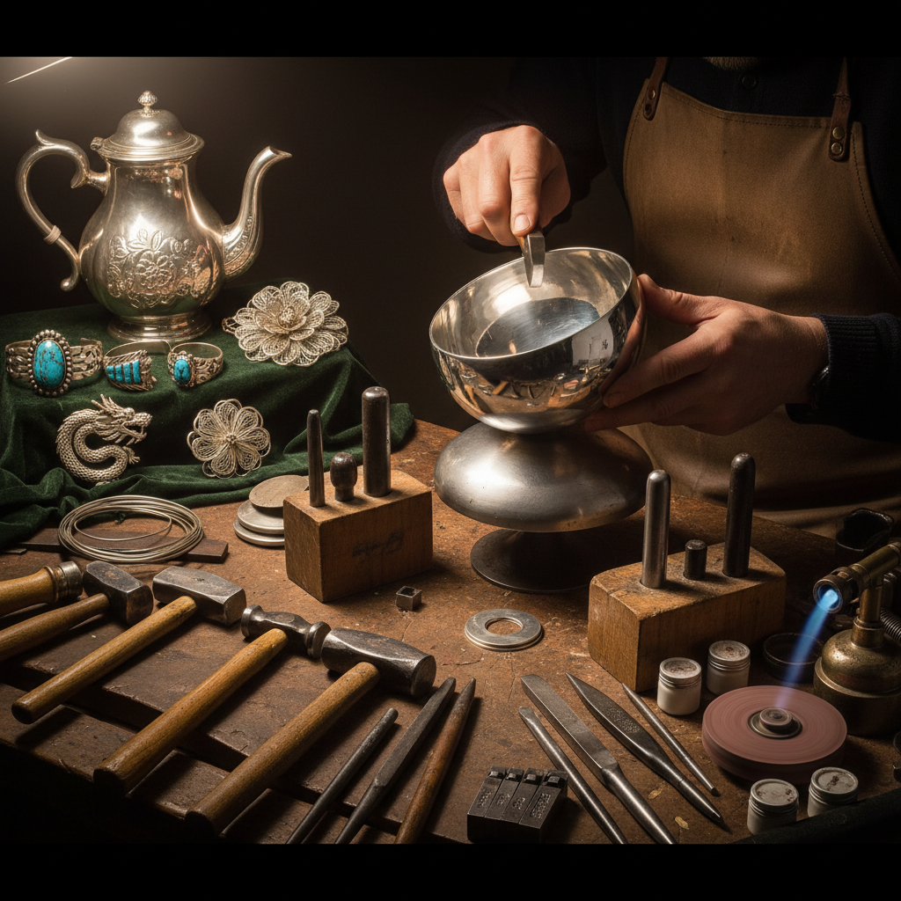

# Silversmithing Art 银器艺术

> "Silver is the moon's metal — cool, luminous, reflective, catching every ray of light and returning it transformed. The silversmith works with hammer and fire, coaxing flat sheets of metal into vessels that hold both liquid and light, into jewelry that adorns the body with captured moonbeams, into objects that grow more beautiful with age as they develop the soft gray patina that only time can bestow." — Unknown

## 概述

银器艺术（Silversmithing Art）是以白银为主要材料，通过锻造、雕刻、焊接和表面处理等技法创造器物和装饰品的金属工艺艺术——包括银器皿、银首饰、银雕塑和银装饰品的制作。银器艺术是世界各文化中最重要的贵金属工艺之一。

银器艺术的实践包括：1）银器皿——银制的杯、盘、壶等器皿；2）银首饰——银制的项链、戒指、手镯等；3）银雕塑——银制的装饰性雕塑；4）银镶嵌——将银嵌入其他材料；5）银丝工艺——用银丝编织的精细工艺（花丝）；6）银錾刻——在银面上錾刻图案；7）当代银艺——将银作为当代艺术媒介的创作。

## 核心特征

| 特征 | 描述 |
|------|------|
| 光泽 | 银的独特光泽 |
| 延展 | 极好的延展性 |
| 贵重 | 贵金属的价值 |
| 精密 | 精密的工艺要求 |
| 氧化 | 会产生氧化变色 |
| 传承 | 代代相传的技艺 |

## 视觉特征

- **光泽**：银白色的金属光泽
- **反射**：镜面般的反射效果
- **锤纹**：锻造留下的锤纹
- **雕刻**：精细的表面雕刻
- **氧化**：银的氧化灰色调
- **丝线**：银丝的精细编织

## 代表作品

| 作品 | 艺术家/传统 | 年代 | 意义 |
|------|-------------|------|------|
| *Navajo silver jewelry* | 纳瓦霍族 | 19世纪至今 | 美洲原住民银饰 |
| *Georgian silverware* | 英国传统 | 18世纪 | 英国银器 |
| *Taxco silver* | 墨西哥 | 20世纪至今 | 墨西哥银饰 |
| *Chinese filigree* | 中国传统 | 古代至今 | 中国花丝工艺 |
| *Contemporary silver* | Various | 当代 | 当代银艺 |

## 历史时间线

| 时期 | 事件 |
|------|------|
| 公元前4000年 | 最早的银器制作 |
| 古代 | 各文明的银器传统 |
| 中世纪 | 欧洲银匠行会 |
| 18-19世纪 | 银器的黄金时代 |
| 当代 | 银器的当代艺术实践 |

## 中国语境

银器艺术在中国有悠久的传统——中国的银器制作可追溯到商周时期。中国的花丝镶嵌工艺是世界上最精细的银丝工艺之一——被列入国家级非物质文化遗产。中国的苗族银饰是中国最具特色的银器传统——苗族妇女佩戴的全套银饰重达数公斤，工艺极其精湛。中国的云南、贵州等地是传统银器制作的重要产区——至今仍有银匠用传统方法手工制作银器。中国当代的一些珠宝设计师将传统银器工艺与现代设计相结合——创造出既有传统韵味又具现代感的银饰。中国的银器收藏市场也在发展——古代银器和当代银艺作品都受到收藏家的关注。

## AI生成概念图

## 与其他风格的关系

- **Goldsmithing** → 金器艺术
- **Jewelry Art** → 珠宝艺术
- **Metal Art** → 金属艺术
- **Filigree** → 花丝工艺
- **Engraving** → 雕刻艺术
- **Craft Art** → 工艺美术

---

*浮光艺志 | Chronicle of Artistry*
