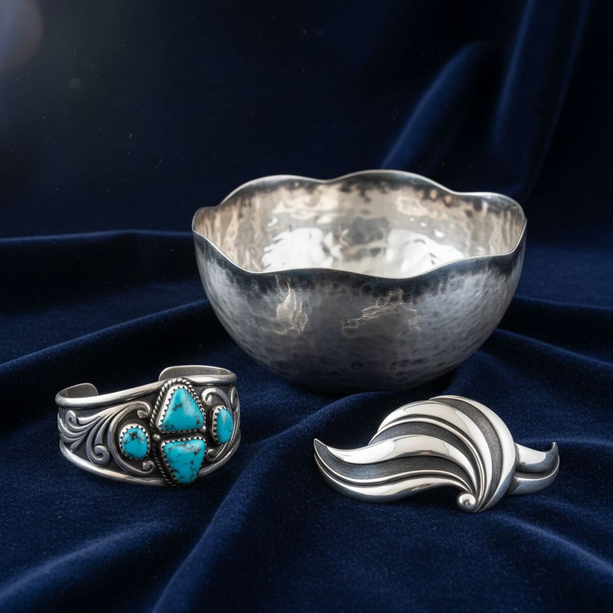

# Silversmithing 银匠工艺

> "Silver is the moon's metal — cool, luminous, and endlessly responsive to the maker's hand." — Unknown

## 概述

银匠工艺（Silversmithing）是以白银为主要材料的金属加工艺术——涵盖锻造、铸造、焊接、雕刻、氧化等技法，创造从餐具到珠宝、从宗教器物到当代雕塑的各种银制品。白银比黄金更易加工、更亲民，却同样美丽——它的冷白光泽、可塑性和抗菌性使其成为人类最喜爱的贵金属之一。从纳瓦霍人的绿松石银饰到英国的银茶具，银匠工艺在全球各文化中都有独特的传统。

银匠工艺的美学在于：月光的金属——银的冷白光泽既高贵又平易，既古典又现代。

## 核心特征

| 特征 | 描述 |
|------|------|
| 白银 | 以白银为主要材料 |
| 可塑 | 极好的可塑性 |
| 光泽 | 冷白的金属光泽 |
| 氧化 | 可利用氧化创造对比 |
| 多用途 | 从餐具到珠宝 |
| 全球 | 全球各文化的传统 |

## 视觉特征

- **银白**：冷白的银色光泽
- **光滑**：抛光的镜面效果
- **氧化**：黑色氧化的对比
- **锤痕**：手工锤打的质感
- **流线**：优美的流线形态
- **反射**：强烈的反射效果

## 代表作品

| 作品 | 艺术家 | 年代 | 意义 |
|------|--------|------|------|
| *Navajo silver jewelry* | 匿名 | 1860s+ | 纳瓦霍银饰传统 |
| *Paul Revere silver* | Paul Revere | 18世纪 | 美国殖民地银器 |
| *Georg Jensen* | Georg Jensen | 1904+ | 丹麦现代银器 |
| *Mexican silver* | William Spratling | 1930s+ | 墨西哥塔斯科银器 |
| *Contemporary art silver* | Various | 当代 | 当代银器艺术 |

## 历史时间线

| 时期 | 事件 |
|------|------|
| 公元前4000年 | 最早的银器加工 |
| 古代 | 各文明的银器传统 |
| 中世纪 | 教会银器和行会 |
| 18-19世纪 | 欧美银器的黄金时代 |
| 1904 | Georg Jensen创立 |
| 当代 | 当代银器艺术和珠宝 |

## 中国语境

中国的银匠工艺有悠久传统——从唐代的银器（何家村窖藏）到明清的银饰。中国少数民族的银饰文化尤为丰富——苗族银饰是国家级非物质文化遗产，苗族妇女的全套银饰可重达数公斤。藏族、彝族、傣族等也有独特的银饰传统。当代中国的银饰设计在传统与现代之间寻找新的表达，贵州、云南是重要的银饰产地。

## AI生成概念图

## 与其他风格的关系

- **Goldsmithing** → 金匠工艺的姊妹
- **Jewelry** → 银饰珠宝
- **Repoussé** → 银器锤揲
- **Niello** → 银器黑金装饰
- **Navajo Art** → 纳瓦霍银饰
- **Scandinavian Design** → 北欧银器设计

---

*浮光艺志 | Chronicle of Artistry*
