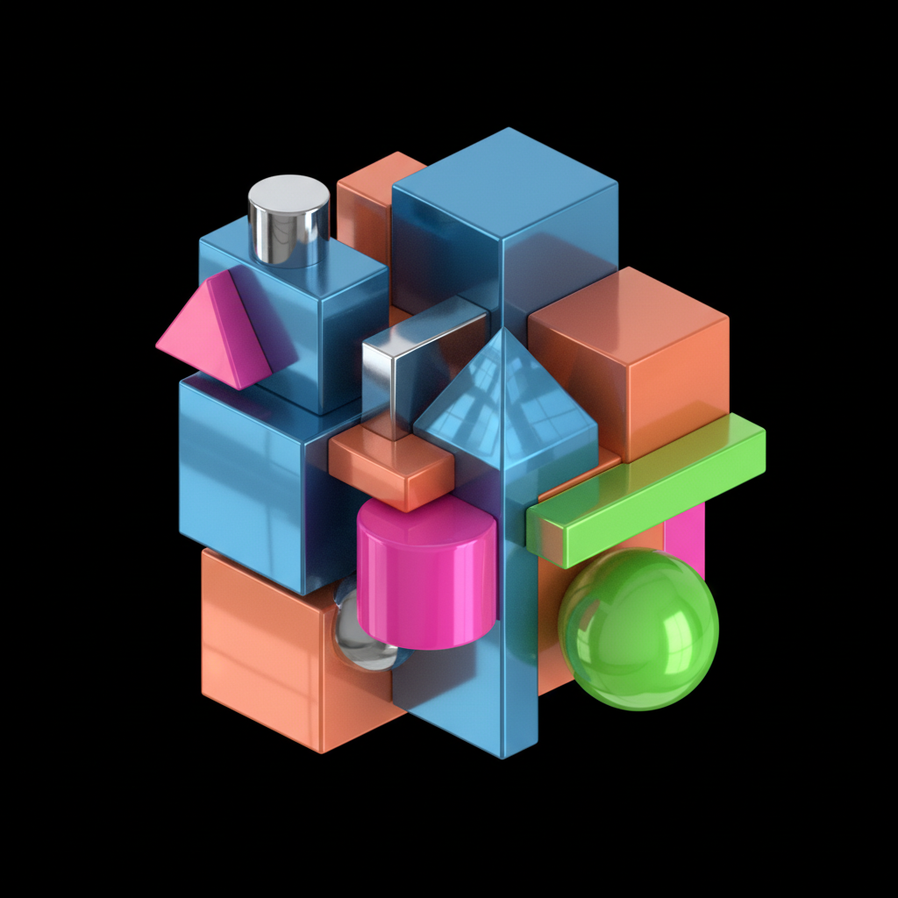

# Simulation Art 模拟艺术

> **时期：** 1980年代  
> **关键词：** 拟像、超真实、商品美学、后现代复制、鲍德里亚

## 概述

模拟艺术（Simulationism/Neo-Geo）是1980年代中期兴起的后现代艺术潮流，深受让·鲍德里亚"拟像与模拟"理论影响。艺术家们认为在消费社会中，图像已经脱离了原始参照物，成为自我指涉的"拟像"——他们通过模仿商品设计、企业美学和抽象艺术的外观，揭示艺术本身已成为一种商品符号。

## 风格特征

- **商品美学**：模仿产品设计和企业视觉语言
- **光滑表面**：工业化的完美质感
- **几何抽象**：看似极简主义但带有讽刺意味
- **品牌化**：将艺术作品当作商品来呈现
- **挪用**：复制和重新语境化已有的视觉符号

## 代表人物与作品

- Jeff Koons 不锈钢气球动物
- Haim Steinbach 商品货架雕塑
- Ashley Bickerton 品牌化自画像
- Peter Halley 几何牢房绘画

## 概念图

