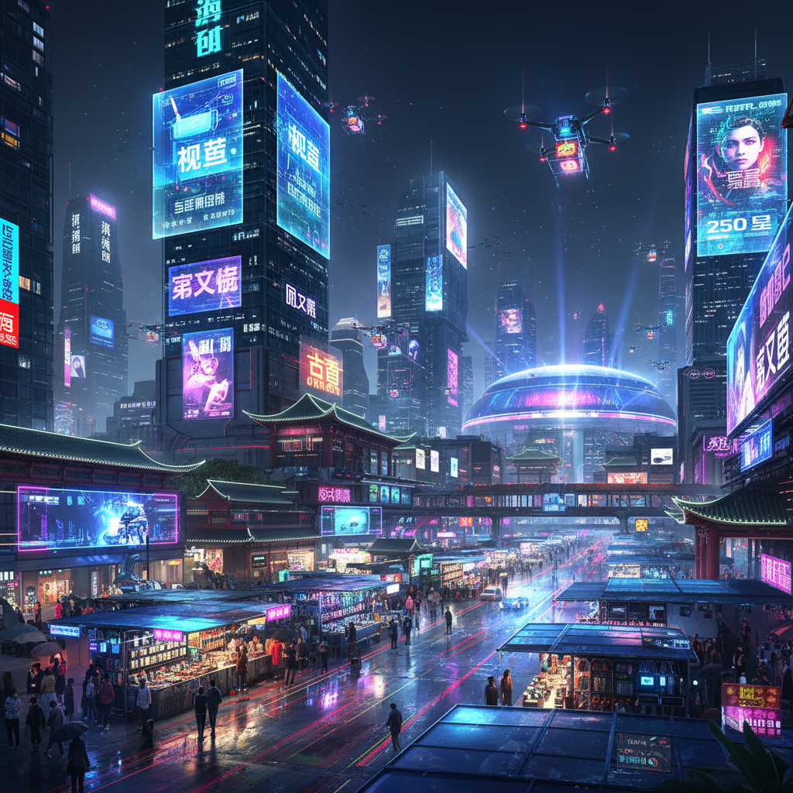

# Sinofuturism 华夏未来主义

> **时期：** 2016–至今  
> **关键词：** 中国科技想象、AI劳动、电竞文化、山寨美学、加速主义

## 概述

华夏未来主义（Sinofuturism）由艺术家Lawrence Lek在2016年同名视频论文中系统阐述，探索中国作为"未来"的文化想象。它将西方对中国的刻板印象——计算、复制、游戏成瘾、勤劳——重新框架为一种独特的未来主义美学：深圳的硬件黑客文化、电竞的赛博运动员、山寨的创新性模仿、AI驱动的社会系统。

## 风格特征

- **赛博城市**：深圳、重庆等城市的霓虹夜景
- **山寨美学**：复制与变异作为创新方法
- **电竞文化**：游戏界面、直播美学
- **AI与自动化**：算法治理的视觉化
- **加速感**：高速发展的眩晕与兴奋

## 代表人物与作品

- Lawrence Lek《Sinofuturism (1839–2046 AD)》
- Lu Yang 数字化身与游戏装置
- Cao Fei《人民城寨》虚拟世界
- 陆扬 数字转世系列

## 概念图

