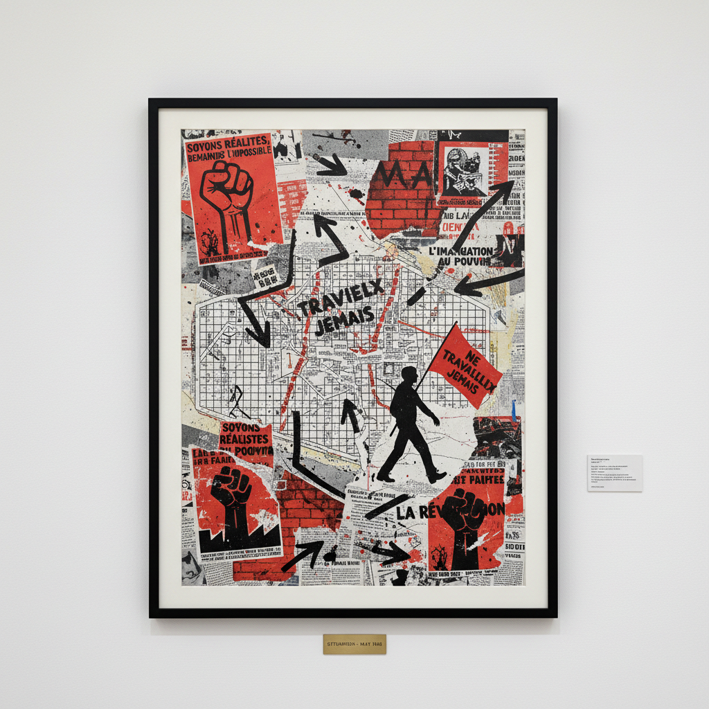

# Situationism 情境主义

> "Beneath the paving stones, the beach!" — May 1968 graffiti

## 概述

情境主义（Situationism / Situationist International）是1957–1972年间活跃的激进政治-艺术运动，由居伊·德波（Guy Debord）领导。它不仅是一种艺术运动，更是一种革命理论——主张通过"构建情境"（constructed situations）来打破资本主义"景观社会"（Society of the Spectacle）对日常生活的殖民。

情境主义者认为，现代社会已经变成了一场巨大的"景观"——人们不再真正生活，而是被动地观看生活的图像。唯一的出路是通过创造性的行动重新夺回日常生活。

## 核心特征

| 特征 | 描述 |
|------|------|
| 景观批判 | 揭露消费社会将一切变为可观看的图像 |
| 构建情境 | 创造打破日常惯性的事件和体验 |
| 漂移 | Dérive——无目的地在城市中游荡 |
| 异轨 | Détournement——挪用和颠覆已有文化产品 |
| 反艺术 | 拒绝艺术作为独立领域——艺术必须融入生活 |
| 革命性 | 最终目标是社会革命而非艺术创新 |

## 视觉特征

- **拼贴**：挪用广告、漫画、地图并加以颠覆
- **地图**：心理地理学地图——城市的情感拓扑
- **文字**：涂鸦、标语、宣言——文字即行动
- **电影**：Debord的反电影——黑屏、静止画面、旁白
- **杂志**：*Internationale Situationniste*的排版设计
- **城市**：城市空间本身是创作和行动的场所

## 代表作品

| 作品 | 创作者 | 年代 | 意义 |
|------|--------|------|------|
| *The Society of the Spectacle* (book) | Guy Debord | 1967 | 情境主义的核心理论文本 |
| *The Society of the Spectacle* (film) | Guy Debord | 1973 | 反电影的极致 |
| *The Naked City* | Guy Debord | 1957 | 心理地理学地图 |
| *Mémoires* | Debord & Asger Jorn | 1959 | 砂纸封面的拼贴书 |
| *Modified Paintings* | Asger Jorn | 1959 | 在旧画上涂鸦——异轨 |
| May 1968 posters | Atelier Populaire | 1968 | 革命海报——情境主义的实践 |

## 历史时间线

| 时期 | 事件 |
|------|------|
| 1952 | Lettrist International成立（前身） |
| 1957 | 情境主义国际（SI）在意大利成立 |
| 1958 | 第一期*Internationale Situationniste*出版 |
| 1961 | 艺术家成员被开除——SI转向纯政治 |
| 1967 | Debord出版《景观社会》 |
| 1968 | 五月风暴——情境主义思想影响巴黎学生运动 |
| 1972 | SI正式解散 |
| 1990s-至今 | 情境主义思想影响文化干扰、反全球化运动 |

## 子类型

| 子类型 | 特征 |
|--------|------|
| 心理地理学 | 城市漂移和情感地图 |
| 异轨 | 挪用和颠覆已有文化产品 |
| 统一城市主义 | 重新设计城市以服务于游戏和欲望 |
| 反电影 | Debord——拒绝景观的电影 |
| 文化干扰 | Adbusters——当代异轨实践 |

## 中国语境

情境主义在中国学术界有一定影响（景观社会理论被广泛引用），但作为艺术实践的影响有限。然而，中国城市化进程中的"城市漫游"文化（如豆瓣上的城市探索小组）、街头涂鸦、以及对消费主义的反思性创作，都可以在情境主义的框架中找到回响。中国互联网上的"恶搞"文化也是一种大众化的"异轨"实践。

## 争议与遗产

- **争议**：情境主义者自己拒绝被称为"艺术运动"
- **内部清洗**：Debord不断开除成员，SI最终只剩几人
- **1968年的失败**：五月风暴未能实现革命
- **遗产**：深刻影响了朋克文化、文化干扰、反全球化运动、关系美学
- **当代回响**：Adbusters、Banksy、快闪族、城市游击艺术

## AI生成概念图

## 与其他风格的关系

- **Dadaism** → 达达的反艺术精神是情境主义的直接先驱
- **Surrealism** → 超现实主义的城市漫游影响了心理地理学
- **Fluxus** → 激浪派共享反体制和日常性
- **Relational Aesthetics** → 关系美学直接继承了"构建情境"的理念
- **Street Art** → 街头艺术继承了情境主义的城市干预
- **Culture Jamming** → 文化干扰是异轨的当代延续

---

*浮光艺志 | Chronicle of Artistry*
