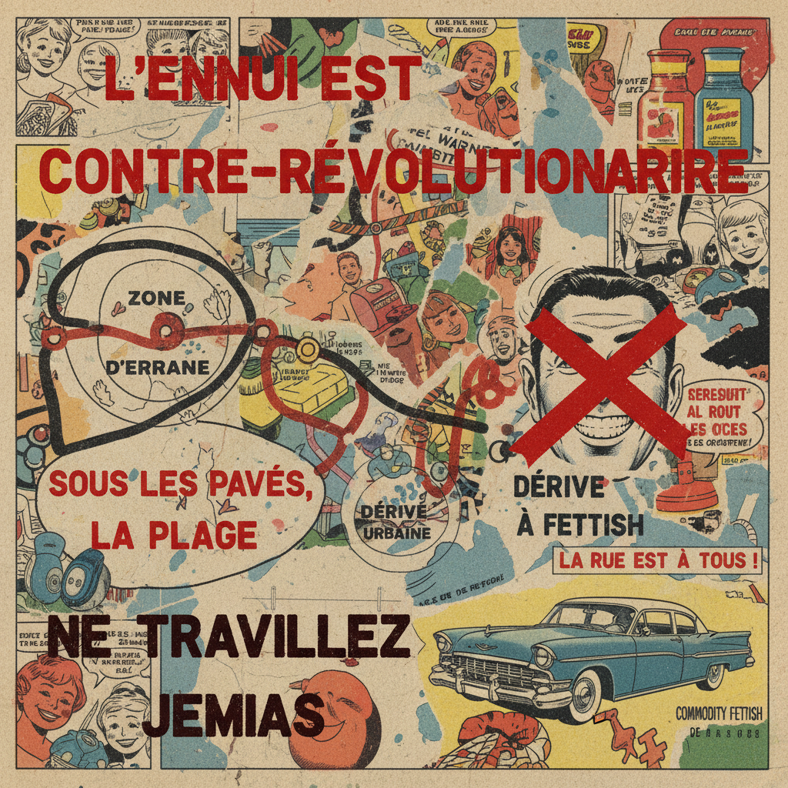

# Situationist Art 情境主义艺术

> **时期：** 1957年–1972年  
> **关键词：** 居伊·德波、景观社会、漂移、异轨、日常生活革命

## 概述

Situationist Art（情境主义艺术）源自1957年成立的情境主义国际，由居伊·德波领导。它不是传统意义上的艺术运动，而是一场试图通过"构建情境"来颠覆资本主义景观社会的文化革命。其视觉实践包括异轨（détournement）——挪用和颠覆现有图像的意义——以及心理地理学地图等。

## 风格特征

- **异轨**：挪用并颠覆现有图像和文本
- **拼贴**：漫画、广告、地图的重新组合
- **文字介入**：标语和理论文本作为视觉元素
- **反艺术**：拒绝艺术品的商品属性
- **城市实践**：漂移和心理地理学的视觉记录

## 代表人物与作品

- 居伊·德波《景观社会》
- 阿斯格·约恩 改绘旧画
- 情境主义国际杂志拼贴
- 1968年五月风暴海报

## 概念图

