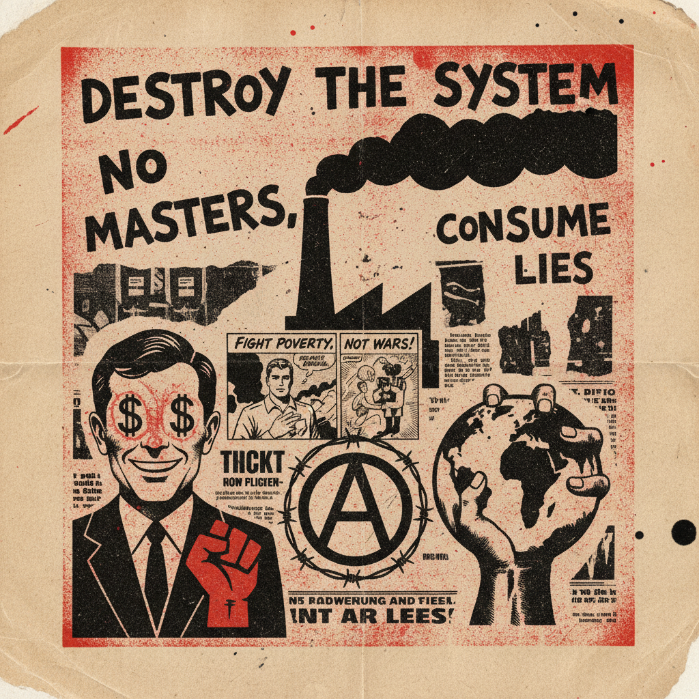

# Situationist International 情境主义国际

> **时期：** 1957–1972  
> **关键词：** 异轨、漂移、景观社会、心理地理学、文化颠覆

## 概述

情境主义国际（Situationist International）是由居伊·德波（Guy Debord）等人创立的激进艺术与政治运动。他们认为资本主义已将生活变成"景观"——一切真实体验都被商品化的图像所取代。情境主义者通过"异轨"（détournement，挪用并颠覆大众媒体素材）和"漂移"（dérive，无目的地城市漫游）来打破日常生活的麻木，试图创造真正的"情境"来对抗景观社会。

## 风格特征

- **异轨（Détournement）**：挪用广告、漫画、电影片段并篡改其含义
- **心理地理学**：用情感而非功能重新绘制城市地图
- **拼贴与涂改**：在现有图像上覆写、划掉、重新组合
- **反美学**：故意粗糙的排版和复印质感
- **文字优先**：大量宣言、标语和理论文本

## 代表人物与作品

- Guy Debord《景观社会》（1967）
- Asger Jorn 涂改绘画系列
- René Viénet 异轨电影
- 1968年五月风暴海报与标语

## 概念图

