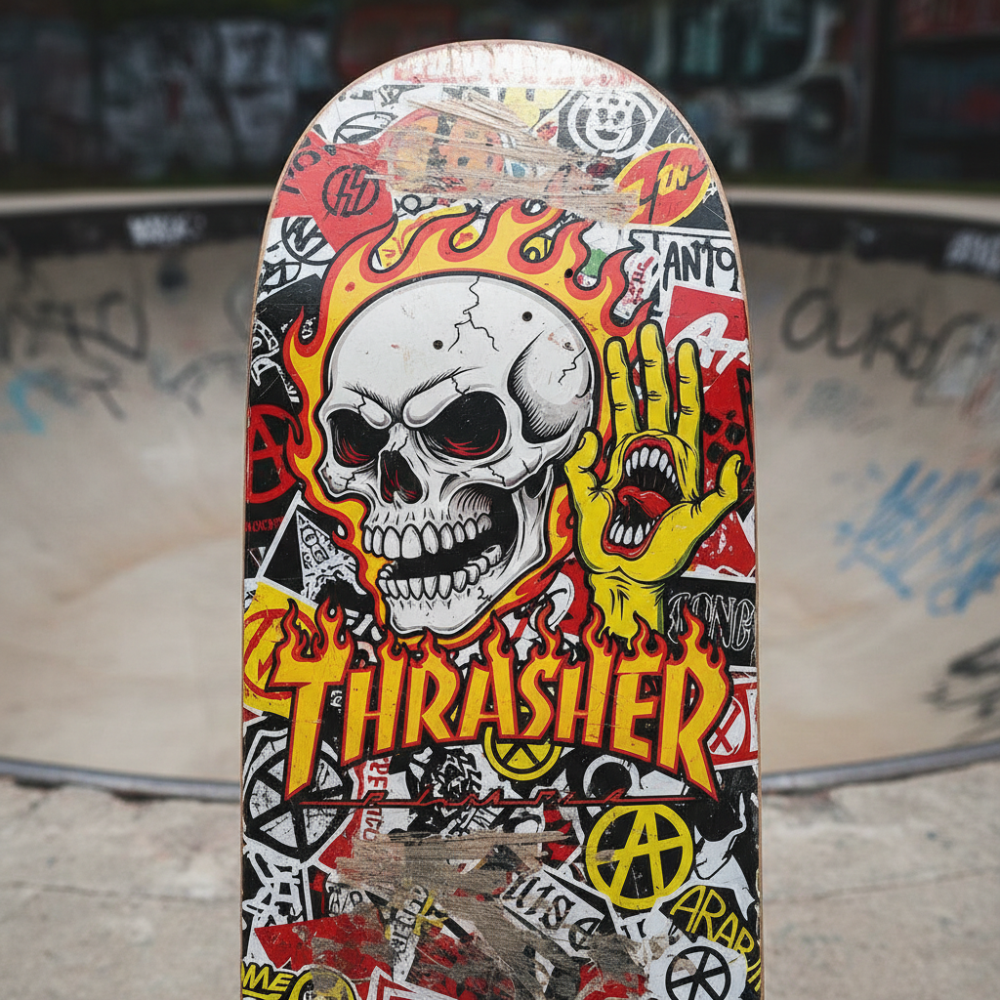

# Skatepunk 滑板朋克



> **"Thrasher字体、骷髅图案、磨破的Vans——半管里的无政府主义。"**

## 概述

| 维度 | 描述 |
|------|------|
| 时期 | 1980s 起源 / 1990s–2000s 黄金时代 |
| 别名 | Skatepunk, Skate Culture, Thrash |
| 核心色彩 | 黑色、红色、黄色、白色 |
| 关键元素 | 骷髅、火焰、Thrasher字体、板面图案 |
| 代表人物 | Powell Peralta、Santa Cruz、Jim Phillips |
| 关联风格 | Punk, Streetwear, Grunge, Skatercore |

---

## 历史脉络

### 从空泳池到全球文化

| 年份 | 事件 |
|------|------|
| 1976 | Dogtown Z-Boys——现代滑板文化诞生 |
| 1981 | Thrasher Magazine 创刊 |
| 1984 | Powell Peralta Bones Brigade |
| 1986 | Jim Phillips "Screaming Hand" for Santa Cruz |
| 1991 | Tony Hawk 成为文化偶像 |
| 1999 | Tony Hawk's Pro Skater 游戏 |
| 2000s | 滑板文化进入主流时尚 |
| 2020 | 滑板成为奥运项目 |

### 核心哲学

Skatepunk 的精神是**"城市是我的游乐场——规则是用来打破的"**：
- DIY = 自己做板面、自己拍视频
- 街头 = 自由（不需要场地、不需要许可）
- 摔倒 = 学习（"没有摔过就没有学会"）
- 反权威、反主流、反规则
- "滑板不是运动——是生活方式"

---

## 视觉语法

### 色彩系统

```
主色：
  黑色 (#000000) — 基础、叛逆
  红色 (#FF0000) — 能量、危险
  黄色 (#FFFF00) — 警告、活力
  白色 (#FFFFFF) — 对比

辅色：
  绿色 (#00FF00) — 毒液、怪物
  紫色 (#800080) — 怪异
  橙色 (#FF8C00) — 火焰

规则：
  - 高对比度
  - 大胆、粗暴
  - 手绘感
  - 不需要"好看"——需要"有力量"
  - 越脏越真实

质感：
  磨损 — 使用痕迹
  贴纸 — 层叠、覆盖
  喷漆 — 街头、快速
  手绘 — DIY、独特
```

### 标志性元素

| 类别 | 元素 |
|------|------|
| 图案 | 骷髅、火焰、蛇、怪物、尖牙 |
| 字体 | Thrasher 火焰字、手写、粗暴 |
| 载体 | 板面图案、贴纸、T恤、杂志 |
| 符号 | 骷髅、十字架、闪电、中指 |
| 品牌 | Thrasher、Santa Cruz、Powell Peralta、Independent |
| 态度 | 反叛、DIY、街头、自由 |

---

## 与千禧怀旧的关系

### Tony Hawk's Pro Skater 一代
- THPS 游戏 (1999) = 一代人的滑板启蒙
- 游戏原声带 = 朋克/滑板音乐入门
- 2020 THPS 重制版 = 纯粹的怀旧
- "我没有真的滑过板但我玩了1000小时THPS"

### 从亚文化到主流
- Thrasher T恤从滑板圈到快时尚
- Vans 从滑板鞋到全球时尚品牌
- 2020 奥运 = 滑板的"主流化"
- 但核心社区认为这是"背叛"

---

## 中国语境

- 中国滑板文化的发展
- 深圳/上海滑板场景
- 中国滑板品牌和设计
- 与中国街头文化的交叉

---

## 设计应用

| 场景 | 应用方式 |
|------|----------|
| 品牌 | 手绘+骷髅+粗暴字体+DIY感 |
| 产品 | 板面图案+贴纸+限量+艺术家联名 |
| 空间 | 涂鸦+混凝土+贴纸墙+视频 |
| 数字 | 手绘元素+粗暴+动态+街头 |

---

## 相关风格

← [Punk 朋克美学](punk.md) | [Streetwear 街头服饰](streetwear.md) →

↑ [返回千禧怀旧目录](README.md) | [返回总目录](../README.md)
