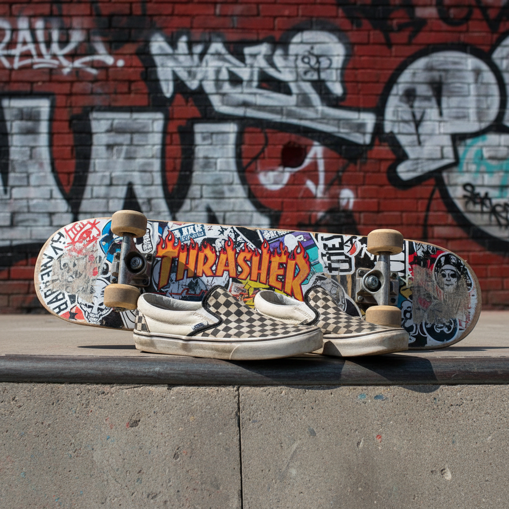

# Skatercore 滑板核



> **"Thrasher字体、磨破的Vans、半管上的自由——滑板文化从街头到T台。"**

## 概述

| 维度 | 描述 |
|------|------|
| 时期 | 1970s起源 / 2000s–2010s 主流化 / 2020s 复兴 |
| 别名 | Skatercore, Skate Culture, Thrash Aesthetic |
| 核心色彩 | 黑色、白色、红色、军绿、旧黄 |
| 关键元素 | 滑板、Vans/Converse、宽松裤、Thrasher |
| 代表人物 | Tony Hawk、Supreme、Stüssy、Palace |
| 关联风格 | Grunge, Streetwear, Punk, Y2K |

---

## 历史脉络

### 1970s–1980s：加州起源

滑板文化在 1970 年代的加州诞生，最初是冲浪文化的陆地延伸：
- **Dogtown & Z-Boys** (1975)：滑板从玩具变成运动
- **Thrasher Magazine** (1981)：定义了滑板视觉语言
- **Powell Peralta**：骷髅和骨头的经典图形

### 1990s：与朋克/Grunge 的融合

- 滑板文化与朋克音乐深度绑定
- **Vans Warped Tour** 将滑板+朋克打包
- 宽松裤、链条、band tee 成为标配
- 滑板视频成为亚文化传播媒介

### 2000s：商业化与街头品牌

| 品牌 | 贡献 |
|------|------|
| Supreme (1994–) | 将滑板文化变成奢侈品 |
| Stüssy | 冲浪/滑板到街头时尚的桥梁 |
| Palace (2009–) | 英国滑板文化的代表 |
| Thrasher | 从杂志到时尚符号 |
| Vans | 从滑板鞋到全球生活方式品牌 |

### 2020s：TikTok 复兴

- "Skater Boy/Girl" 成为 TikTok 美学标签
- Avril Lavigne "Sk8er Boi" 的怀旧回潮
- 滑板进入奥运会 (2021)
- 与 Indie Kid、Grunge Revival 的交叉

---

## 视觉语法

### 色彩系统

```
主色：
  黑色 (#000000) — 基础色
  白色 (#FFFFFF) — 图形/文字
  红色 (#FF0000) — Thrasher、警告色
  军绿 (#556B2F) — 工装裤
  旧黄 (#DAA520) — 复古感

辅色：
  牛仔蓝 (#4169E1) — 宽松牛仔裤
  混凝土灰 (#A9A9A9) — 城市地面
  棕色 (#8B4513) — 皮革、旧木

质感：
  磨损/做旧 — 鞋底、裤脚
  贴纸/涂鸦 — 滑板底面
  混凝土/沥青 — 城市地面
  印花/丝网印刷 — T恤图案
```

### 标志性元素

| 类别 | 元素 |
|------|------|
| 装备 | 滑板、护膝、头盔（或故意不戴） |
| 鞋 | Vans Old Skool、Converse、Nike SB Dunk |
| 上衣 | Thrasher hoodie、band tee、flannel衬衫 |
| 下装 | 宽松工装裤、破洞牛仔裤、短裤 |
| 配饰 | 链条钱包、棒球帽（反戴）、腕带 |
| 空间 | 半管、街头台阶、停车场、混凝土碗池 |
| 图形 | 骷髅、火焰、涂鸦字体、品牌logo |

---

## 与千禧怀旧的关系

### 2000s 的滑板黄金时代
- Tony Hawk's Pro Skater 游戏系列 (1999–)
- 滑板视频 (411VM, Transworld) 的 VHS/DVD 时代
- Jackass (2000–) 将极限运动带入主流
- 这些是很多千禧一代的童年/青春记忆

### 与 Frutiger Metro 的交叉
- 2000s 的滑板赛事海报大量使用 Frutiger Metro 风格
- 黑色人物剪影 + 荧光色 + 城市元素
- 滑板文化是 Frutiger Metro 的重要应用场景

---

## 中国语境

- 2000s 中国滑板文化萌芽（深圳、上海）
- "极限运动"频道和赛事
- Supreme/Palace 在中国的潮流地位
- 小红书/抖音上的"滑板女孩"标签
- 与"街头文化"/"潮牌"的深度绑定

---

## 设计应用

| 场景 | 应用方式 |
|------|----------|
| 品牌 | 涂鸦字体+做旧质感+黑白红配色 |
| 包装 | 贴纸风格+手绘插画+粗犷排版 |
| 空间 | 混凝土+涂鸦墙+滑板展示 |
| 数字 | VHS质感+手写字体+街头摄影 |

---

## 延伸阅读

- 《Dogtown and Z-Boys》(2001) 纪录片
- Thrasher Magazine 视觉史
- Supreme 品牌文化分析

---

## 相关风格

← [Grunge 垃圾摇滚](grunge.md) | [Frutiger Metro 弗鲁提格都市](frutiger-metro.md) →

↑ [返回千禧怀旧目录](README.md) | [返回总目录](../README.md)
