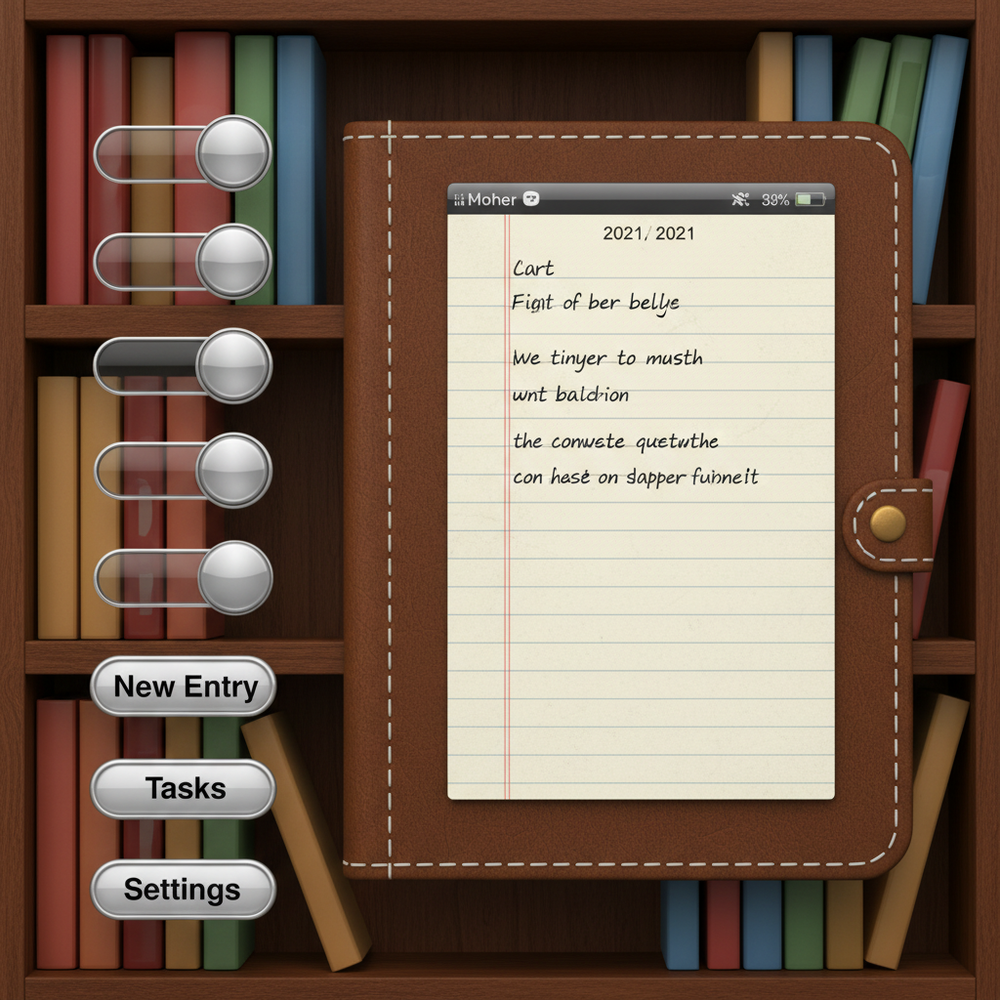

# Skeuomorphism 拟物设计



> **"皮革纹理的笔记本、木质书架、金属旋钮——当数字界面假装自己是真实物品。"**

## 概述

| 维度 | 描述 |
|------|------|
| 时期 | 2007–2012 鼎盛 |
| 别名 | Skeuomorphism, Rich Design, Realistic UI |
| 核心色彩 | 皮革棕、木纹色、金属灰、亚麻白、深蓝 |
| 关键元素 | 真实材质纹理、光影效果、3D按钮、拟物图标 |
| 代表人物 | Apple (iOS 1–6)、Scott Forstall |
| 关联风格 | Frutiger Aero, Neumorphism, Glassmorphism |

---

## 历史脉络

### 2007–2012：iPhone 时代

| 年份 | 事件 |
|------|------|
| 2007 | iPhone 发布，拟物设计成为标准 |
| 2008 | App Store 开放，拟物图标泛滥 |
| 2010 | iPad 的 iBooks 木质书架 |
| 2011 | iOS 5 的皮革日历、亚麻纹理 |
| 2012 | 拟物设计达到巅峰（也是终点） |
| 2013 | iOS 7 发布，拟物时代终结 |

### 为什么需要拟物？

| 原因 | 解释 |
|------|------|
| 用户教育 | 触摸屏是新事物，需要"熟悉感" |
| 隐喻 | "这看起来像笔记本" = "你可以在这里写字" |
| 愉悦感 | 精美的纹理和光影让人愉悦 |
| 技术展示 | Retina 屏幕需要展示细节 |
| Steve Jobs | 他个人热爱真实材质 |

### 为什么它死了？

| 原因 | 解释 |
|------|------|
| 用户成熟 | 不再需要"皮革"来理解"笔记本" |
| 过度装饰 | 纹理成了噪音 |
| 响应式 | 纹理在小屏幕上不好用 |
| 审美疲劳 | 6年的皮革和木头让人厌倦 |
| Jony Ive | 他讨厌拟物，推动了 iOS 7 |

---

## 视觉语法

### 色彩系统

```
主色：
  皮革棕 (#8B4513) — 笔记本、日历
  木纹色 (#DEB887) — 书架、桌面
  金属灰 (#808080) — 按钮、旋钮
  亚麻白 (#FAF0E6) — 背景纹理
  深蓝 (#191970) — 夜空、深度

辅色：
  绿色毡布 (#228B22) — 游戏桌
  红色皮革 (#8B0000) — 高级感
  铬银 (#C0C0C0) — 金属装饰

质感（核心！）：
  皮革 — 缝线、纹理、磨损
  木材 — 纹理、光泽、年轮
  金属 — 反射、拉丝、铆钉
  纸张 — 纤维、折痕、撕边
  玻璃 — 反射、透明、高光
  布料 — 亚麻、毡布、编织
```

### 标志性元素

| 类别 | 元素 |
|------|------|
| 按钮 | 3D凸起、高光、阴影、按下状态 |
| 图标 | 真实物品的微缩版（指南针、相机） |
| 纹理 | 皮革、木材、金属、纸张 |
| 光影 | 环境光、高光、投影 |
| 细节 | 缝线、铆钉、螺丝、折痕 |
| 隐喻 | 书架=图书馆、日历=真实日历 |

---

## 与千禧怀旧的关系

### iPhone 时代的视觉记忆
- 2007–2012 = 千禧一代的"第一台智能手机"
- 那些精美的拟物图标 = 青春记忆
- iOS 6 的 Game Center 绿色毡布 = 时代符号
- 现在看到拟物设计会感到"温暖"和"怀旧"

### Frutiger Aero 的近亲
- 两者都属于"Web 2.0 时代"的视觉语言
- 都热爱光泽、反射、真实感
- 都在 2013 年被 Flat Design 终结
- 都在 2020s 成为怀旧对象

---

## 中国语境

- "拟物化设计"/"写实风格"
- 早期 iOS 中国区 App 的设计风格
- 与"新拟物"(Neumorphism) 的对比
- 设计面试中的"拟物 vs 扁平"经典题
- 部分游戏/工具 App 仍在使用拟物元素

---

## 设计应用

| 场景 | 应用方式 |
|------|----------|
| 游戏 | 真实材质按钮+3D效果+物理隐喻 |
| 音乐 | 旋钮、推子、VU表的拟物界面 |
| 工具 | 计算器、指南针、时钟的真实感 |
| 怀旧 | 故意使用拟物元素唤起 2010s 记忆 |

---

## 相关风格

← [Frutiger Aero](frutiger-aero.md) | [Flat Design 扁平设计](flat-design.md) →

↑ [返回千禧怀旧目录](README.md) | [返回总目录](../README.md)
