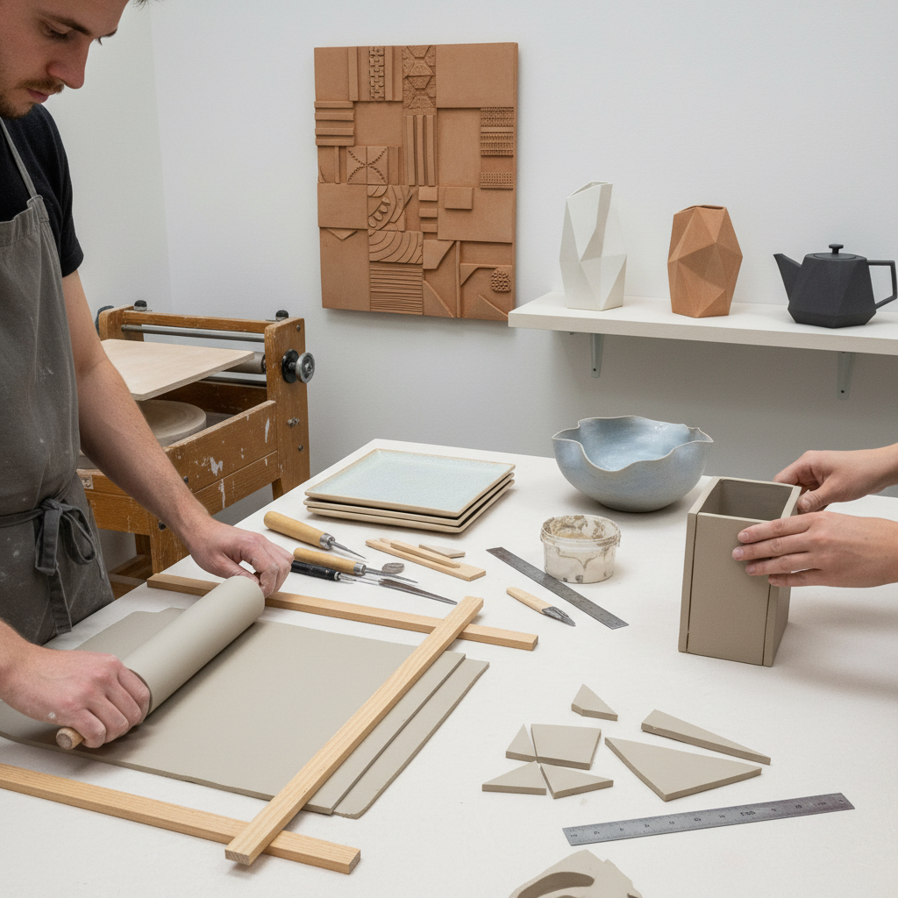

# Slab Building 板筑陶艺

> "Slab building is carpentry in clay — flat sheets of earth cut, scored, and joined like panels of wood, creating forms with the architectural precision of boxes and the organic freedom of draped fabric frozen in time." — Unknown

## 概述

板筑陶艺（Slab Building）是一种使用平整的粘土板（slabs）来构建陶瓷器物的手工成型技法。粘土被擀成均匀厚度的平板，然后像纸板或木板一样切割、弯曲、连接，组装成各种形状。板筑法特别适合制作几何形状的器物（如方形花瓶、矩形盒子）以及建筑感强的陶瓷作品。

板筑法的优势在于：可以制作陶轮无法实现的非圆形器物、可以在平板上预先装饰（印花、刻画、贴花）再组装、可以制作大型平面作品（如陶瓷壁画）。板筑法有两种主要方式：硬板法（stiff slab，使用半干的硬板组装几何形状）和软板法（soft slab，使用柔软的板材弯曲和悬垂形成有机形态）。

## 核心特征

| 特征 | 描述 |
|------|------|
| 平板 | 使用平整的粘土板 |
| 组装 | 切割和组装 |
| 几何 | 适合几何形状 |
| 建筑 | 建筑感的形态 |
| 预装饰 | 可预先装饰 |
| 大型 | 适合大型作品 |

## 视觉特征

- **平面**：平整的表面
- **几何**：几何的形态
- **建筑**：建筑感的结构
- **接缝**：可见的接缝
- **棱角**：清晰的棱角
- **有机**：软板的有机形态

## 代表作品

| 作品 | 艺术家 | 年代 | 意义 |
|------|--------|------|------|
| *Slab-built vessels* | Various | 当代 | 板筑器皿 |
| *Architectural ceramics* | Various | 当代 | 建筑陶瓷 |
| *Slab sculpture* | Various | 当代 | 板筑雕塑 |
| *Ceramic wall pieces* | Various | 当代 | 陶瓷壁挂 |
| *Soft slab organic forms* | Various | 当代 | 软板有机形态 |

## 历史时间线

| 时期 | 事件 |
|------|------|
| 古代 | 早期板筑陶器的使用 |
| 传统 | 各文化中的板筑传统 |
| 20世纪 | 工作室陶艺中的板筑发展 |
| 1960s | 当代陶艺运动中的板筑创新 |
| 当代 | 板筑法在陶艺教育中的标准化 |
| 当代 | 板筑法在建筑陶瓷中的应用 |

## 中国语境

板筑法在中国的陶艺教育和创作中有广泛的应用。中国的陶瓷院校和工作室教授板筑法作为手工成型的基础技法之一。中国的当代陶艺家使用板筑法创作具有建筑感和现代感的作品。中国传统的一些陶瓷器物（如方形茶壶、砖瓦）也使用板筑原理。中国的陶艺体验课程中，板筑法因其"容易上手、形状自由"的特点而受欢迎。

## AI生成概念图

## 与其他风格的关系

- **Coiling Pottery** → 盘筑陶艺
- **Pinch Pottery** → 捏塑陶艺
- **Wheel Throwing** → 拉坯
- **Ceramic Sculpture** → 陶瓷雕塑
- **Architecture** → 建筑
- **Hand Building** → 手工成型

---

*浮光艺志 | Chronicle of Artistry*
