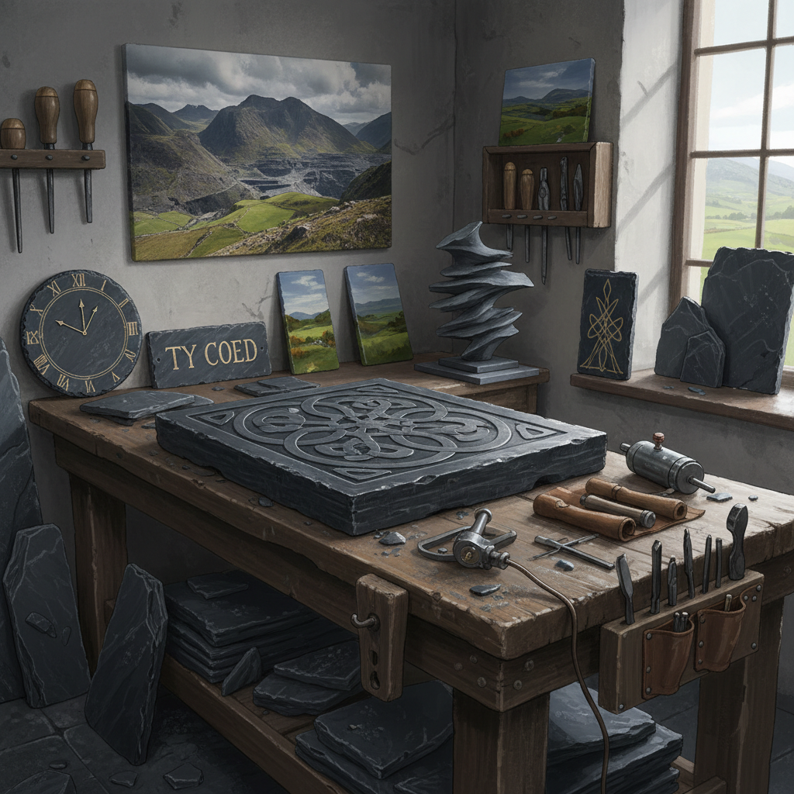

# Slate Art 板岩艺术

> "Slate splits along planes laid down hundreds of millions of years ago — each cleavage reveals a surface that has been hidden since before dinosaurs walked the earth. This ancient flatness, this geological patience, makes slate the perfect canvas for art that aspires to permanence. What you carve or paint on slate will outlast civilizations." — Unknown

## 概述

板岩艺术（Slate Art）是以板岩（页岩变质而成的层状岩石）为材料进行艺术创作的实践——利用板岩的天然平整性、深色调、可劈裂性和耐久性创造各种艺术形式。板岩因其能够沿层理面劈裂成薄片的特性，自古以来就被用作书写、绘画和建筑材料。

板岩艺术的实践包括：1）板岩雕刻——在板岩表面进行浮雕或阴刻；2）板岩绘画——在板岩表面绘画（油画、丙烯等）；3）板岩书法——在板岩上刻写文字；4）板岩马赛克——用板岩碎片拼贴成图案；5）板岩建筑装饰——用板岩作为建筑装饰元素；6）板岩家居艺术——用板岩制作的时钟、相框等家居装饰；7）板岩景观——用板岩设计的景观艺术。

## 核心特征

| 特征 | 描述 |
|------|------|
| 平整 | 天然的平整表面 |
| 深色 | 深灰到黑色的色调 |
| 耐久 | 极其耐久 |
| 可劈 | 可沿层理劈裂 |
| 古老 | 数亿年的地质历史 |
| 防水 | 天然防水性 |

## 视觉特征

- **深灰**：板岩的深灰到黑色
- **平整**：光滑平整的表面
- **层次**：层状的边缘纹理
- **哑光**：天然的哑光质感
- **对比**：刻痕与表面的对比
- **厚重**：视觉上的厚重感

## 代表作品

| 作品 | 艺术家 | 年代 | 意义 |
|------|--------|------|------|
| *Welsh slate carvings* | 威尔士传统 | 古代至今 | 威尔士板岩雕刻 |
| *Slate gravestones* | Various | 17-19世纪 | 板岩墓碑艺术 |
| *Slate paintings* | Various | 文艺复兴至今 | 板岩绘画 |
| *Slate sculptures* | Richard Long | 当代 | 当代板岩雕塑 |
| *Slate architecture* | Various | 古代至今 | 板岩建筑 |

## 历史时间线

| 时期 | 事件 |
|------|------|
| 古代 | 板岩作为书写材料 |
| 中世纪 | 板岩屋顶和建筑 |
| 文艺复兴 | 板岩作为绘画载体 |
| 工业时代 | 板岩开采工业化 |
| 当代 | 板岩作为当代艺术媒介 |

## 中国语境

板岩艺术在中国有独特的文化传统。中国传统的"石刻"——在石板上刻写文字和图案——是中国最重要的文化遗产形式之一。中国的碑刻艺术（如西安碑林）虽然多用石灰岩，但板岩在某些地区也被广泛使用。中国贵州、湖南等地出产优质板岩，当地有用板岩制作屋顶、墙壁和地面的传统。中国传统的"砚台"——用于研墨的石板——虽然多用端石、歙石等特定石材，但其平整光滑的特性与板岩相似。中国当代的一些艺术家在探索板岩艺术：将中国书法刻于板岩、用板岩的天然层理创作当代雕塑、以及将板岩与中国传统建筑美学结合。

## AI生成概念图

## 与其他风格的关系

- **Stone Carving** → 石雕
- **Calligraphy** → 书法
- **Architecture** → 建筑
- **Land Art** → 大地艺术
- **Mosaic Art** → 马赛克艺术
- **Minimalism** → 极简主义

---

*浮光艺志 | Chronicle of Artistry*
