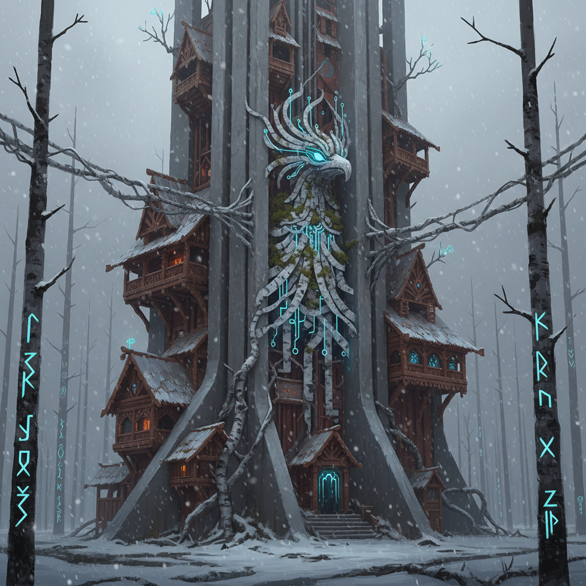

# Slavic Futurism 斯拉夫未来主义

> **时期：** 2010年代–至今  
> **关键词：** 斯拉夫神话+科技、东欧美学、苏联遗产、民间传说未来化

## 概述

斯拉夫未来主义将东欧和斯拉夫文化的独特元素——民间传说、东正教图像学、苏联建筑遗产、斯拉夫神话——与科幻和未来主义想象结合。它创造了一种既不是西方赛博朋克也不是日本动漫的第三种未来美学：巴巴雅加的小屋变成太空站，套娃变成AI容器，苏联混凝土变成外星建筑。

## 风格特征

- **民间传说科幻化**：斯拉夫神话生物与科技融合
- **苏联建筑遗产**：粗野主义建筑的未来延伸
- **东正教图像学**：圣像画风格的科幻插画
- **自然崇拜**：森林、河流作为有意识的实体
- **忧郁美学**：东欧特有的诗意忧伤

## 代表人物与作品

- Simon Stålenhag 东欧风格科幻绘画
- 当代俄罗斯科幻插画
- 东欧独立游戏视觉设计
- Zdzisław Beksiński 的当代继承者

## 概念图

