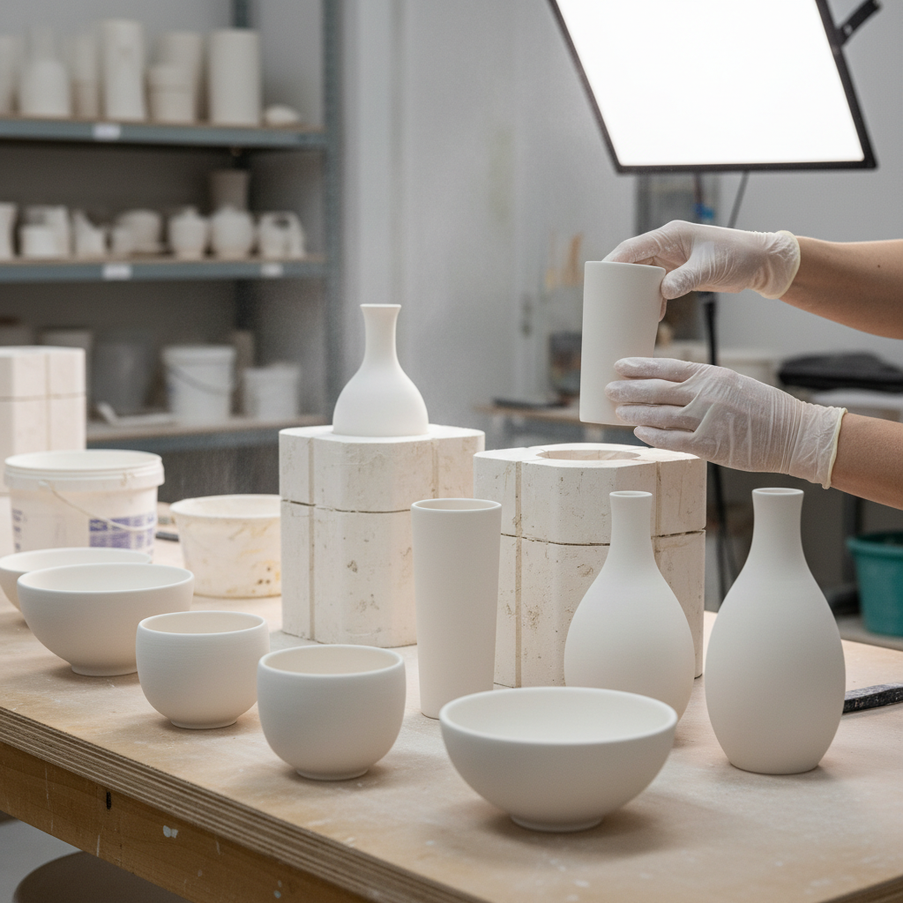

# Slip Cast Art 注浆成型艺术

> "Slip casting is patience made porcelain — liquid clay poured into a plaster mold that drinks the water from its edges inward, building a shell of solid clay molecule by molecule against the mold wall until the potter judges the thickness right and pours the remaining slip away, leaving behind a hollow form of impossible thinness and perfect uniformity that no hand could shape alone." — Unknown

## 概述

注浆成型艺术（Slip Cast Art）是一种将液态粘土（泥浆）倒入石膏模具中，利用石膏的吸水性使泥浆在模具内壁形成均匀薄壁的陶瓷成型技法。注浆成型可以制作出极薄、极均匀、形状复杂的器物——从工业陶瓷到艺术创作都广泛使用。当代陶艺家利用注浆成型的精确性和可重复性，结合手工修饰和组合，创造出独特的艺术作品。

注浆成型艺术的核心要素包括：1）泥浆配制——将粘土配制成流动性好的液态泥浆；2）石膏模具——制作精确的石膏模具；3）注浆——将泥浆倒入模具；4）吸水成型——石膏吸水使泥浆在壁面固化；5）排浆——倒出多余泥浆形成空心器物；6）脱模——待干燥后从模具中取出；7）修整——对接缝和表面进行修整。

## 核心特征

| 特征 | 描述 |
|------|------|
| 液态成型 | 使用液态泥浆成型 |
| 均匀薄壁 | 极其均匀的壁厚 |
| 精确复制 | 可精确重复生产 |
| 复杂形状 | 可制作复杂造型 |
| 石膏模具 | 依赖精确的模具制作 |
| 工业与艺术 | 兼具工业和艺术应用 |

## 视觉特征

- **均匀薄壁**：极其均匀的器壁厚度
- **光滑表面**：模具赋予的光滑表面
- **精确造型**：精确的几何或有机形态
- **轻盈感**：薄壁带来的轻盈质感
- **复杂结构**：难以手工实现的复杂形状
- **系列感**：可重复的统一形态

## 代表作品

| 作品 | 艺术家/文化 | 年代 | 意义 |
|------|-------------|------|------|
| *Wedgwood jasperware* | Wedgwood | 18世纪 | 早期工业注浆 |
| *Kate Malone作品* | Kate Malone | 当代 | 当代注浆艺术 |
| *Hitomi Hosono作品* | 细野仁美 | 当代 | 精细注浆装饰 |
| *工业设计陶瓷* | 各品牌 | 当代 | 工业注浆应用 |
| *当代注浆雕塑* | 各地陶艺家 | 当代 | 注浆的艺术探索 |

## 历史时间线

| 时期 | 事件 |
|------|------|
| 18世纪 | 欧洲开始使用注浆成型 |
| 19世纪 | 工业陶瓷中注浆的普及 |
| 20世纪初 | 注浆技术的工业化完善 |
| 20世纪中期 | 艺术家开始探索注浆的艺术可能 |
| 当代 | 注浆在艺术与设计中的广泛应用 |

## 中国语境

注浆成型在中国陶瓷工业中有广泛应用。景德镇的日用瓷生产大量使用注浆成型技术。中国当代陶艺家也在探索注浆成型的艺术可能性——利用其精确性和可重复性进行系列创作，或将注浆件作为基础进行二次加工和装饰。中国的陶瓷设计教育中，注浆成型是重要的技术课程。中国的陶瓷产业——从卫浴到餐具到艺术瓷——都依赖注浆成型技术。近年来，3D打印模具与注浆成型的结合为中国陶瓷创新提供了新的可能。

## AI生成概念图

## 与其他风格的关系

- **Industrial Design** → 工业设计
- **Mold Making** → 模具制作
- **Porcelain** → 瓷器
- **3D Printing** → 3D打印
- **Serial Art** → 系列艺术
- **Minimalism** → 极简主义

---

*浮光艺志 | Chronicle of Artistry*
