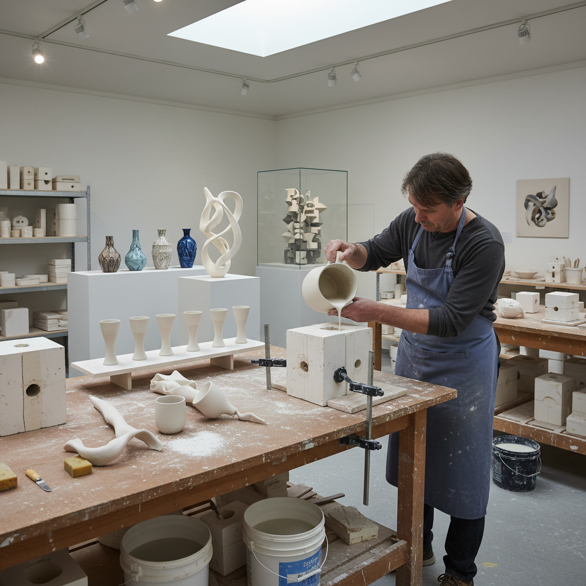

# Slip Casting 注浆成型

> "Slip casting is patience in liquid form — clay suspended in water, poured into plaster that drinks it slowly, leaving behind a hollow shell of perfect uniformity that no hand could achieve." — Unknown

## 概述

注浆成型（Slip Casting）是一种陶瓷成型技法——将液态的泥浆（slip，黏土与水的悬浮液）倒入石膏模具中，石膏吸收泥浆中的水分，在模具内壁形成一层均匀的泥坯。当泥坯达到所需厚度后，倒出多余的泥浆，待泥坯干燥收缩后脱模，再经修整、干燥和烧制。

注浆成型的优势在于：可以制作形状复杂、壁厚均匀的空心器物，且可以精确重复。它是工业陶瓷生产的主要方法之一，但也被当代陶艺家用于艺术创作——利用模具的可重复性来探索系列、变体和组合的概念。当代艺术家还通过变形、切割、重组注浆坯体来创造独特的作品。

## 核心特征

| 特征 | 描述 |
|------|------|
| 泥浆 | 液态泥浆为材料 |
| 模具 | 石膏模具成型 |
| 吸水 | 石膏吸水原理 |
| 均匀 | 壁厚极其均匀 |
| 空心 | 制作空心器物 |
| 可重复 | 可精确重复 |

## 视觉特征

- **均匀**：极其均匀的壁厚
- **光滑**：光滑的表面
- **精确**：精确的形状
- **薄壁**：可实现极薄的壁
- **复杂**：可制作复杂形状
- **系列**：可制作系列作品

## 代表作品

| 作品 | 艺术家 | 年代 | 意义 |
|------|--------|------|------|
| *Industrial porcelain* | Various | 18世纪+ | 工业注浆瓷器 |
| *Slip-cast sculptures* | Various | 当代 | 当代注浆雕塑 |
| *Bone china tableware* | Wedgwood等 | 18世纪+ | 骨瓷餐具 |
| *Contemporary slip-cast art* | Kate Malone | 当代 | 当代注浆艺术 |
| *Conceptual multiples* | Various | 当代 | 概念性系列作品 |

## 历史时间线

| 时期 | 事件 |
|------|------|
| 18世纪 | 欧洲瓷器工厂的注浆技术 |
| 19世纪 | 注浆成型的工业化 |
| 20世纪初 | 注浆技术的标准化 |
| 1960s+ | 当代陶艺家的艺术性应用 |
| 当代 | 3D打印模具与注浆的结合 |
| 当代 | 当代艺术中的注浆探索 |

## 中国语境

注浆成型在中国的陶瓷工业中有着重要地位。中国是世界最大的陶瓷生产国，注浆成型是日用陶瓷和卫生陶瓷的主要生产方式。景德镇等传统陶瓷产区广泛使用注浆技术。当代中国的陶艺家也在探索注浆成型的艺术可能性——一些艺术家利用注浆的可重复性来创作装置艺术和概念作品。中国的陶瓷院校（如景德镇陶瓷大学）教授注浆成型作为基础课程。

## AI生成概念图

## 与其他风格的关系

- **Porcelain** → 瓷器
- **Mold Making** → 模具制作
- **Ceramics** → 陶瓷
- **Industrial Design** → 工业设计
- **Coiling** → 盘筑法
- **Wheel Throwing** → 拉坯

---

*浮光艺志 | Chronicle of Artistry*
