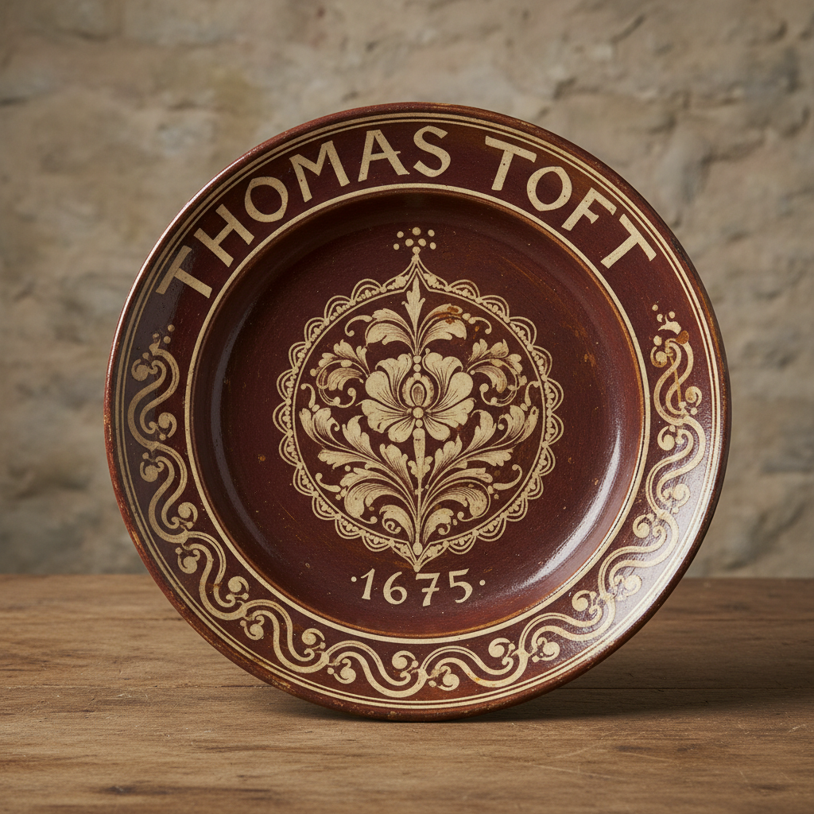

# Slip Trail Art 泥浆拖花艺术

> "Slip trailing is drawing with earth — the potter's pen writes in liquid clay." — English folk pottery tradition

## 概述

泥浆拖花艺术（Slip Trail Art）是一种使用液态黏土（泥浆/slip）在陶器表面进行装饰的传统技术。泥浆拖花是陶瓷装饰中最古老、最直觉化的技法之一——陶工将调配好的液态黏土装入带有细嘴的容器中，像挤奶油花一样在器物表面"书写"或"绘画"，创造出浮雕般的线条和图案。

泥浆拖花的历史可追溯至数千年前——从古代近东到中世纪欧洲，从英国斯塔福德郡到美国宾夕法尼亚德裔社区，这一技术在世界各地独立发展。17-18世纪英国斯塔福德郡的泥浆装饰陶器（slipware）是这一传统最著名的代表——托马斯·托夫特（Thomas Toft）等陶工创造了大型装饰盘，上面用泥浆拖花描绘人物、动物和文字。美国宾夕法尼亚德裔（Pennsylvania Dutch）的红陶泥浆装饰也是这一传统的重要分支。

泥浆拖花艺术的核心要素包括：1）液态黏土——使用不同颜色的泥浆作为"墨水"；2）线条表现——流畅的线条和书写感；3）浮雕效果——泥浆干燥后形成微微凸起的浮雕；4）民间传统——与民间艺术和日常生活紧密相连；5）文字装饰——常包含文字、日期和祝福语；6）色彩对比——深色胎体上的浅色泥浆或反之；7）当代复兴——现代陶艺家的重新诠释。

## 核心特征

| 特征 | 描述 |
|------|------|
| 液态黏土 | 不同颜色泥浆作为墨水 |
| 线条表现 | 流畅线条和书写感 |
| 浮雕效果 | 微微凸起的浮雕质感 |
| 民间传统 | 与民间艺术紧密相连 |
| 文字装饰 | 文字日期祝福语 |
| 色彩对比 | 深浅色泥浆的对比 |

## 视觉特征

- **线条流动**：自由流畅的泥浆线条
- **浮雕质感**：微微凸起的触觉效果
- **色彩对比**：白色泥浆在红色胎体上
- **文字书写**：手写文字和日期
- **民间图案**：花卉、鸟、人物
- **圆盘构图**：大型装饰盘的构图

## 代表作品

| 作品 | 年代 | 意义 |
|------|------|------|
| *托马斯·托夫特装饰盘* | 1670年代 | 英国泥浆陶经典 |
| *斯塔福德郡泥浆陶* | 17-18世纪 | 英国民间传统 |
| *宾夕法尼亚德裔红陶* | 18-19世纪 | 美国民间传统 |
| *伯纳德·利奇泥浆装饰* | 20世纪 | 现代复兴 |
| *汉娜·麦克贝斯作品* | 当代 | 当代诠释 |
| *日本泥浆装饰* | 各时期 | 东方传统 |

## 历史时间线

| 时期 | 事件 |
|------|------|
| 古代 | 近东地区早期泥浆装饰 |
| 中世纪 | 欧洲泥浆装饰发展 |
| 17世纪 | 英国斯塔福德郡泥浆陶鼎盛 |
| 18世纪 | 宾夕法尼亚德裔传统确立 |
| 19世纪 | 工业化导致传统衰落 |
| 20世纪 | 伯纳德·利奇等人复兴 |
| 当代 | 现代陶艺家重新诠释 |

## 中国语境

泥浆拖花技术在中国陶瓷传统中也有悠久的历史。中国宋代磁州窑的"白地黑花"装饰中就包含了泥浆装饰的元素——用深色泥浆在白色化妆土上绘画。中国民间陶器中的"堆花"技法与西方的泥浆拖花有异曲同工之妙——都是用液态黏土在器物表面创造浮雕般的装饰效果。这种技术的全球普遍性说明了人类对"用泥土书写"这一直觉性创作方式的共同追求。当代中国陶艺家也在重新探索泥浆装饰的可能性——将传统的堆花技法与现代设计语言相结合。

## 概念图

## 与其他风格的关系

- **Staffordshire Pottery** → 斯塔福德郡陶器
- **Pennsylvania Dutch** → 宾夕法尼亚德裔民间艺术
- **Sgraffito** → 刮花装饰（互补技法）
- **Cizhou Ware** → 磁州窑（中国平行传统）
- **Folk Art** → 民间艺术
- **Studio Pottery** → 工作室陶艺（现代复兴）

---

*浮光艺志 | Chronicle of Artistry*
