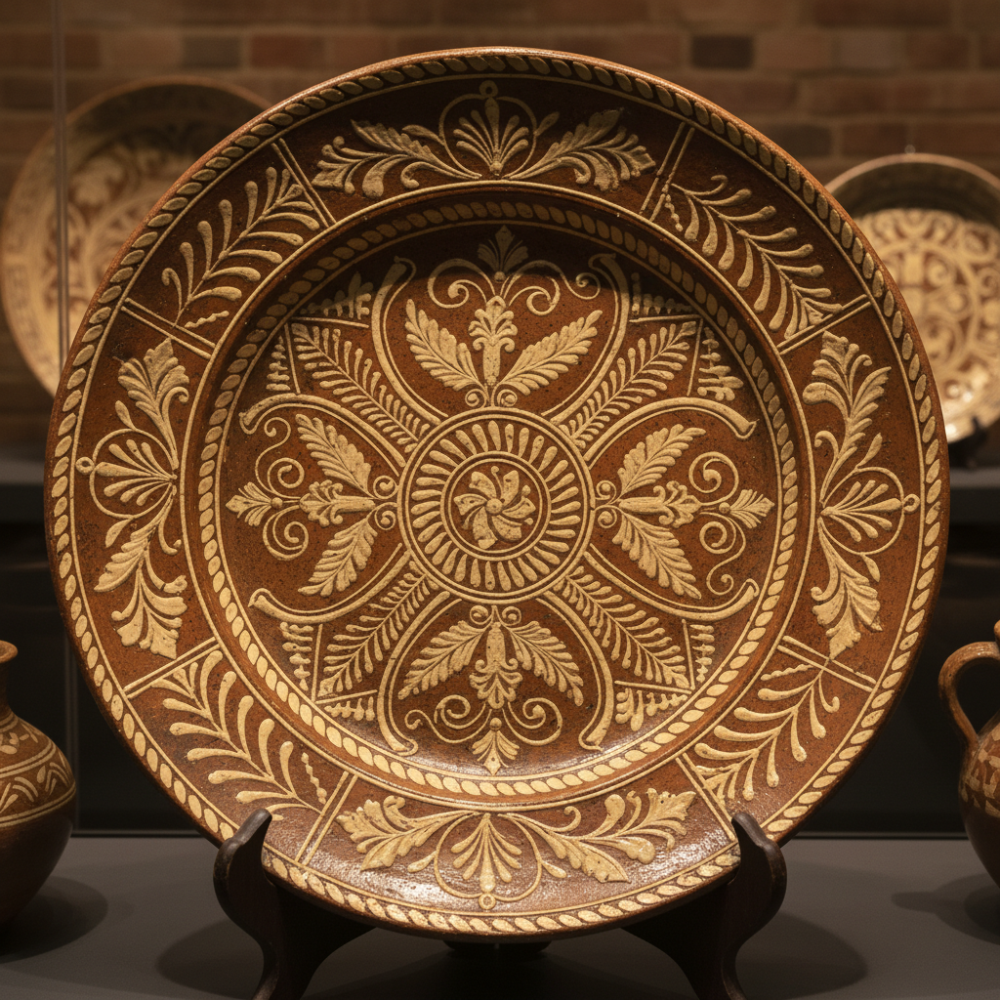

# Slip Trailing Art 泥浆描绘艺术

> "Slip trailing is drawing with liquid clay — a thick cream of colored slip is squeezed through a nozzle onto the surface of a pot, building up raised lines and dots that stand proud of the surface like icing on a cake. It is one of the most direct and expressive of all ceramic decoration techniques, where the hand's pressure and speed are recorded permanently in every line's thickness and flow." — Unknown

## 概述

泥浆描绘艺术（Slip Trailing Art）是一种将液态粘土（泥浆/化妆土）通过挤压工具在陶器表面描绘出凸起线条和图案的陶瓷装饰技法——类似于蛋糕裱花的原理，通过控制挤压力度和速度在坯体表面创造出浮雕般的装饰效果。这是最古老和最直接的陶瓷装饰技法之一，在世界各地的陶瓷传统中都有应用。

泥浆描绘艺术的实践包括：1）线条描绘——用泥浆画出连续的线条图案；2）点状装饰——挤出泥浆点形成点状图案；3）填充——在轮廓线内填充不同颜色的泥浆；4）梳理——在湿泥浆上用梳子创造纹理；5）多色泥浆——使用不同颜色的泥浆创造对比；6）立体装饰——堆积泥浆形成高浮雕效果；7）当代泥浆描绘——将传统技法与现代陶艺结合的创作。

## 核心特征

| 特征 | 描述 |
|------|------|
| 凸起 | 凸起的线条和图案 |
| 直接 | 直接的手工表达 |
| 流动 | 流动的线条质感 |
| 触觉 | 强烈的触觉效果 |
| 古老 | 数千年的传统 |
| 多彩 | 可使用多种颜色 |

## 视觉特征

- **凸起**：凸起的线条和点
- **流动**：流畅的线条运动
- **质感**：丰富的表面质感
- **对比**：不同颜色泥浆的对比
- **手工**：明显的手工痕迹
- **装饰**：高度装饰性的效果

## 代表作品

| 作品 | 艺术家/文化 | 年代 | 意义 |
|------|-------------|------|------|
| *English slipware* | 英国 | 17世纪 | 英国泥浆陶器 |
| *Thomas Toft chargers* | 英国 | 1670年代 | 托夫特大盘 |
| *Pennsylvania Dutch redware* | 美国 | 18-19世纪 | 宾州荷兰人陶器 |
| *Japanese slip decoration* | 日本 | 传统 | 日本泥浆装饰 |
| *Contemporary slip trailing* | 当代 | 当代 | 当代泥浆描绘 |

## 历史时间线

| 时期 | 事件 |
|------|------|
| 古代 | 各文明的泥浆装饰起源 |
| 17世纪 | 英国泥浆陶器的黄金时代 |
| 18-19世纪 | 美国民间陶器的发展 |
| 20世纪 | 工作室陶艺中的复兴 |
| 当代 | 泥浆描绘的艺术化发展 |

## 中国语境

泥浆描绘技法在中国陶瓷传统中有重要地位。中国古代的堆塑技法——在器物表面堆贴泥条和泥点——与泥浆描绘有相似之处。中国宋代的磁州窑系使用化妆土进行各种装饰——包括类似泥浆描绘的技法。中国的民间陶瓷中，泥浆装饰在各地窑口都有应用——如广东石湾窑的堆塑装饰。中国当代的陶艺家广泛使用泥浆描绘技法——将其与中国传统陶瓷美学结合。中国的陶瓷教育中，泥浆描绘是基础装饰技法之一——培养学生的手工表达能力。中国的一些陶艺工作室将泥浆描绘与现代设计结合——创造出具有当代感的陶瓷作品。

## AI生成概念图

## 与其他风格的关系

- **Ceramics** → 陶瓷艺术
- **Slip Decoration** → 泥浆装饰
- **Terra Sigillata** → 化妆土陶艺
- **Sgraffito** → 刮花装饰
- **Majolica** → 马约利卡
- **Folk Pottery** → 民间陶器

---

*浮光艺志 | Chronicle of Artistry*
