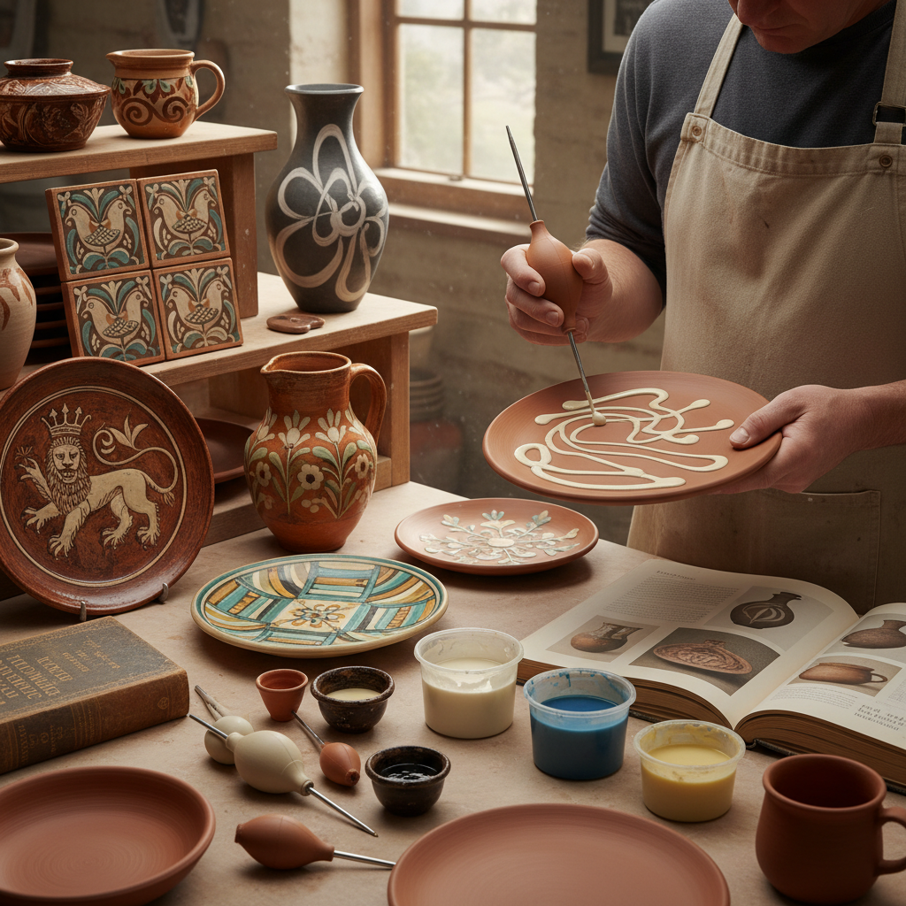

# Slip Trailing 泥浆拖线装饰

> "Slip trailing is calligraphy in clay — liquid earth flowing from a nozzle like ink from a brush, drawing lines and patterns that dance across the surface of pottery with the spontaneity of handwriting and the permanence of stone." — Unknown

## 概述

泥浆拖线装饰（Slip Trailing）是一种陶瓷表面装饰技法——使用装有细嘴的容器（slip trailer/挤瓶）将液态粘土（slip/泥浆）挤出，在陶器表面绘制线条、图案和文字。泥浆从细嘴流出后在器物表面形成凸起的线条，干燥和烧制后成为永久的浮雕装饰。

泥浆拖线装饰的历史可追溯到17世纪英国的斯利普器（Slipware）传统——Thomas Toft等陶工用泥浆拖线在大盘上绘制人物、动物和文字。泥浆拖线装饰也广泛存在于欧洲民间陶器、美洲原住民陶器和亚洲陶瓷传统中。当代陶艺家将泥浆拖线发展为精细的装饰艺术——从简单的线条到复杂的图案、从传统的民间风格到现代的抽象设计。

## 核心特征

| 特征 | 描述 |
|------|------|
| 泥浆 | 使用液态粘土 |
| 挤出 | 从细嘴挤出 |
| 凸起 | 形成凸起线条 |
| 装饰 | 表面装饰技法 |
| 流动 | 流动的线条感 |
| 手写 | 类似书法的自由 |

## 视觉特征

- **凸起**：凸起的线条
- **流动**：流动的曲线
- **对比**：色彩对比
- **图案**：装饰性图案
- **手工**：手工的自由感
- **民间**：民间艺术的质朴

## 代表作品

| 作品 | 艺术家 | 年代 | 意义 |
|------|--------|------|------|
| *Slipware chargers* | Thomas Toft | 17世纪 | 英国泥浆装饰传统 |
| *Staffordshire slipware* | Various | 17-18世纪 | 斯塔福德郡传统 |
| *Pennsylvania Dutch redware* | Various | 18-19世纪 | 美国民间陶器 |
| *Contemporary slip trail* | Various | 当代 | 当代泥浆拖线艺术 |
| *Japanese slip decoration* | Various | 传统 | 日本泥浆装饰 |

## 历史时间线

| 时期 | 事件 |
|------|------|
| 古代 | 早期泥浆装饰的使用 |
| 17世纪 | 英国Slipware的黄金时代 |
| 18世纪 | 欧洲民间陶器的泥浆装饰 |
| 19世纪 | 工业化对手工泥浆装饰的冲击 |
| 20世纪 | Bernard Leach等人的复兴 |
| 当代 | 泥浆拖线在当代陶艺中的创新 |

## 中国语境

泥浆装饰在中国陶瓷传统中有悠久的历史——中国的一些传统陶瓷使用类似的泥浆堆花技法。中国的磁州窑系统中有丰富的泥浆装饰传统。中国的当代陶艺教育中，泥浆拖线作为表面装饰技法之一被教授。中国的陶艺工作室和体验课程中，泥浆拖线因其"趣味性强、效果即时"的特点而受欢迎。中国的一些当代陶艺家将泥浆拖线与中国书法和绘画传统结合。

## AI生成概念图

## 与其他风格的关系

- **Sgraffito** → 刮花装饰
- **Ceramic Glazing** → 陶瓷施釉
- **Calligraphy** → 书法
- **Folk Art** → 民间艺术
- **Majolica** → 马约利卡
- **Engobe** → 化妆土装饰

---

*浮光艺志 | Chronicle of Artistry*
