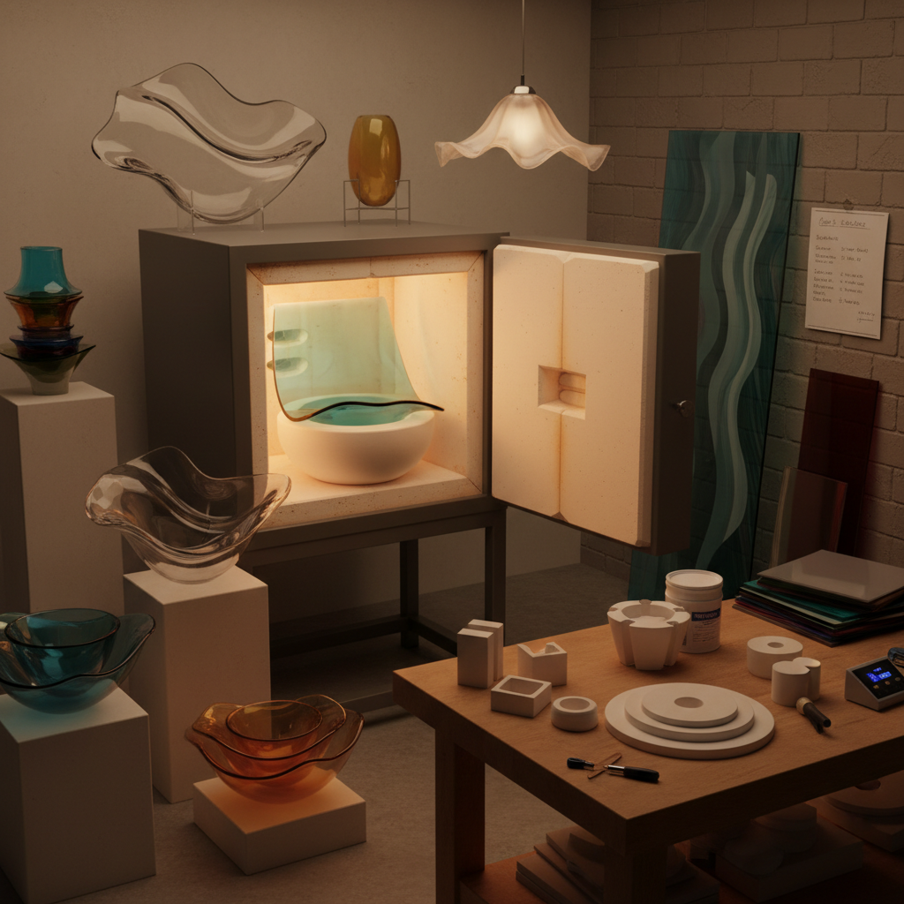

# Slumped Glass Art 热弯玻璃艺术

> "Slumping is gravity's art — the glassmaker heats a flat sheet until it softens just enough to yield to its own weight, draping over or into a mold like silk falling from a table's edge. The artist controls nothing but temperature and time; gravity does the shaping. This surrender to natural force gives slumped glass its characteristic organic curves — forms that no hand could press into being, only coax into existence through patient heat." — Unknown

## 概述

热弯玻璃艺术（Slumped Glass Art）是将平面玻璃加热至软化温度，使其在重力作用下自然弯曲贴合模具形状的玻璃成型工艺——通过精确控制窑炉温度（通常在593-677°C之间），让玻璃在不完全熔融的状态下缓慢变形，形成优雅的三维曲面造型。

热弯玻璃艺术的实践包括：1）碗盘成型——将平面玻璃热弯成碗、盘等器皿；2）建筑玻璃——大型建筑用弯曲玻璃；3）灯具制作——热弯玻璃灯罩；4）雕塑创作——利用热弯创造雕塑形态；5）组合技法——先熔融再热弯的多步工艺；6）自由热弯——不使用模具的自由变形；7）当代热弯——将热弯作为当代艺术表达的创作。

## 核心特征

| 特征 | 描述 |
|------|------|
| 重力 | 利用重力自然成型 |
| 曲面 | 优雅的自然曲面 |
| 精控 | 精确的温度控制 |
| 有机 | 有机的自然形态 |
| 透明 | 保持玻璃的透明性 |
| 柔和 | 柔和的曲线造型 |

## 视觉特征

- **曲线**：自然流畅的曲线
- **透明**：玻璃的透明质感
- **光影**：曲面上的光影变化
- **薄壁**：均匀的壁厚
- **有机**：有机的自然形态
- **反射**：曲面的光线反射

## 代表作品

| 作品 | 艺术家/文化 | 年代 | 意义 |
|------|-------------|------|------|
| *Kait Rhoads vessels* | Kait Rhoads | 当代 | 当代热弯玻璃 |
| *Architectural slumped glass* | Various | 当代 | 建筑热弯玻璃 |
| *Slumped glass bowls* | Studio glass | 1970s至今 | 工作室热弯器皿 |
| *Richard Whiteley* | Richard Whiteley | 当代 | 热弯玻璃雕塑 |
| *Warm glass platters* | Various | 当代 | 装饰热弯盘 |

## 历史时间线

| 时期 | 事件 |
|------|------|
| 古代 | 早期玻璃热弯的尝试 |
| 19世纪 | 工业热弯玻璃技术 |
| 1960s | 工作室玻璃运动 |
| 1980s | 热弯技术的艺术化 |
| 当代 | 热弯玻璃的多元发展 |

## 中国语境

热弯玻璃艺术在中国主要体现在建筑和工业应用领域——中国是世界上最大的建筑热弯玻璃生产国之一。中国的大型建筑项目（如国家大剧院、各地博物馆等）大量使用热弯玻璃——展示了中国在大尺寸热弯玻璃加工方面的技术实力。中国的艺术玻璃工作室也在探索热弯技法的艺术应用——一些艺术家将热弯与熔融、彩绘等技法结合创作。中国的玻璃艺术教育中，热弯是重要的教学内容之一。中国的家居装饰市场对热弯玻璃制品有越来越大的需求——从果盘到花瓶，热弯玻璃制品越来越受欢迎。中国的一些玻璃艺术家将中国传统造型（如荷叶、山水）融入热弯玻璃创作——创造具有东方韵味的作品。

## AI生成概念图

## 与其他风格的关系

- **Fused Glass** → 熔融玻璃
- **Glass Blowing** → 吹制玻璃
- **Kiln Art** → 窑炉艺术
- **Architecture** → 建筑艺术
- **Sculpture** → 雕塑
- **Light Art** → 光艺术

---

*浮光艺志 | Chronicle of Artistry*
