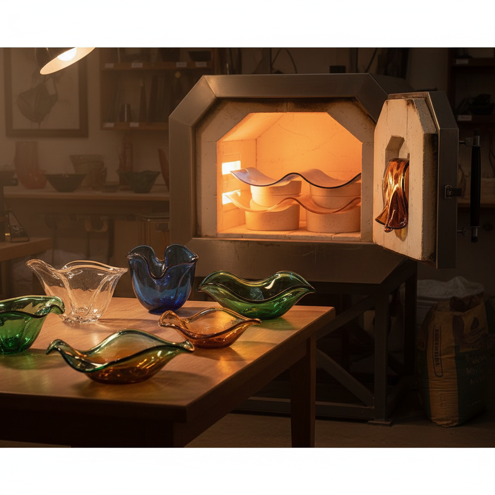

# Slumping 玻璃塌陷成型

> "Slumping lets gravity be the sculptor — glass softens and surrenders to the shape beneath it." — Unknown

## 概述

玻璃塌陷成型（Slumping）是将平板玻璃加热至软化温度（通常600-700°C），使其在重力作用下自然下垂，贴合模具形状的玻璃成型技法。与熔融玻璃的完全融合不同，塌陷成型保持玻璃的整体性——它只是让玻璃"记住"新的形状。这种技法常用于制作碗、盘、灯罩等弧形器物，也可以创造自由流动的有机形态。

塌陷成型的哲学在于：顺势而为——不强迫玻璃，而是让重力和热量引导它找到自己的形状。

## 核心特征

| 特征 | 描述 |
|------|------|
| 重力 | 利用重力成型 |
| 软化 | 加热至软化点 |
| 模具 | 使用模具定形 |
| 弧形 | 创造弧形器物 |
| 温和 | 温度低于熔融 |
| 保持 | 保持玻璃整体性 |

## 视觉特征

- **弧度**：优美的弧形曲线
- **光滑**：保持玻璃光滑表面
- **透明**：保持原有透明度
- **流畅**：流畅的形态过渡
- **器物**：功能性器物形态
- **有机**：自然的有机曲线

## 代表作品

| 作品 | 艺术家 | 年代 | 意义 |
|------|--------|------|------|
| *Slumped glass bowls* | Various | 传统 | 经典塌陷碗 |
| *Higgins glass panels* | Frances & Michael Higgins | 1950s-60s | 中世纪现代玻璃 |
| *Architectural slumped glass* | Various | 当代 | 建筑用弯曲玻璃 |
| *Free-form slumped sculptures* | Various | 当代 | 自由形态雕塑 |
| *Slumped glass lighting* | Various | 当代 | 玻璃灯具设计 |

## 历史时间线

| 时期 | 事件 |
|------|------|
| 古代 | 古代玻璃器物的早期成型 |
| 中世纪 | 皇冠玻璃的旋转塌陷 |
| 1950s | Higgins夫妇的现代塌陷玻璃 |
| 1960s-70s | 工作室玻璃运动 |
| 1980s+ | 建筑弯曲玻璃的发展 |
| 当代 | 艺术与功能的结合 |

## 中国语境

在中国，玻璃塌陷成型主要应用于建筑装饰和艺术玻璃领域。中国的建筑玻璃行业大量使用热弯（塌陷）技术制作弧形幕墙和装饰面板。在艺术领域，越来越多的中国玻璃艺术家将塌陷成型与中国传统器物美学结合——如制作具有宋代瓷器韵味的玻璃碗盘。上海、深圳等城市的玻璃工作室提供塌陷成型的体验课程。

## AI生成概念图

## 与其他风格的关系

- **Fused Glass** → 熔融玻璃（更高温）
- **Kiln Casting** → 窑铸玻璃
- **Glass Blowing** → 吹制玻璃
- **Ceramics** → 陶瓷（类似窑烧过程）
- **Architecture** → 建筑弯曲玻璃
- **Industrial Design** → 工业设计应用

---

*浮光艺志 | Chronicle of Artistry*
