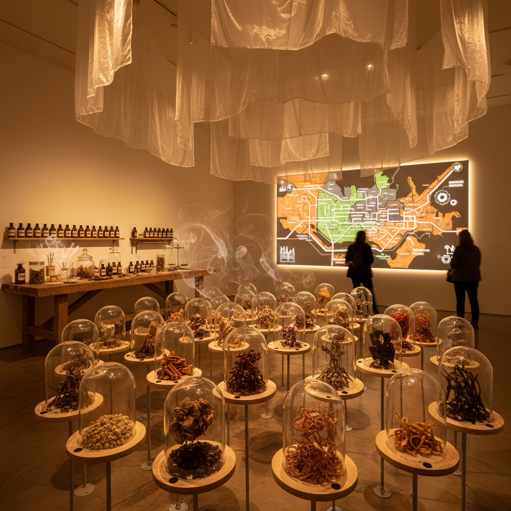

# Smell Art 嗅觉艺术

> "Smell art is the most intimate and most neglected of the sensory arts — scent bypasses the rational mind entirely, traveling directly from nose to limbic system, triggering memories and emotions before consciousness can intervene, making it perhaps the most powerful aesthetic medium we possess and certainly the least explored, an art form that cannot be photographed, cannot be reproduced on screen, cannot be experienced at a distance, that demands presence and proximity, that dissolves the boundary between artwork and viewer because you must literally breathe it in, take it inside your body, let it become part of you." — Unknown

## 概述

嗅觉艺术（Smell Art / Olfactory Art）是一种以气味和嗅觉体验为核心媒介的艺术实践。嗅觉艺术挑战了视觉在艺术中的绝对主导地位，探索气味作为美学表达、叙事工具和情感触发器的可能性。嗅觉艺术的独特之处在于：气味无法被"框住"或"挂在墙上"，它是弥散的、短暂的、亲密的，需要观众的身体直接参与。

嗅觉艺术的实践包括：1）气味装置——在展览空间中释放特定气味创造沉浸式体验；2）气味肖像——用气味来"描绘"一个人、一个地方或一段记忆；3）气味叙事——通过气味的序列来讲述故事；4）气味档案——收集和保存即将消失的气味；5）合成气味艺术——创造自然界不存在的新气味。代表性的嗅觉艺术家包括：Sissel Tolaas（气味研究者和艺术家）、Peter de Cupere、Kate McLean（气味地图）等。

## 核心特征

| 特征 | 描述 |
|------|------|
| 嗅觉 | 嗅觉作为核心媒介 |
| 记忆 | 气味与记忆的联系 |
| 弥散 | 弥散性和不可控性 |
| 亲密 | 需要身体的亲近 |
| 短暂 | 体验的短暂性 |
| 情感 | 直接的情感触发 |

## 视觉特征

- **容器**：气味的容器和释放装置
- **雾气**：可见的气体和雾气
- **材料**：芳香材料的展示
- **地图**：气味地图的可视化
- **实验室**：实验室般的环境
- **瓶子**：各种形状的香水瓶

## 代表作品

| 作品 | 艺术家 | 年代 | 意义 |
|------|--------|------|------|
| *Smell research projects* | Sissel Tolaas | 2000年代 | 气味研究的艺术化 |
| *Smell maps* | Kate McLean | 2010年代 | 城市气味的地图化 |
| *Olfactory installations* | Peter de Cupere | 2000年代 | 气味装置 |
| *Osmodrama* | Various | 2016 | 气味戏剧 |
| *Scent preservation* | Various | 当代 | 濒危气味的保存 |

## 历史时间线

| 时期 | 事件 |
|------|------|
| 古代 | 香料和熏香的仪式使用 |
| 1960年代 | 感官艺术的早期实验 |
| 2000年代 | 嗅觉艺术的专业化 |
| 2010年代 | 气味地图和气味档案 |
| 当代 | AI辅助的气味设计 |

## 中国语境

嗅觉艺术在中国有深厚的文化传统。中国的香文化（香道）有数千年的历史——从先秦的佩香、汉代的博山炉、唐宋的合香艺术，到明清的文人香事。中国传统的"香道"本身就是一种嗅觉艺术——通过精心调配的香料组合来创造特定的嗅觉体验和精神状态。当代中国的一些艺术家和设计师在探索将传统香文化与当代艺术实践结合——如用气味来重现消失的历史空间、用香料来讲述地方故事、或将传统的合香技艺与当代装置艺术融合。中国的香文化复兴也为嗅觉艺术提供了商业和文化的支持。

## AI生成概念图

## 与其他风格的关系

- **Sensory Art** → 感官艺术
- **Installation Art** → 装置艺术
- **Performance Art** → 表演艺术
- **Conceptual Art** → 概念艺术
- **Memory Art** → 记忆艺术
- **Perfumery** → 调香艺术

---

*浮光艺志 | Chronicle of Artistry*
