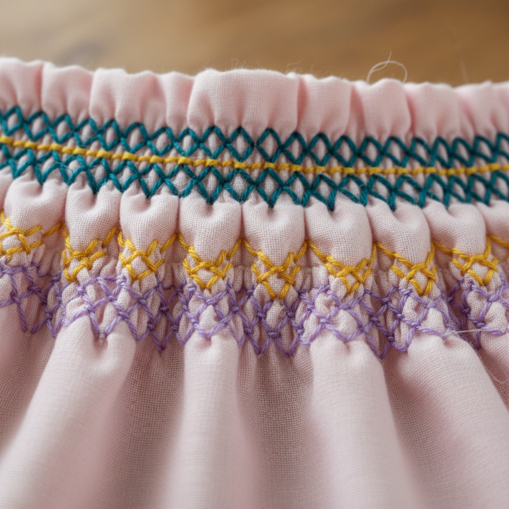

# Smocking Art 缩褶绣艺术

> "Smocking is the art of controlled gathering — fabric is pleated into tiny, regular folds and then stitched with decorative patterns that both hold the pleats in place and create an elastic, textured surface. What begins as flat cloth becomes a honeycomb of gathered fabric that stretches and breathes, making smocking both functional and beautiful. It is geometry made soft, structure made flexible." — Unknown

## 概述

缩褶绣艺术（Smocking Art）是一种通过将织物折叠成规则的小褶，然后用装饰性针法将褶皱固定并装饰的刺绣技法——创造出既有弹性又有装饰效果的织物表面。缩褶绣最初是一种功能性技法（使宽松的衣物贴合身体），后来发展为精美的装饰艺术。

缩褶绣艺术的实践包括：1）英式缩褶绣——在预先打褶的织物上绣制装饰图案；2）加拿大缩褶绣——直接在织物上绣制形成褶皱；3）蜂巢针——经典的蜂巢状缩褶针法；4）缆绳针——创造缆绳状纹理的针法；5）波浪针——创造波浪状图案的针法；6）钻石针——创造菱形图案的针法；7）当代缩褶绣——将传统技法与现代设计结合的创作。

## 核心特征

| 特征 | 描述 |
|------|------|
| 弹性 | 创造弹性的织物 |
| 褶皱 | 规则的褶皱基础 |
| 功能 | 功能与装饰结合 |
| 纹理 | 丰富的表面纹理 |
| 几何 | 几何化的图案 |
| 传统 | 乡村服饰传统 |

## 视觉特征

- **褶皱**：规则的褶皱纹理
- **弹性**：可伸缩的表面
- **蜂巢**：蜂巢状的经典图案
- **色彩**：绣线的色彩装饰
- **立体**：褶皱的立体效果
- **柔软**：柔软流动的质感

## 代表作品

| 作品 | 艺术家/文化 | 年代 | 意义 |
|------|-------------|------|------|
| *English smock frocks* | 英国 | 18-19世纪 | 英国农民罩衫 |
| *Children's dresses* | 欧美 | 19-20世纪 | 儿童服装 |
| *Ecclesiastical vestments* | 教会 | 中世纪至今 | 教会服装 |
| *Heirloom sewing* | 欧美 | 当代 | 传家宝缝纫 |
| *Contemporary smocking* | 当代 | 当代 | 当代缩褶绣 |

## 历史时间线

| 时期 | 事件 |
|------|------|
| 中世纪 | 缩褶绣的功能性起源 |
| 18-19世纪 | 英国农民罩衫的黄金时代 |
| 19世纪末 | 缩褶绣从功能到装饰的转变 |
| 20世纪 | 儿童服装中的广泛应用 |
| 当代 | 缩褶绣的时装化和艺术化 |

## 中国语境

缩褶绣艺术在中国有一定的应用和发展。中国传统服饰中虽然没有完全对应的缩褶绣传统，但褶皱装饰在中国服饰中有悠久的历史。中国的童装设计中，缩褶绣作为一种精致的装饰技法正在流行——特别是在高端手工童装品牌中。中国的一些手工艺社区开始教授缩褶绣技法——将其作为一种独特的面料处理方式。中国的时装设计师开始将缩褶绣元素融入当代设计——利用其弹性和纹理效果创造新的服装形态。中国的一些少数民族服饰中有类似缩褶的装饰技法——虽然名称和具体做法不同，但原理相通。中国的面料设计中，机器模拟的缩褶效果被广泛应用——在保持手工美感的同时提高生产效率。

## AI生成概念图

## 与其他风格的关系

- **Embroidery** → 刺绣艺术
- **Textile Art** → 纺织艺术
- **Pleating** → 褶皱艺术
- **Fashion Design** → 时装设计
- **Folk Art** → 民间艺术
- **Heirloom Sewing** → 传家宝缝纫

---

*浮光艺志 | Chronicle of Artistry*
