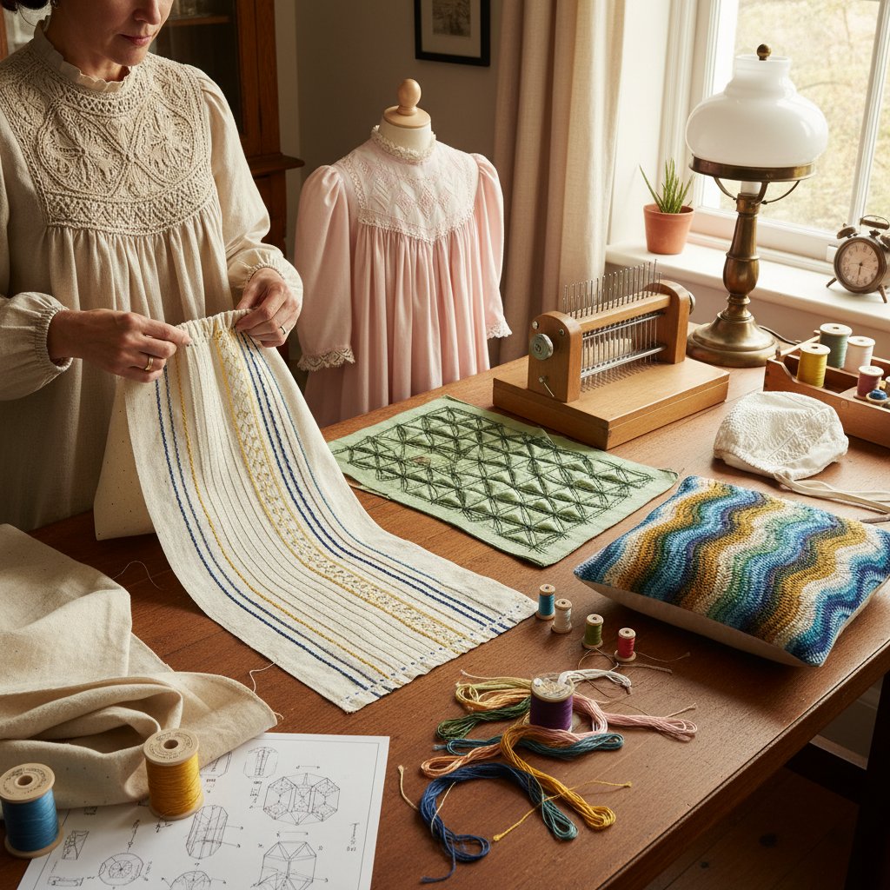

# Smocking Technique 缩褶绣

> "Smocking is geometry made soft — fabric gathered into precise pleats and then stitched with decorative patterns that stretch and contract like an accordion, creating surfaces that are simultaneously structured and elastic, ornamental and functional, transforming flat cloth into living texture." — Unknown

## 概述

缩褶绣（Smocking）是一种将织物先折叠成均匀的褶皱（pleats），然后在褶皱上施加装饰性针法将其固定的纺织技法。缩褶绣的独特之处在于它同时具有装饰性和功能性——缩褶后的织物具有弹性，可以伸展和收缩，同时表面呈现出精美的几何图案。

缩褶绣的历史可以追溯到中世纪的英国——农民和牧羊人的工作服（smock-frock）使用缩褶技法使宽松的亚麻布贴合身体同时保持活动自由。维多利亚时代，缩褶绣从实用技法发展为精美的装饰艺术——用于儿童服装、女性服饰和教堂法衣。当代缩褶绣包括传统英式缩褶（English smocking）、加拿大缩褶（Canadian smocking/lattice smocking）和直接缩褶（direct smocking）等多种变体。

## 核心特征

| 特征 | 描述 |
|------|------|
| 褶皱 | 均匀的褶皱基础 |
| 弹性 | 缩褶后的弹性 |
| 几何 | 几何装饰图案 |
| 功能 | 功能与装饰结合 |
| 纹理 | 丰富的表面纹理 |
| 规律 | 精确的规律性 |

## 视觉特征

- **褶皱**：均匀精美的褶皱
- **几何**：几何的装饰图案
- **纹理**：蜂窝状的表面纹理
- **弹性**：可伸缩的视觉暗示
- **规律**：精确的重复节奏
- **立体**：褶皱的立体感

## 代表作品

| 作品 | 艺术家 | 年代 | 意义 |
|------|--------|------|------|
| *English smock-frocks* | 英国农民 | 中世纪-19世纪 | 传统工作服缩褶 |
| *Victorian children's dresses* | Various | 维多利亚时代 | 维多利亚儿童服装 |
| *Heirloom smocking* | Various | 当代 | 传家宝级缩褶 |
| *Canadian lattice smocking* | Various | 当代 | 加拿大格子缩褶 |
| *Contemporary fashion smocking* | Various | 当代 | 当代时装缩褶 |

## 历史时间线

| 时期 | 事件 |
|------|------|
| 中世纪 | 英国工作服缩褶的起源 |
| 18-19世纪 | 缩褶工作服的普及 |
| 维多利亚时代 | 缩褶绣的装饰化发展 |
| 20世纪 | 缩褶绣在儿童服装中的流行 |
| 当代 | 缩褶绣的艺术化和时装化 |

## 中国语境

缩褶绣在中国的传统服饰中有类似的技法——中国传统服装中的"抽褶"和"打褶"技法与缩褶绣有相似之处。苗族服饰中的百褶裙使用精细的褶皱技法。当代中国的服装设计师在高级成衣和定制服装中使用缩褶技法。中国的手工爱好者通过社交媒体了解并实践英式缩褶绣。缩褶绣在中国的童装设计和手工婴儿服制作中有一定的应用。

## AI生成概念图

## 与其他风格的关系

- **Embroidery** → 刺绣
- **Textile Art** → 纺织艺术
- **Quilting** → 绗缝
- **Pleating** → 褶皱工艺
- **Fashion Design** → 时装设计
- **Heirloom Sewing** → 传家宝缝纫

---

*浮光艺志 | Chronicle of Artistry*
