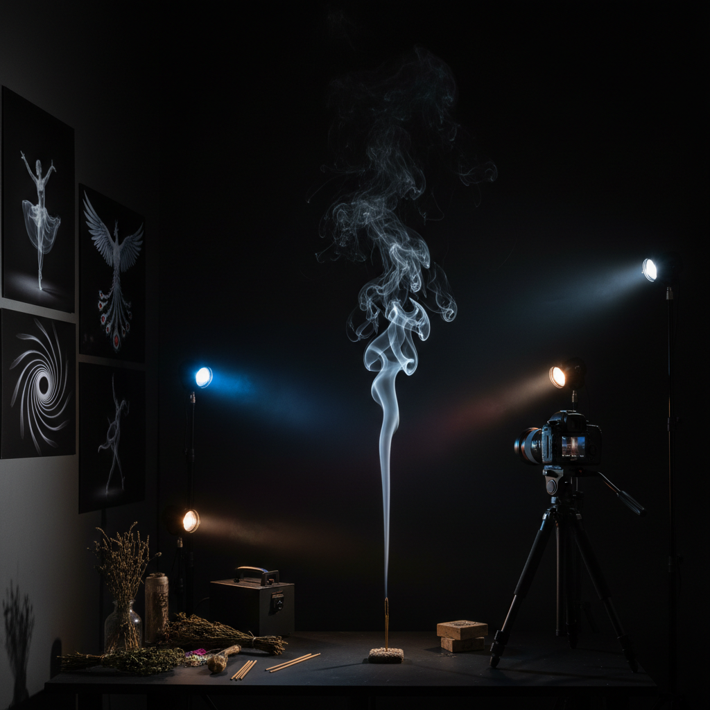

# Smoke Art 烟雾艺术

> "Smoke art captures the most ephemeral of all materials — a substance that exists for mere seconds before dissolving into nothing, that can never be held or shaped by hand, that moves with a grace no dancer can match, and that creates forms of such complexity that no mathematician can predict them. To photograph smoke is to freeze chaos, to sculpt with smoke is to collaborate with thermodynamics, and to perform with smoke is to dance with disappearance itself." — Unknown

## 概述

烟雾艺术（Smoke Art）是以烟雾——气体中悬浮的微小固体或液体颗粒——为媒介的艺术实践。烟雾是最短暂、最不可控的艺术材料之一，它在空气中形成复杂的湍流图案，每一瞬间都不可重复。

烟雾艺术的实践包括：1）烟雾摄影——捕捉烟雾瞬间形态的高速摄影；2）烟雾雕塑——在封闭空间中用烟雾创造三维形态；3）烟雾表演——将烟雾作为舞台和表演元素；4）烟雾装置——利用烟雾机和气流控制创造沉浸式环境；5）烟火艺术——烟花和烟火的艺术化使用；6）香道艺术——焚香产生的烟雾作为冥想和美学对象。

## 核心特征

| 特征 | 描述 |
|------|------|
| 短暂 | 极度短暂 |
| 流动 | 持续流动 |
| 不可控 | 无法精确控制 |
| 湍流 | 复杂的湍流 |
| 消散 | 必然消散 |
| 光影 | 与光的互动 |

## 视觉特征

- **曲线**：优雅的曲线形态
- **层次**：烟雾的层次感
- **透明**：半透明的质感
- **光束**：光束穿透烟雾
- **漩涡**：涡旋和螺旋
- **消散**：边缘的消散

## 代表作品

| 作品 | 艺术家 | 年代 | 意义 |
|------|--------|------|------|
| *Smoke photography* | Thomas Herbrich | 2000年代 | 烟雾摄影 |
| *Smoke sculptures* | Various | 2010年代 | 烟雾雕塑 |
| *Fog installations* | Fujiko Nakaya | 1970年代至今 | 雾装置 |
| *Fireworks art* | Cai Guo-Qiang | 1990年代至今 | 烟火艺术 |
| *Incense ceremonies* | Various | 古代至今 | 香道艺术 |

## 历史时间线

| 时期 | 事件 |
|------|------|
| 古代 | 焚香、烟火的仪式使用 |
| 唐宋 | 中国香道的成熟 |
| 1970年代 | Nakaya的雾雕塑 |
| 1990年代 | 蔡国强的火药艺术 |
| 当代 | 数字烟雾模拟与装置 |

## 中国语境

烟雾艺术在中国有极其深厚的文化传统。中国是烟火（烟花）的发源地——火药是中国四大发明之一，中国的烟花艺术有超过千年的历史。蔡国强是当代最著名的烟火艺术家之一，他的"天梯"等作品将中国烟火传统推向了当代艺术的最前沿。中国的香道文化——焚香观烟——是一种精致的烟雾美学实践，宋代文人将"焚香"列为生活四艺之一。中国传统绘画中的"烟云"是山水画的灵魂——"烟云供养"是画家追求的境界。中国当代的一些艺术家在探索烟雾艺术：蔡国强的火药绘画和烟火表演、将中国传统香道与当代装置结合、以及用烟雾创造呼应中国山水画"烟云"美学的沉浸式空间。

## AI生成概念图

## 与其他风格的关系

- **Ephemeral Art** → 短暂艺术
- **Light Art** → 光艺术
- **Performance Art** → 行为艺术
- **Fire Art** → 火艺术
- **Photography** → 摄影
- **Weather Art** → 气象艺术

---

*浮光艺志 | Chronicle of Artistry*
